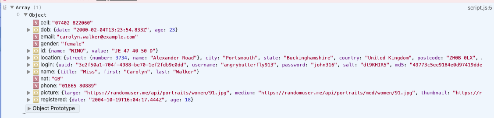

# API Calls with Promises and Fetch

To build an app that uses JSON APIs on the front-end, you'll need a way to connect to an external server and retrieve data from it. The browser's built-in `fetch()` function is one way to do so. This function allows you to make requests to external websites and does so using promises.

In this lesson, you'll learn how to use the `fetch()` function, which returns a promise with the desired data. Then, you'll see how you could integrate data into an HTML, CSS, and JavaScript web application.

## Learning objectives

By the end of this lesson, you should be able to:

- Describe what it means for code to run asynchronously.
- Identify what kind of operations usually lead to asynchronous code.
- Identify the purpose of promises.
- Distinguish between the three states of promises.
- Gracefully handle errors by showing a response to the user.
- Use the `fetch()` API to make GET requests to a public JSON API.
- Use the data from an API call to build a web application, including event listeners.

---

## Managing code that takes time

All the code you have written so far happens quickly, so most (if not all) of the output occurs in the order you have written it. However, JavaScript is `asynchronous`, meaning it starts a task (code block) and does not wait for it to finish before moving on to the following code block.

What order will the following console logs happen in?

```js
setTimeout(() => {
  console.log("I should happen first");
}, 1000);

setTimeout(() => {
  console.log("I should happen second");
}, 5000);

setTimeout(() => {
  console.log("I should happen third");
}, 3000);

console.log("I should happen last");
```

You can rewrite the code above so that the console logs happen in the order you would expect based on their message:

```js
setTimeout(() => {
  console.log("I should happen first");
  setTimeout(() => {
    console.log("I should happen second");
    setTimeout(() => {
      console.log("I should happen third");
      console.log("I should happen last");
    }, 3000);
  }, 5000);
}, 1000);
```

As you can see, the callback function executes after its higher-order function has been invoked.

This code looks ok because the code being executed is short. However, such nested code can become challenging to work with and maintain. Developers refer to this code structure as `callback hell` or `pyramid of doom`.

When you make an API call, the call takes _a long time_ in computation. Imagine if you want to make an HTML page that loads some Cat Facts onto the page. You would have to ask for the data, _then_ wait for it to come back _then_ create some HTML elements to contain the data and append them to your page. If you didn't wait for the data, your HTML elements would be empty because JavaScript code is executed asynchronously: it won't wait for the previous code that asks for data to finish before starting on the following code block to build the HTML elements.

You could create callback functions to help wait for things to complete and then do something. But there is a better way called promises.

## Intro to Promises

Promises have three states:

- Pending
- Resolved
- Rejected

Pending means that the promise is still waiting for something to happen. Resolved means the expected behavior has occurred, the correct data is returned successfully, and finally, rejected means something went wrong in the promise.

### The promise object

The `Promise` object is a powerful object that you can use to write your code in a way where the code _promises_ to wait for a response and _then_ does something.

```js
const promiseToWait = new Promise(() => {
  setTimeout(() => {
    return "I promise to wait";
  }, 1000);
});
```

If you console log the promise:

```js
console.log(promiseToWait);
```

You will get a pending message because the promise is still waiting when its value is console logged.

```
Promise { <pending> }
```

To fulfill the promise, you don't use a return statement. Instead, you use two callbacks, `resolve` and `reject`. This is because it is possible for something to either go right or go wrong in the promise. An excellent example is if you are using a third-party API and either the servers are up, and you get a response, or the servers are down and don't get a response. To prevent your website from breaking, you must know if a promise can't be fulfilled and deal with it.

```js
const promiseToWait = new Promise((resolve, reject) => {
  setTimeout(() => {
    if (true) {
      resolve("I promise to wait");
    }
    {
      reject("Something went wrong");
    }
  }, 1000);
});

console.log(promiseToWait);
```

If you rerun the code, you'll notice that it takes a moment to regain control of the terminal. This is because the promise is executed, and the setTimeout function is running.

But how do you get the resolve value to console log?

### Then

To use the return values in the promise, you use a function `.then()` that chains off the promise. The `.then()` function takes a minimum of one argument, which is a callback function. The argument for the callback function is the data being returned from the promise.

Function chained to the promise:

```js
promiseToWait.then();
```

`.then()` Takes a callback, the value returned from the promise.

```js
promiseToWait.then((response) => {
  console.log(response);
});
```

### Then again

A great feature of promises is that you can chain as many `.then()` functions as you want.

```js
promiseToWait
  .then((response) => {
    return response.toUpperCase();
  })
  .then((nextResponse) => {
    console.log(nextResponse);
  });
```

### Error handling

What happens if the promise fails? You get an error if you change the `true` to a `false` in the promise.

```js
const promiseToWait = new Promise((resolve, reject) => {
  setTimeout(() => {
    if (false) {
      resolve("I promise to wait");
    }
    {
      reject("Something went wrong");
    }
  }, 1000);
});
```

```js
node:internal/process/promises:279
 triggerUncaughtException(err, true /* fromPromise */);
 ^

[UnhandledPromiseRejection: This error originated either by throwing inside of an async function without a catch block or by rejecting a promise which was not handled with .catch(). The promise was rejected with the reason "Something went wrong".] {
 code: 'ERR_UNHANDLED_REJECTION'
}

```

To handle the rejection better, you must have the final function on the `.then()` chain to be `.catch()`.

`.catch()` is a function that takes a callback and will execute if the promise fails (the reject function was called).

```js
promiseToWait
  .then((response) => {
    return response.toUpperCase();
  })
  .then((nextResponse) => {
    console.log(nextResponse);
  })
  .catch((error) => console.error(error));
```

Sometimes it is helpful to see just the shell of the syntax. Working on code from the outside takes practice.

```js
promise.then().then().catch();
```

## Fetch

Many code libraries have promise objects for you to use. You don't often have to create a promise, but you only need to write the code that goes inside the `.then()` and the `.catch()`.

The browser has a function called `fetch()`. Fetch is also known as an API, though in this case, it is referring to the functionality provided by [`fetch()`](https://developer.mozilla.org/en-US/docs/Web/API/Fetch_API) rather than a service that returns data. It is important to note that Node.js does not have `fetch`, and you will get an error if you try to run this code in Node.js.

You either read or code along.

<details><summary>StarterCode</summary>

```html
<!DOCTYPE html>
<html lang="en">
  <head>
    <meta charset="UTF-8" />
    <link rel="stylesheet" href="style.css" />
    <script src="script.js" defer></script>
    <title>Random User API</title>
  </head>
  <header>
    <h1>
      Random User
      <span> From <a href="https://randomuser.me">randomuser.me</a> </span>
    </h1>
  </header>

  <main>
    <section class="people"></section>
    <section style="display: none" class="error"></section>
  </main>
</html>
```

```css
@import url("https://fonts.googleapis.com/css2?family=EB+Garamond:ital,wght@0,400;0,700;1,400&family=Playfair+Display&display=swap");

html,
body {
  color: #46494c;
  font-family: "EB Garamond", serif;
  margin: 0;
  padding: 0;
}

h1,
h2,
h3,
h4,
h5,
h6 {
  font-family: "Playfair Display", serif;
  margin: 0;
}

header {
  background: #0e1c36;
  border-bottom: 3px solid #1c77c3;
  color: #fffafb;
}

header h1 {
  padding: 25px;
}

header h1 span {
  font-family: "EB Garamond", serif;
  font-size: 18px;
  margin-left: 10px;
}

header a,
a:hover {
  color: #1c77c3;
}

main {
  margin: 25px auto;
  width: 80%;
}

.error {
  border: 3px solid #aa5042;
  padding: 25px;
  text-align: center;
}

.card {
  border: 3px solid #0e1c36;
  border-radius: 3px;
  margin: 0 auto;
  padding: 25px;
  text-align: center;
  width: 50%;
}

.card img {
  border: 3px solid #0e1c36;
  border-radius: 50%;
  margin-bottom: 5px;
}
```

</details>

Much like the `fs` module that retrieved data from a file, `.fetch()`retrieves data from places on the Internet.

The first argument for `fetch()` will be a URL. Use the fake user generator at https://randomuser.me

```js
// script.js

fetch("https://randomuser.me/api");
```

Once the data is retrieved, _then_ do something with it:

```js
fetch("https://randomuser.me/api").then((response) => console.log(response));
```

When you open up the dev tools to see the console log, you will see the response object:


You must convert the response into JSON to get data for your app. _Then_ you can console log it.

```js
fetch("https://randomuser.me/api")
  .then((response) => response.json())
  .then((JSONresponse) => console.log(JSONresponse));
```

Now you should be able to see data on the generated random user.


Notice that you must use dot notation to access the results array to see just the data.



## Dealing with errors

Errors are inevitable. Handling them gracefully improves both the user and developer experience.

Create an error by going to the wrong URL:

```js
fetch("https://randomuser.me/")
  .then((response) => response.json())
  .then((JSONresponse) => console.log(JSONresponse.results));
```


Add a display error function to create an HTML template to append to the site. This will improve the user experience:

```js
function displayError(error) {
  const section = document.querySelector("section.error");
  section.style.display = "block";

  const paragraph = document.createElement("p");
  paragraph.textContent = "Something went wrong!";

  const errorMessage = document.createElement("p");
  errorMessage.classList.add("error-message");
  errorMessage.textContent = error;

  section.append(paragraph, errorMessage);
}
```

Add a `.catch()`

```js
fetch("https://randomuser.me/")
  .then((response) => response.json())
  .then((JSONresponse) => console.log(JSONresponse.results))
  .catch(displayError);
```

Now your web page should show an error message:


## Incorporating data from `.fetch()` into a web page

Create a display card:

```js
function displayCard({ results }) {
  const [person] = results;
  const { title, first, last } = person.name;
  const fullName = `${title} ${first} ${last}`;

  const section = document.createElement("section");
  section.classList.add("card");
  //
  const img = document.createElement("img");
  img.setAttribute("src", person.picture.large);
  img.setAttribute("alt", fullName);

  const h2 = document.createElement("h2");
  h2.textContent = fullName;

  const paragraph = document.createElement("p");
  paragraph.textContent = person.email;

  section.append(img, h2, paragraph);
  document.querySelector(".people").append(section);
}
```

Update the fetch call:

```js
fetch("https://randomuser.me/")
  .then((response) => response.json())
  .then((JSONresponse) => console.log(JSONresponse.results))
  .catch(displayError);
```

Fix the URL in the fetch call:

```js
fetch("https://randomuser.me/api");
```

Now your page should work:


## Alternative syntax for promises

As you look up documentation and search for support on Stack Overflow or other places, you may see an alternative syntax for promises that uses keywords `async` and `await`. This syntax will be covered at a later time.
