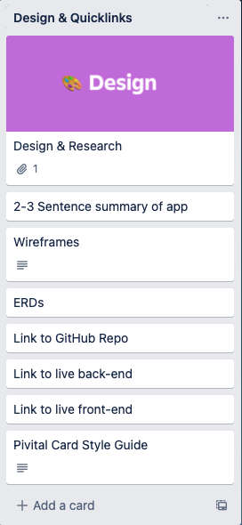
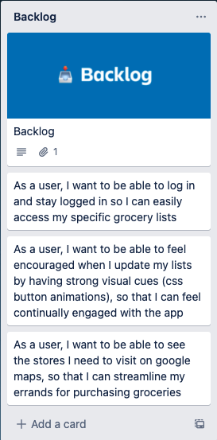
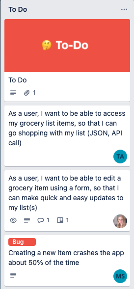
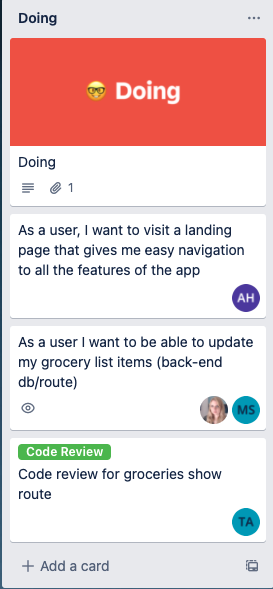
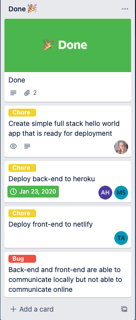
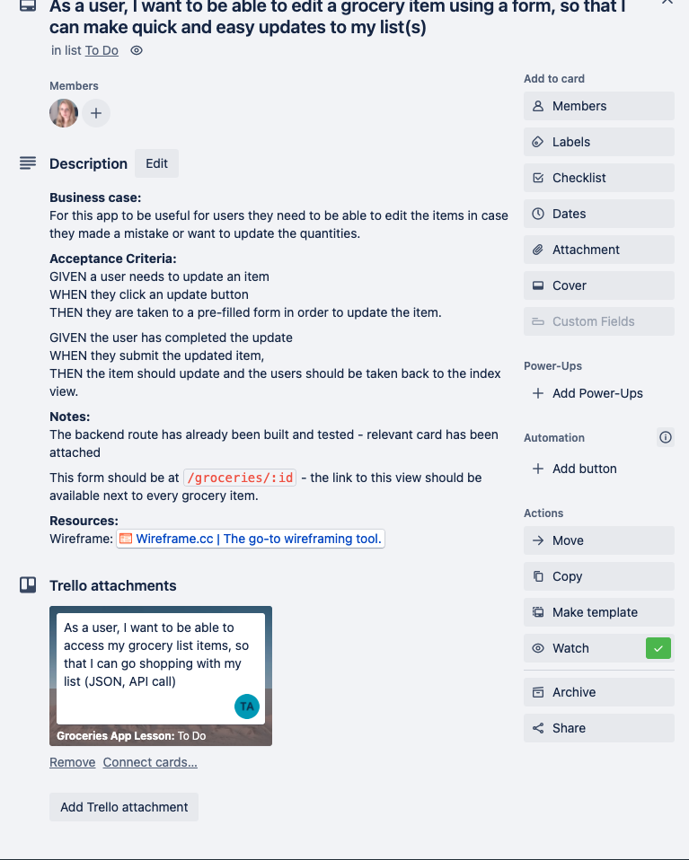
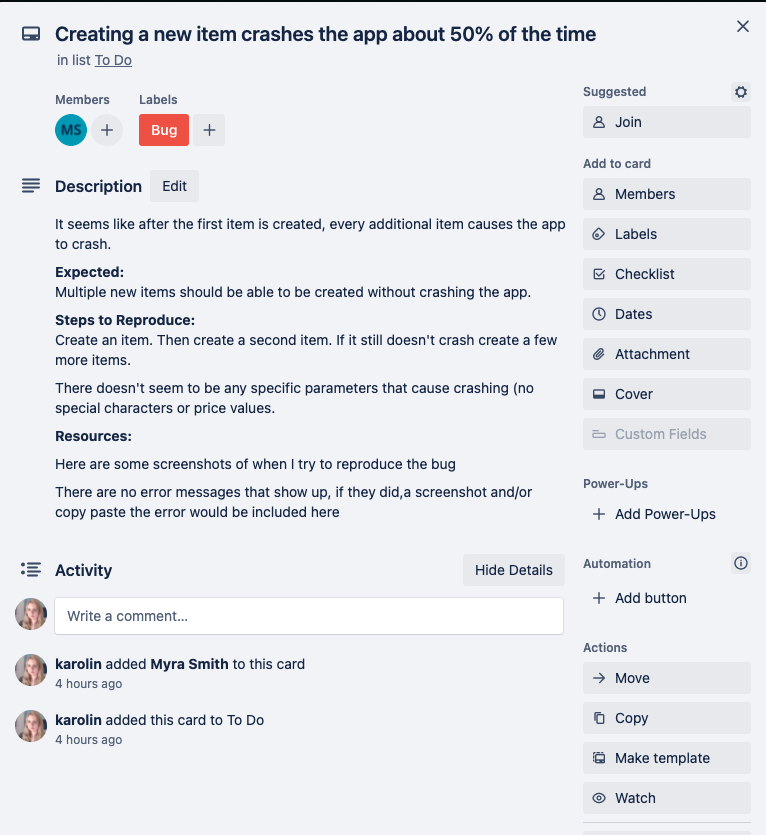
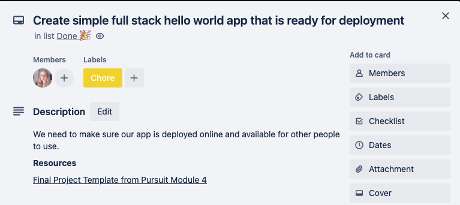
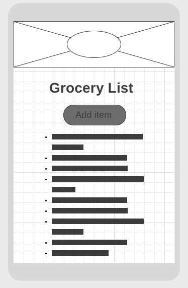

# Application Planning

Take a moment to think about an app you use often. What do you like about it? What features does it have? What feature(s) do you wish it had? Can you think of a competitor? What are the reasons you choose this app as your favorite over another?

Two reasons likely fall on everyone's list: the app's usefulness and ease of use.

So how can you ensure you're building an app that other people will find useful and enjoyable?

One often notable difference between a novice developer and a more experienced one is that novices tend to undervalue planning and often don't do enough of it.

It's easy to slip into a mentality where if you just learn to code better, faster, and keep writing more code, the rest of the pieces of your project will fall into place. And while this may help you start a project quickly, it is easy to get lost in your code and deliver an application that works well but is hard for a user to use.

Therefore, planning your projects before you begin coding can help you better achieve your vision for your app.

## Learning Objectives

By the end of this lesson, you should be able to:

- Understand the utility of stories and how to write your own
- Categorize stories according to priority
- Use a project management tool replicates this process within a web interface.
- Assign individual tasks to group contributors.
- Set clear categories of work to understand the current state of a story and when a story should be moved to the next category.
- Run a retrospective to determine if what was expected to get done got done.
- Understand the utility of wireframes and how to create your own
- Design a variety of low-fidelity mockups for an application using a free online tool.
- Design a variety of low-fidelity mockups for an application using pen and paper.
- Differentiate between different types of mockups and describe their purpose.

## The role of planning in a project

Applications at companies are massive. They have been built by groups of people over the years. Many factors go into what features should be made, prioritized, how quickly the features are needed, and more.

When you work for a company, there will be at least one person whose primary role will be to plan a project and ensure progress is going well.

Learning how to plan your applications and continually determine the next steps in a similar manner that is done professionally will help you with your personal projects and prepare you for your career.

Learning to be an effective planner and leader takes a lot of knowledge, practice, and skill. There are entire courses that cover the kinds of expertise needed. Today, we'll focus on two tools you can use immediately for your labs and projects: utilizing a project management tool and creating low-fidelity wireframes.

When creating something new, there is a lot of ambiguity to solve for. Take the time to think things through and come up with the best solutions. There are many situations where there are no perfectly correct answers. However, a good solution will have a solid list of pros and cons. If you are struggling to know what to write for a user story or wireframe, take a moment to acknowledge that there is likely still things that need to be resolved before you can continue. You should be working towards thinking a lot and writing little.

## User stories

One of the first things you can do to build a great app that people will enjoy is to write user stories.

User stories are a way to write about one or more features of an app in plain English. They also help non-developer teams understand the features being created and can help clarify the purpose behind a feature. They also can help bolster discussions on ambiguous goals and ensure alignment across people and teams.

User stories are typically written in the following format:

```
As a <type of user>, I want to <some goal>, so that <some reason>.
```

You can add detail by making the user stories smaller or more specific.

Let's look at a few examples:

- As a customer, I want to see my account balance to know how much money I can withdraw.
- As a school administrator, I want to be able to add new students to a school so that I can start enrolling them in classes.
- As a premium member, I want to see articles without an overwhelming number of advertisements so that I can focus on reading.

From the lens of the user, it is clear what you can do. From a developer's perspective, it is clear what kind of features need to be built; from a business perspective, it is clear what this feature solves. Good user stories are a clear and easy tool for cross-team discussions.

User stories can also be a way to generate meaningful conversations. For example, take a look at that first example again.

> - As a customer, I want to see my account balance to know how much money I can withdraw.

When first considering addressing this user concern, you may imagine building a view in the application where users can see their remaining balance. However, read that last part again: "_so that I know how much money I can withdraw."_ Instead of a simple balance, the user may want to also know how much they can withdraw in a day.

Conversations like this can help you build more innovative, engaging, and helpful user features.

### Trello

One tool that can be used for organizing these user stories is [Trello](https://trello.com/). Trello is an app that helps manage the work of big projects. Trello is made up of lists and cards. Cards should primarily be used to put individual user stories.

Putting time into your Trello board (writing the user stories, adding details, and creating frequent updates) helps you communicate with your team and improves your ability to work together. Time invested in Trello may feel like a lot of work upfront, but it will help your time excel at collaborating over time.

Even if you are working on your own, spending time on a Trello board can help you organize your thoughts, help you break down tasks into smaller pieces, and set daily goals so that your project feels more doable, and it can help you manage your time and priorities.

## Management tool components

There are numerous variations on the components - especially in terms of naming them. Here we'll introduce one set. On the job, you will see a number of variations.

For now, you will work with five lists:

- Design/Quicklinks
  - This is where you should attach links to your Wireframes, ERDs, and your brief description of your app - that way, everyone can easily find these assets. Later, you'll put these details/assets in the README.md of your app
- Backlog
  - Start by putting all your user stories here. This is a great way to help later organize what features are part of MVP (Minimum Viable Product) and what are bonus/stretch features.
- To-Do
  - As a team (or on your own), work through which user stories (features) meet MVP and narrow down which user stories will be built during this sprint.\*
- Doing
  - These are the user stories you/your team is currently (actively working on).
- Done
  - These are completed items. Rather than deleting them, they are stored for record-keeping purposes.

Here is an example Trello Board:


[Getting Started with Trello Docs](https://trello.com/guide)

[How to get started with Trello Video](https://www.youtube.com/watch?v=xky48zyL9iA)

> **Note**: A sprint is a short amount of time (typically 1-2 weeks) where the team chooses some features to build, checks in at the end, and then sets up a new sprint with new goals. For your work in this program, you may only make one sprint or have short 2-3 day sprints.

## Converting user stories to cards

Convert your user stories into Trello cards. You'll likely need to revise and refine your user stories as you do this step. This is a normal part of the process.

### Acceptable User Stories/Cards

- As a user, I want to visit a landing page so that I have access to easy navigation to the site
- As a user, I want to get a list of grocery items (JSON, API call), so I can see my grocery list
- As a user, I want to be able to edit a grocery item through a form, so I can keep my list accurate and up to date

These specific features should be easy to check whether the functionality exists. They are also small features that are possible to build within a short period.

### User Stories/Cards that Need Improvement

- Users
- Full CRUD on grocery items
- Submit button for Edit one grocery item

The first one is too vague. What do users mean? What kind of functionality? What does a successful implementation look like?

The second one is also vague - is that the front-end? Back-end? Both? How many user stories are in this one card? If this is front and back-end, is this a reasonable amount of work for a short period?

The final task is too small, and the feature functionality is unclear. Creating a button is very small and simple. Also, does it imply the ability to edit an item? How is the user interacting with this button?

## Trello Board in More Depth

Again, be aware there are numerous variations on how to set up a board. This is one example that will fit your needs in this course well.

### Lists

#### Design & Quick-links

This is a centralized list that should contain links to all the relevant assets of your project. Eventually, most of these assets should be added to a well-written README.md in the GitHub repository of your app.



#### Backlog

This is where all your user stories should be placed first. These are user stories you'd like to add to your project, but no one is currently working on them/there are no plans to work on them during this sprint.



#### To-Do

As a team, you will agree on what everyone will work on during this sprint (a short period where work will be reviewed, and then a new batch of work will be planned).



#### Doing

These are the items your team members are actively working on right now. This should be an accurate reflection of what members are working on. If someone is working on five features at once, they are likely unfocused and trying to juggle too much or not being realistic about what they are getting done.

A user story may be a collaboration of two or more members, and something may be on `to-do`, but only one person is working on it at a time. Make sure to talk with your team to clarify how things are progressing.



#### Done

Success! Victory! This list shows tasks that are completed by your team. It's a great way to keep track of all the things you've accomplished.



## Cards in More Depth

Not every task you'll have to work on is a user story. You can (and should) include two other common tasks in your Trello board. You can also use `labels` to denote that they are not user stories:


### User Stories Details

More details should be added to a user story to clarify the user stories.

Some common categories are

- Business case - clarifying the user story (if needed/not fully clear from the user story)
- Acceptance criteria - clarifying the steps the user will take and what should happen
- Notes - anything useful for your teammates to know
- Resources - the associated wireframe or anything else useful to know. In the following example, a Trello card attachment that has completed the work of the back-end could be helpful.



#### Bugs

Bugs are a defect in an existing feature. Bugs should only be fixed. If new parts are required, they should be included as new features.

##### Example:

**Bug:**

When purchasing items, the amount purchased adds to the total stock in the warehouse rather than subtracting it.

**Not a bug; this is a new feature request:**

A user can't see a list of items already purchased.

##### Completing the Trello Card for a Bug

When other teammates look into the issue, they need more information. Bug cards should also include

- A brief description of what is happening
- What is expected to happen
- The steps it takes to reproduce the bug
- Any resources (screenshots, error messages, stack overflow links, documentation links) used so far



#### Chores

These are necessary features but provide no direct and obvious value to the user. For example, Passwords should be encrypted.

##### Completing the Trello Card for a Chore

A further description and any resources available should be provided for chore cards.



### Retrospective

Building good applications is hard work. Each project will have things that go well and things that didn't go well. It's important to pause and reflect on the work so that you can do things a little bit better each time.

When you work by yourself, you can create a list of things you'd do differently the next time. It's important that your list is factual and not emotional. For example, recognizing you spent too much time on a bonus feature and not enough time on the main functionality is useful and something you can change for next time.

When you work on a team, it's also important to take time to discuss how things went. It's important to be open and learn. Remember:

- The goal of the meeting is to improve work and morale. Start by taking a moment to appreciate what was accomplished and acknowledge the work everyone put into things.
- Work should be professional, not personal. If someone gave feedback that a lot of your code didn't match the agreed-upon style guides, it doesn't mean they don't like you or appreciate your efforts. It means that you have a specific and actionable thing to work on for next time.
- Listen with an open mind because everyone's experience is valid. Give people the same space and attention you would like to be given.
- The past is the past. Blame typically does not solve problems. Rather, focus on improvement and S.M.A.R.T goals.

## Wireframes

Wireframes are simple sketches of your app, usually done on paper or with an app. The wireframe lays out the components' approximate size and location. Wireframes let all stakeholders agree on where information and visuals will be placed before developers build the interface.

Typically a designer or product owner would create these wireframes instead of a software developer. However, when building your applications, you will need to do this on your own.

Each page of your app should have a wireframe. You can plan your app further by associating a route with each view.

An additional benefit of a wireframe is that it should provide a guide to all your HTML elements. That way, when you build your HTML, it should require minimal changes later, which can decrease the amount of refactoring you need to do as you continue to develop your application.

### Types of Wireframes

There are roughly three levels of a wireframe:

- Low fidelity: these are just black-and-white sketches with almost no details (see below).
- Medium fidelity: these have more details, including styling and colors.
- Mockup: this is a full-fledged design with many specific details.

You are only expected to create low-fidelity wireframes for applications you are building for now.

#### Low fidelity wireframe example



This wireframe has the following elements:

- A heading that has a background image (i.e., a box with an x through it)
- A logo on top of the box (i.e., the circle on top of the image)
- A header that identifies what the user is looking at
- A button to add an item
- A bulleted list that represents a list

This wireframe is a good start to a single page. However, consider what happens when the user presses the add item button:

- Does a pop-up appear?
- Does it take the user to a new page?
- Does the form replace the title and button, and, on submit, revert?
- Where does the new item appear? At the top of the list or the bottom? Or are things always sorted in a specific way?

You have a lot of design decisions like this to make. Again, it is best to figure them out before coding is started.

### Templates

One thing to also consider when making your designs is if you would like to follow a template. That would mean that you create the 'outer' elements that will be reused on every page. Design elements like the header, footer, and navigation are things you often want to appear on every page.

When building your wireframes, consider making views that follow a similar pattern and reuse components from one page to the next.

## Further Your Understanding

Watch an expert draw and refine some wireframes to better understand the process [here](https://youtu.be/qpH7-KFWZRI).
