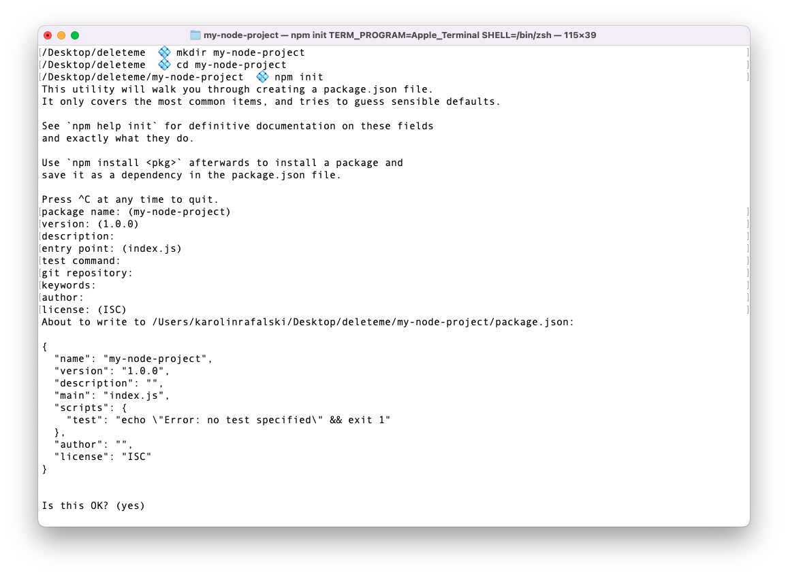

# ESM Modules

## Introductions

Technology is always changing. While fundamental concepts stay the same, best practices tend to change over time.

One such change is Node.js's introduction and likely eventual transition to ESM modules. As you may recall, Node.js let's you create modules simply by creating new files and then exporting the code. The old system of doing this is called CJS (CommonJS) and it uses the syntax `module.exports` to export things and `require()` to import.

The new way of creating modules with files uses the syntax `export` to export things and `import` to import. Noticeably, this syntax tends to be more easy to read.

## Learning Objectives

By the end of this lesson, you should be able to:

- Create a new node project and set it up to use ESM modules rather than the current default CJS
- Import and export modules using the ESM syntax

## Creating a Node.js project

> **Note:** When creating a new Node.js project, make sure you are not already inside a git repository. You can check by running `git status`. If you get the following message:

> > fatal: not a git repository (or any of the parent directories): .git

> Then you are NOT in a git repository and are ready to begin working.

You can either read the following steps or code along. A common struggle when starting out is the proper location and nesting of files and folders. Example instructions using terminal are provided to clarify where files and folders should go.

Node projects need a _top level_ folder:

- `mkdir my-node-project`
- `cd my-node-project`

Now that the _top level_ folder setup is complete. You can initialize a new npm project:

```
npm init
```

This will log a message similar to the following one in the terminal:

> This utility will walk you through creating a package.json file.
> It only covers the most common items, and tries to guess sensible defaults.

> See `npm help init` for definitive documentation on these fields
> and exactly what they do.

> Use `npm install <pkg>` afterward to install a package and
> save it as a dependency in the package.json file.

> Press ^C at any time to quit.

Take the time to read this message and see if you understand it. Some parts may not make sense yet. As you build and work with these projects, it will become easier to understand.

At the very least, you should take away that:

- You will see some prompts that guide creating a `package.json` file.
- You can type <kbd>Control</kbd>+<kbd>C</kbd> to quit any time.

Press <kbd>return</kbd> to accept the default or type something different for each prompt.

The terminal should look similar to the following:



For now, when running `npm init` you can press the <kbd>return</kbd> key repeatedly until you get your regular terminal prompt back. The default values are acceptable if you are learning or doing a tutorial. If you are working on a project that goes into your portfolio or will go into production, you would want to be more thoughtful about each value.

Remember, you can check out more documentation by typing `npm help init` or `man npm`. Both of these commands will load a manual for npm into your terminal. Make your terminal full-sized to be able to read the manual with ease. Additionally, to quit the view type the letter <kbd>q</kbd>. You can also go to the [documentation online](https://docs.npmjs.com).

If you look at the documentation, you may see the option `-y`. This means to select all the default options for the `npm init` command. This can make setting up a basic project for a tutorial or practice even faster.

## package.json

`package.json` is a file where the metadata for the project is stored. npm will automatically generate some of the fields. You can also edit this file manually.

You can verify that the `npm init` process has worked by checking the contents of your folder. You should see a `package.json` file.

While the contents of the `package.json` file look like a JavaScript object, they are not the same. Some key differences between a JavaScript object and JSON include:

- Double quotes around all keys
- Double quotes instead of single quotes whenever referencing a string value
- No trailing commas
- No comments are permitted

By default, the `package.json` file should look similar to the following:

```json
{
  "name": "my-project",
  "version": "1.0.0",
  "description": "",
  "main": "index.js",
  "scripts": {
    "test": "echo \"Error: no test specified\" && exit 1"
  },
  "author": "",
  "license": "ISC"
}
```

If you scroll back to the earlier screenshot and compare the output of running the `npm init` command and the contents of the file, you will see that they are the same.

### Editing a `package.json` file

You can edit the `package.json` file directly by opening the file in your code editor. You can change any of the keys or values at will. However, your JSON will need to be valid for it to run. For example, you could add your name as a value for the `"author" key:

```json
{
  "name": "my-project",
  "version": "1.0.0",
  "description": "",
  "main": "index.js",
  "scripts": {
    "test": "echo \"Error: no test specified\" && exit 1"
  },
  "author": "Cam Howe",
  "license": "ISC"
}
```

> **Note:** You must maintain proper JSON format, or your project will not run.

### Application entry point

Within an application, there has to be a starting point for the application to run. The `package.json` file defines this filename with the key `main`. According to the default `package.json` file, the entry point into the application is a file called `index.js`. You can create it by running the following command:

```
 touch index.js
```

Open this file and write a simple console log:

```js
console.log("Hello, Node.js!");
```

To run this program, type:

```
node index.js
```

## Modules

In learning to work as a developer, there are likely two surprising challenges that you have encountered: naming variables well and organizing your code.

Node.js allows you to organize your code into separate files. Each file is a module. Each module has its own scope for variables.

### Updating to the Latest Syntax

There is a newer syntax to import and export code between files.

To utilize it, you must update your `package.json`.

You must add the following line:

```js
  "type": "module",
```

It does not matter where you add this line within the `package.json`, as long as you maintain proper JSON structure.

### Exporting a variable

Create a new file called `messages.js`:

```
touch messages.js
```

```js
// messages.js
const message = "Oh, hai again!";
```

You will need to export this message to be able to use it in another file. You will use the `export` statement. The keyword `default` will allow you to rename the variable when you import it elsewhere.

```js
const message = "Oh, hai again!";

export default message;
```

You will use the `import` statement to import this module. When requiring your file, you will use the _relative path_ to the file:

```js
// index.js
import importedMessage from "./messages.js";

console.log(importedMessage);
```

<details><summary>Gotcha!</summary>

You must use the full file name for imports.

If you only use the file name:

```js
import importedMessage from "./messages";
```

The error message will say it cannot find your module and suggest you look up in a higher directory.

```
Error [ERR_MODULE_NOT_FOUND]: Cannot find module '/Users/karolinrafalski/dev/curriculum-pursuit/react/deleteme/pre-reading/messages' imported from /Users/karolinrafalski/dev/curriculum-pursuit/react/deleteme/pre-reading/index.js
Did you mean to import ../messages.js?

```

This is not a helpful error message. You must, instead, add the `.js` at the end of the file name.

</details>

> **Note**: If you forget to update your `package.json` to have `    "type": "module",`

You will get an error message similar to:

```js
import importedMessage from "./messages";
^^^^^^

SyntaxError: Cannot use import statement outside a module
```

#### Exporting and importing multiple variables

Add another variable to `messages.js`

```js
// messages.js
const message = "Oh, hai again!";
const anotherMessage = "Oh, goodbye again!";
```

In order to be able to export both these messages, the `export` statement would have to be set to an object.

```js
const message = "Oh, hai again!";
const anotherMessage = "Oh, goodbye again!";
export { message, anotherMessage };
```

To import these variables, go to `index.js`

This console.log will now be the entire object:

```js
// index.js
import importedMessage from "./messages";

console.log(importedMessage);
```

We can now access the original `message` with object destructuring.

```js
import importedMessage from "./messages";

console.log(importedMessage.message);
```

It is also possible to get the other object with destructuring:

```js
import { message, anotherMessage } from "./messages.js";

console.log(message);
console.log(anotherMessage);
```

You can also rename the objects. This can be helpful for shortening the names or creating new variable names that add clarity to the code.

```js
import { message as hello, anotherMessage } from "./messages.js";

console.log(hello);
console.log(anotherMessage);
```

```js
import { message as hello, anotherMessage as goodbye } from "./messages.js";

console.log(hello);
console.log(goodbye);
```

#### Exporting and importing functions

It is also possible to export and import functions. This will allow you write groups of functions that have related roles in the code base in their own files. By doing this, it will allow you to structure and organize your code to be maintainable as it grows.

```js
// messages.js

const customMessage = (message, name) => {
  return `${message} ${name}`;
};

module.exports = { message, anotherMessage, customMessage };
```

Import and call the function:

```js
// index.js
import {
  message as hello,
  anotherMessage as goodbye,
  customMessage,
} from "./messages.js";

console.log(customMessage("Nice to see you,", "Ava"));
```

### Exporting JSON

JSON can be integral to a project. However, the JSON format is very strict. If you want to export a JSON file, you must name it `.json`. You will not need to use the `export` statement, [but you will need to assert the datatype on import](https://nodejs.org/docs/latest-v16.x/api/esm.html#data-imports).

Create a file called `donuts.json`, then copy and paste these values into it.

```json
{
  "donuts": [
    {
      "id": 1,
      "name": "Glazed Donut",
      "price": 1.99,
      "description": "Classic donut with a sweet glaze.",
      "ingredients": ["flour", "sugar", "glaze"],
      "image": "glazed_donut.jpg"
    },
    {
      "id": 2,
      "name": "Chocolate Donut",
      "price": 2.49,
      "description": "Rich chocolate-flavored donut.",
      "ingredients": ["flour", "sugar", "cocoa powder"],
      "image": "chocolate_donut.jpg"
    },
    {
      "id": 3,
      "name": "Strawberry Donut",
      "price": 2.99,
      "description": "Delicious donut with strawberry filling.",
      "ingredients": ["flour", "sugar", "strawberry jam"],
      "image": "strawberry_donut.jpg"
    }
  ]
}
```

Import the JSON and log the value to confirm it has been imported:

```js
// index.js
import donuts from "./donuts.json" assert { type: "json" };
console.log(donuts);
```

## Creating a custom script

You can write your own scripts that will interact with terminal and have the ability to launch other applications.

Here is a simple script that prints `'I just ran my own script!'` to your terminal:

`echo 'I just ran my own script!'`

> **Note:** It is important to use single-quotes for this command.

We can make this script a little bit more complex. We can add the text to a `README.md` file by using `>>` to reroute the output from printing to terminal and into the file:

`echo 'I just ran my own script!' >> README.md`

> **Note**: If the `README.md` file does not exist, the above command will create it.

This command is often seen when you create a new repository on GitHub.

After testing that it works, add it to the `package.json`:

**package.json**

```json
{
  "name": "my-node-project",
  "version": "1.0.0",
  "description": "",
  "main": "index.js",
  "scripts": {
    "my-script": "echo 'I just ran my own script!'"
  },
  "author": "",
  "license": "ISC"
}
```

To run this script type:

`npm run my-script`

What happens? Does the text in the file get replaced by the new text? Or does something else happen? Run the command a few times to find out.
