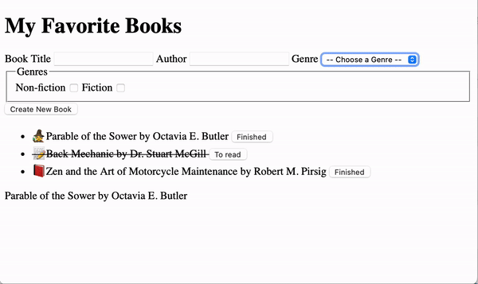

# Forms with Events

Forms and their various fields work a bit differently than other HTML elements. They store the data inside of them differently (not as `innerText`) and have different types of events they can trigger.

This lesson will teach you the basics of working with forms and events. First, you'll learn how to access the data from specific form fields. Then, you'll learn how to add event listeners to forms so they can do whatever you like instead of performing their default behavior.

## Learning Objectives

By the end of this lesson, you should be able to:

- Access data directly from form fields.
- Describe and utilize `event.preventDefault()` to stop the default behavior of certain events.
- Capture the data submitted in a form using the `name` attribute and the `event` object.
- Combine DOM knowledge to build a small CRUD application

---

## Getting Started

The following reading will help you complete the app so that it looks and functions like so



<details><summary>You may read along or use the following starter code to code along.</summary>

**index.html**

```html
<!DOCTYPE html>
<html lang="en">
  <head>
    <meta charset="UTF-8" />
    <script src="script.js" defer></script>
    <title>My Favorite Books</title>
  </head>
  <body>
    <h1>My Favorite Books</h1>
    <form>
      <label>
        Book Title
        <input id="title" name="title" type="text" />
      </label>
      <label>
        Author
        <input id="author" name="title" type="text" />
      </label>
      <label>
        Genre
        <select id="genre" name="genre">
          <option>-- Choose a Genre --</option>
          <option value="non-fiction">Non-fiction</option>
          <option value="fantasy">Fantasy</option>
          <option value="sci-fi">Science Fiction</option>
          <!-- ... -->
        </select>
      </label>
      <fieldset>
        <legend>Genres</legend>
        <label>
          Non-fiction
          <input
            id="genre-non-fiction"
            type="checkbox"
            name="genre"
            value="non-fiction"
          />
        </label>
        <label>
          Fiction
          <input
            id="genre-fiction"
            type="checkbox"
            name="genre"
            value="fiction"
          />
        </label>
        <!-- ... -->
      </fieldset>
      <input type="submit" value="Create New Book" />
    </form>
    <ul>
      <li>
        <span>🧙‍♀️</span>Parable of the Sower by Octavia E. Butler
        <button>Finished</button>
      </li>
      <li class="read">
        <span>📝</span>Back Mechanic by Dr. Stuart McGill
        <button>To read</button>
      </li>
      <li>
        <span>📕</span>Zen and the Art of Motorcycle Maintenance by Robert M.
        Pirsig
        <button>Finished</button>
      </li>
    </ul>
    <section>
      <p>Parable of the Sower by Octavia E. Butler</p>
    </section>

    <style>
      .read {
        text-decoration: line-through;
      }
    </style>
  </body>
</html>
```

**script.js**

```js
// double click to delete
function removeBook(element) {
  element.addEventListener("dblclick", (event) => {
    console.log("double-clicked");
    event.target.remove();
  });
}

// button to toggle read/to read
function toggleRead(element) {
  element.addEventListener("click", () => {
    element.parentNode.classList.toggle("read");
    let innerButtonText =
      element.innerText === "Read it" ? "Finished" : "Read it";
    element.innerText = innerButtonText;
  });
}

const books = document.querySelectorAll("li");
books.forEach((book) => {
  removeBook(book);
  const button = book.querySelector("button");
  toggleRead(button);
});
```

</details>

## Accessing data from form fields

Recall that to access the text inside most elements. You can use the `.textContent` property.

```html
<!-- index.html -->
<p>Parable of the Sower by Octavia E. Butler</p>
```

```js
// script.js
const p = document.querySelector("p");
console.log(p.textContent);
```

Form fields. Instead, to access the value of a form field, you should use the `.value` property. This will return the current value of the form field. In the case of text inputs, this means returning whatever has been typed inside the field.

```html
<!-- index.html -->
<label>
  Book Title
  <input id="title" name="title" type="text" />
</label>
```

```js
// script.js
const title = document.querySelector("input[type='text']");
console.log(title.value);
```

For dropdowns (i.e., `select` elements), `.value` will work as well, as long as your `option` elements include `value` attributes.

```html
<!-- index.html -->
<label>
  Genre
  <select id="genre" name="genre">
    <option>-- Choose a Genre --</option>
    <option value="non-fiction">Non-fiction</option>
    <option value="fantasy">Fiction</option>
    <option value="sci-fi">Fictionalized Autobiography</option>
    <!-- ... -->
  </select>
</label>
```

```js
// script.js
const genre = document.querySelector("select");
console.log(genre.value);
```

However, input types that can be "checked", such as radio buttons and checkboxes, will always return the same value. This is because a `value` attribute is associated with each input. Instead, you can use the `.checked` property to determine whether or not that input is checked. The `.checked` property will return a boolean value depending on whether or not the input is checked.

```html
<!-- index.html -->
<fieldset>
  <legend>Genres</legend>
  <label>
    Non-fiction
    <input
      id="genre-non-fiction"
      type="checkbox"
      name="genre"
      value="non-fiction"
    />
  </label>
  <label>
    Fiction
    <input id="genre-fiction" type="checkbox" name="genre" value="fiction" />
  </label>
  <!-- ... -->
</fieldset>
```

```js
// script.js
const nonFiction = document.querySelector("#genre-non-fiction");
console.log(nonFiction.value); //> non-fiction
console.log(nonFiction.checked); //> false
```

## Default behaviors

As you may have seen already, some elements have a default behavior. For example, links attempt to send the user to a different place, either on the same page or another page. Similarly, forms have the default behavior of sending a request. This typically leads to the page being refreshed when specific attributes are missing from the form field.

Some behaviors are undesirable when working with JavaScript on the front-end. Thankfully, it is possible to stop the behaviors using a method built-in to the `event` object: `.preventDefault()`.

`event.preventDefault()` does just what it says: it prevents the default event from being fired. For an example, look below.

```html
<!-- index.html -->
<form id="new-book">
  <label>
    Book Title
    <input id="title" name="title" type="text" />
  </label>
  <label>
    Book Author
    <input id="author" name="author" type="text" />
  </label>
  <input type="submit" value="Create New Book" />
</form>
```

```js
// script.js
const form = document.querySelector("form");
form.addEventListener("submit", (event) => {
  event.preventDefault();

  const title = document.querySelector("#title");
  console.log(title.value);

  const author = document.querySelector("#author");
  console.log(author.value);
});
```

In the JavaScript code above, the following is happening:

1. The form element is selected and assigned to a variable.
1. An event listener is added to the element. The callback function will run when the "submit" event is triggered.
1. Inside the callback function, `event.preventDefault()` is called. This stops the form from refreshing the page. If you use `event.preventDefault()`, you should always put it first in the event listener.
1. The values from the `#title` and `#author` inputs are logged out.

The `event.preventDefault()` method is commonly used with forms. However, it can be used with other elements like links and form fields.

## Accessing form data

In the previous example, each value was accessed from each form field. While it's possible to do this, imagine if your form had 10 or more fields; selecting each id would become tedious. There is a better way that is more DRY.

When submitting a form, accessing all form fields from the `event` object is possible. If a `name` attribute is added to the form field, a new property with that same name will be added to the `event.target` element.

```html
<!-- index.html -->
<form id="new-book">
  <label>
    Book Title
    <input id="title" name="title" type="text" />
  </label>
  <label>
    Book Author
    <input id="author" name="author" type="text" />
  </label>
  <input type="submit" value="Create New Book" />
</form>
```

```js
// script.js
const form = document.querySelector("form");
form.addEventListener("submit", (event) => {
  event.preventDefault();

  console.log(event.target.title.value); // Value of Book Title
  console.log(event.target.author.value); // Value of Book Author
});
```

If the name refers to multiple inputs, as would be the case with checkboxes or radio buttons, the property on `event.target` will return a node list. This can be looped through to access each value and "checked" status.

```js
const form = document.querySelector("form");
form.addEventListener("submit", (event) => {
  event.preventDefault();

  // A list of all checkboxes with the name "genre".
  const genres = event.target.genre;

  for (let genre of genres) {
    console.log(genre.value, genre.checked);
  }
});
```

## Using form data to create a new item

Firstly, when you submit the form, the old values stay. To clear the values so the form is ready for new input, add the method `reset()` to the form element.

```js
form.reset();
```

Next, you can add a new item using the vales to set the inner text. However, you cannot toggle whether the book was read or delete a book with a double click.

```js
const form = document.querySelector("form");
form.addEventListener("submit", (event) => {
  event.preventDefault();

  const title = document.querySelector("#title").value;
  console.log(title.value);

  const author = document.querySelector("#author").value;

  const ul = document.querySelector("ul");
  const li = document.createElement("li");

  li.innerText = `${title} by ${author}`;

  ul.append(li);
});
```

The first thing to note is that the `li` element is more than just text. You can create a template function to create the element with the values.

First, create the top element and then add the innerHTML with the specific values.

```js
function bookTemplate(author, title, genre) {
  const template = document.createElement("li");
  template.innerHTML = `<span> ${genre}</span>${title} by ${author}
 <button>Finished</button>
`;
}
```

Add the event listeners/handlers for updating and removing a book.

```js
function bookTemplate(author, title, genre) {
  const template = document.createElement("li");
  template.innerHTML = `<span> ${genre}</span>${title} by ${author}
 <button>Finished</button>
`;
  const bookButton = template.querySelector("button");
  toggleRead(bookButton);
  removeBook(template);
  return template;
}
```

Call this function in the form submit.

```js
const liTemplate = bookTemplate(author, title, genre.value);
```

Append the element to the unordered list.

```js
ul.append(liTemplate);
```

On your own:

- Write a function that converts the `genre.value` to an emoji.
- Look up how to prevent the form from being submitted if a selection is not made from the select menu and display an error message.

## Full code

> **Note**: No updates were made to the starting HTML

```js
const p = document.querySelector("p");
// console.log(p.textContent);

const title = document.querySelector("input[type='text']");
// console.log(title.value);

const genre = document.querySelector("select");
// console.log(genre.value);

const nonFiction = document.querySelector("#genre-non-fiction");
// console.log(nonFiction.value); //> non-fiction
// console.log(nonFiction.checked); //> false

const form = document.querySelector("form");
form.addEventListener("submit", (event) => {
  // Prevents form from refreshing the page
  event.preventDefault();

  // Gets values from form
  const title = document.querySelector("#title").value;

  const author = document.querySelector("#author").value;

  const genre = document.querySelector("select");

  // Selects elements to append new books
  const ul = document.querySelector("ul");

  // appends text only li
  // const li = document.createElement("li");
  // li.innerText = `${title} by ${author}`;
  // ul.append(li);

  // Creates template li with innerHTML and event listeners/handlers
  const liTemplate = bookTemplate(author, title, genre.value);

  // Appends li Template
  ul.append(liTemplate);
  // resets the form
  form.reset();
});

// Double click to delete
function removeBook(element) {
  element.addEventListener("dblclick", (event) => {
    event.target.remove();
  });
}

// create template for HTML elements inside li
function bookTemplate(author, title, genre) {
  const template = document.createElement("li");
  template.innerHTML = `<span> ${genre}</span>${title} by ${author}
 <button>Finished</button>
`;
  const bookButton = template.querySelector("button");
  toggleRead(bookButton);
  removeBook(template);
  return template;
}

// button to toggle read/to read
function toggleRead(element) {
  element.addEventListener("click", () => {
    element.parentNode.classList.toggle("read");
    let innerButtonText =
      element.innerText === "Read it" ? "Finished" : "Read it";
    element.innerText = innerButtonText;
  });
}

const books = document.querySelectorAll("li");
books.forEach((book) => {
  removeBook(book);
  const button = book.querySelector("button");
  toggleRead(button);
});
```
