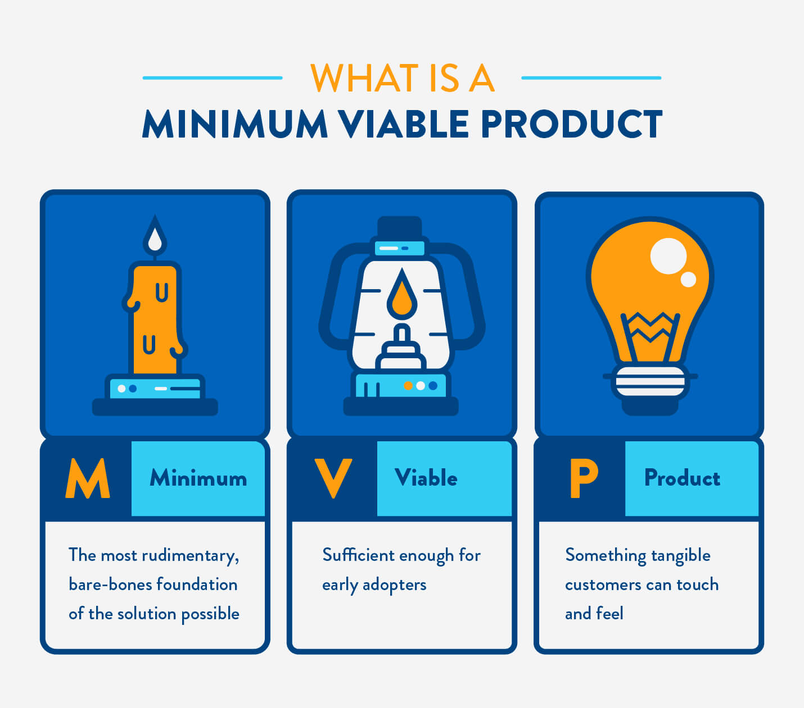

# Ideation and Problem-Solving

## Introduction

Learning to code has many challenges. One of the biggest challenges beyond fundamentals is learning to build large, robust applications that users enjoy using.

Another challenge is figuring out a new application idea. While you may have some ideas of apps you'd like to build for fun based on things that challenge and interest you, it's also essential to learn how to build apps that serve a population of people.

While you may not always end up in the role of thinking of new apps or feature ideas, becoming familiar with the process can help you become a better cross-team collaborator.

## Learning Objectives

By the end of this lesson, you should be able to:

- Identify a problem they experience or a problem that affects a community they care about.
- Brainstorm technological applications that would help solve the chosen problem.
- Research what existing applications and businesses are geared towards solving the chosen problem.
- Differentiate between different profit models for applications and choose one that applies to their chosen application.
- Determine if this app is generally safe to use
- Determine a monetization scheme for your app

## The Vision Comes Before The Skills

It may be tempting to think about what you know how to do and then build an app around the skills you have. This is very limiting and likely won't produce very good results.

Once you have programming fundamentals, your role as a developer will always be to learn what you need to fulfill a vision. A career as a developer is one of life-long learning. Learning how to learn and how you learn best on your own will be crucial to your growth.

> It's been really interesting because there have been some things that, when I dreamed it up, I wasn't technically good enough to figure out how to implement (animating svg paths on scroll, for example, I dreamed that up a year before I actually was able to implement it). But as time went and I worked on other things for fun, I would eventually learn enough to implement it.
>
> \- Shirley Wu

> I started with a design vision, then worked backward to figure out how to achieve it.
>
> \- Tony Chu

> I was introduced to D3 by first drawing a smiley face with just SVG... From then on, everything I was learning was driven by "I want to do X... now how do I do that?"
>
> \- Zan Armstrong

These quotes are from the article [How do you learn d3.js?](https://medium.com/@enjalot/how-do-you-learn-d3-js-ccffc151419b)

So, for now, put aside your coding skills, and let's shift to creating a great app idea because you are ready to build anything!

## Ideas vs. Ideation

You have ideas all the time. For example, you have ideas about what to eat for lunch, what you want to do when you see your friends, how to stop a door from squeaky, etc. Ideation is a more formal way of coming up with ideas.

## Inspiration Versus Ideation

We often hear success stories of someone sitting in the park when struck with a great idea. We tend to love and celebrate these stories. However, they tend to be the exception and do not tell the whole story of how the idea came about.

Most great ideas come from practicing the skill of brainstorming and spending scheduled time being creative, either on your own or with a group. Some great processes have been developed that you can learn and apply to start developing app ideas.

Before we start, let's be sure we understand some key terms and get a better sense of the big picture.

## The Economy and Industries

The economy has many components to it; one of the components is a collection of industries.

There are four types of industries:

- Primary: gathering of raw materials, such as agriculture, fishing, mining
- Secondary: manufacturing, such as making microchips, steel, cars, laptops
- Tertiary: service, such as teaching, nursing
- Quaternary - intellectual and research and development, such as information-sharing, entertainment

[A list of industries](https://www.ilo.org/global/industries-and-sectors/lang--en/index.htm)

As technology advances, the number of jobs in each type of industry tends to change. For example, thanks to the technology of E-ZPass in New York, the number of toll-booth workers declined, but the number of tech workers who maintain and update the system has increased.

What industries have you worked in? What kind of technology did you use when you worked in that industry? What type of technology did you wish your place of employment had? If you haven't worked yet and have only been in school, you can think about the experience of yourself and your teachers.

Lastly, it's important to remember that the economy is about people.

## The Steps of Product Ideation

Now that we have an idea of how far-reaching technology is across the economy, we can start putting all the pieces together to develop a great idea.

The tech you will be building for your project will have some sort of user interface. Even if you develop an idea for a touchscreen app for a microwave, you'll still make it a web app to demonstrate the concept.

### Observation

Take time to think about your everyday life that could be improved, simplified, or more enjoyable. Perhaps you've had conversations with friends or family about specific products and their features.

Perhaps you have some interests, like deep sea fishing. Although you don't intend to go deep sea fishing, you like to read about it and watch programs about it. Perhaps there are problems that the deep sea fisherman has that you can think of a way to assist with.

Be sure to capture as many of these ideas as possible, no matter how small, whether or not they are related to tech. At this point, you are just gathering all the pictures.

### Customer Personas

Not every product is going to be made for everyone. There are specialized baby products that many adults have no use for. A young couple's needs differ from those of an older adult living alone.

And perhaps the problem that you identified that was most interesting to you was not something for you. Perhaps, you are not fond of dogs, but your friend has a dog walking business, and they have trouble figuring out how to schedule their time best. Perhaps, you don't have a lawnmower yourself, but you saw a news report that 70% of lawnmower owners forget to service their machines on a regular schedule.

Once you have your initial set of ideas from observation, think about who would benefit from your idea. You should now be able to narrow all the ideas you had into a smaller number of ideas that have more significant potential to become a business idea.

Your idea will become clearer and more robust as you think of specific users.

### Visualizing Your Idea

What will your idea look like? Is it a phone app? Is it a website? When will your customers interact with it? At home? At work?

Think of similar apps and what you like or don't like about them.

You should have chosen one idea to follow through with the next steps by now.

### Determine MVP

MVP stands for Minimum Viable Product. This is a product with the least amount of features needed to validate a product idea.

For example, you may build a shopping cart with an online store but not fully integrate actual ways to pay/place orders. It is enough to demonstrate how your app works and those additional features will be added later in development.

A real-world example is eBay. When eBay first started, people were in charge of paying each other, either by check, money order, or sending cash in the mail. Later, eBay integrated a unified payment system.

When you plan for your project, your instructor will help you narrow down your idea to something possible to build within your time frame.

### Plan Your Design

Creating a complex application takes planning and strategy. Having a clear vision of what you are building is also essential. If you aren't sure what you are trying to build, it won't be possible to succeed. Learning to plan and execute an idea is critical to success.

Before beginning a project, make sure you can answer the following:

- A summary of the idea
- Which industry does this app belong to?
- Who is this product for (customer persona)?
- What problem does it solve?
- Why is this problem significant?
- What are the customers currently doing to solve the problem?
- How does it compare to the alternatives?
- What tasks does the app perform to solve the problem?
- What are the expected outcomes?
- Will this app be
- A totally new idea (e.g., solves a problem for people living on Mars)
- An extension/new feature of an existing product/app (Uber does [last-mile](<https://en.wikipedia.org/wiki/Last_mile_(transportation)>) deliveries for prescriptions)
- A new version of an app that already exists but is significantly different (compare/contrast MySpace to FaceBook)
- Other (make sure you can clearly explain if it is other)

Now that you've gotten an idea you want to build out, you would take the time to make user stories, wireframes, and ERDs (if applicable). It's ok if you don't remember or perhaps have learned about them. We will go over them in a later lesson.

### An Example

There is a new food craze: soup for lunch. Unfortunately, canned soup doesn't have a lot of variety; buying soup from a restaurant every day is too expensive, and many people are too busy to figure out how to make their soup. Most people need help with getting simple recipes they could make and start enjoying soup!

- The industry this belongs to is the Service industry.
- This product is primarily for busy individuals who work somewhere where there is a microwave that they can use to heat their lunch.
- This solves the problem of helping people make their soup.
- People want to eat better, and soup is a healthy choice. Helping make soup easier to make will help people eat better.
- Customers are buying canned soup, spending too much on takeout, or repeatedly making the same bland soup.
- I searched the internet, and I didn't find any similar alternatives to a soup-building app.
- The app will have a list of 'classic' soups and a guide for people to choose their preferences (meat, vegetarian, vegan, spicy, etc.) and then walk them through creating their custom soups based on their choices.
- The expected outcome is that more people will start enjoying soup for lunch.
- This app is a new idea, but it could be an extended feature of one of the apps that does grocery delivery. It will generate a list of ingredients based on user preferences.

### Research

Before hiring a team of people and having them spend hundreds or thousands of hours building something, extensive research would be done. This is a separate field from software engineering.

For now, you will just use your own experiences to be the driver of building your idea.

## Safety

Will your app be safe to use on its own? If you were making a car sharing app, is just building the app sufficient?

Probably not, you'd need to, at least, find a way to confirm that everyone has a driver's license.

You would need to check whether the cars and drivers could get sufficient insurance.

What happens if someone used the service to rob a bank!? Would you be held liable?

How would you integrate background checks and verifying people's identities?

There is more to an app than just code and taking the time to consider safety aspects of your app are important if you want the app to potentially become a viable business idea.

## Monetization

When building an app as a hobby, you often only focus on the functionality. However, when you start building an app as part of a business idea, it is critical to consider how the app will make money.

Money is necessary for salaries, servers, legal services, etc. The larger the user base, the more services are typically required.

Below are some standard options.

### Your app sells something

Your app sells a product, and the site is what drives sales.

### Freemium

There is a free trial period, or a few limited features are free. But to use all the features, users would need to pay a one-time fee or buy a subscription. Some apps may not have any technical support for the free version.

### Ad-driven

Your app will have ads incorporated into it. The advertisers pay to have ads on your app. There may be a higher payment rate if you drive traffic to their site.

Users may be able to buy an ad-free (or limited ads) experience.

There may also be opportunities to sell user information.

### Subscription

Your app requires a monthly/yearly subscription.

### B2B - business to business

You provide a service for other businesses. For example, email marketing software - is created by a business for other businesses to buy and use.

### Open source

Your app is free to use and free for anyone to contribute. Any expenses come out of pocket by the developer(s). Rarely, some corporate sponsorship may be granted.

### Non-profit

You raise money through fundraising and, possibly, government grants. The fees you may charge are enough to cover your expenses.

## Further Reading

- [What is the economy?](https://www.ecnmy.org/learn/)
- [Industries and Sectors](https://www.ilo.org/global/industries-and-sectors/lang--en/index.htm)
- [The five steps of product design](https://www.beyonddesignchicago.com/the-5-steps-of-product-design-ideation/)
- [What does it take to build the right product](https://www.linkedin.com/pulse/what-does-take-build-right-product-meghna-rao-g/)
- [Minimum Viable Product](https://clevertap.com/blog/minimum-viable-product/)
- [Without a Foundation of Research, Product Development Falls Apart](https://distillery.com/blog/without-a-foundation-of-research-product-development-falls-apart/)

- [Y Combinator Startup Expo 2020](https://www.workatastartup.com/events/startup-career-expo-s20)
