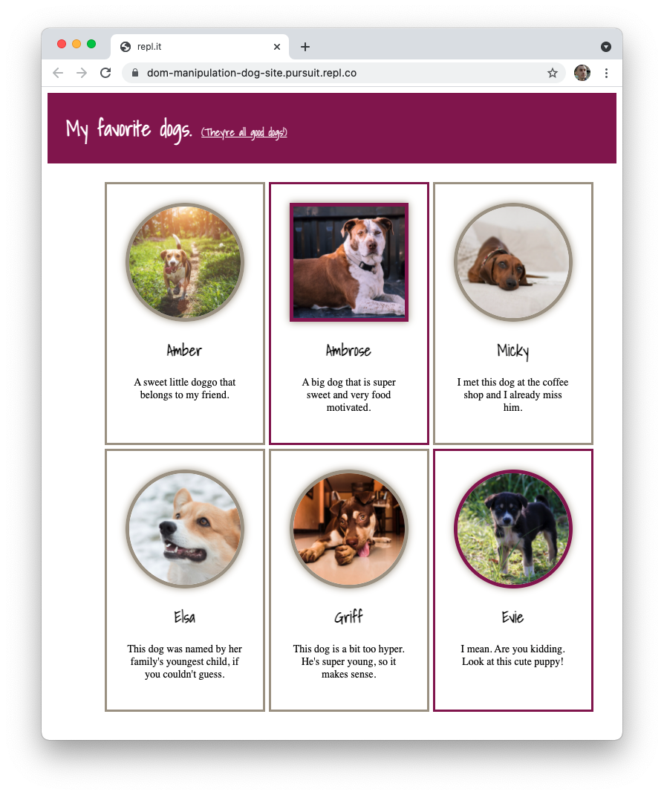

# Introduction to the Document Object Model

## Learning Objectives

By the end of this lesson, you should be able to:

- Understand how HTML can be drawn as a tree
- Relate HTML elements as parents, children, and siblings
- Define the DOM
- Explain what role the DOM plays on a web page
- Connect an external JavaScript file to an HTML file
- Explain what the attribute `defer` does and why it is needed
- Identify common DOM manipulation patterns:
  - query for an element
  - edit an element
  - add an element
  - remove an element

---

## Setup

Begin by forking the following Repl.it.

- [Repl.it: Dog Site](https://replit.com/@Pursuit/DOM-Manipulation-Dog-Site)

## Guiding questions

- The `document.createElement()` method will create a new element. What argument does the `.createElement()` take?

- There are at least four different methods that allow you to attach elements you've created to the DOM. What are those methods and how do they differ from one another? (If you don't remember them, what are some ways you can look them up?)

- In the repl, write code in the `script.js` file that adds a `span` element to the `h1` element currently on the page. The `span` element should come _after_ the text.

- In the repl, update your code so that the following text appears inside of the `span` element. What attribute can you use to set this text?

  ```
  (They're all good dogs!)
  ```

- Add the `underline` class to the `span` element you just created with JavaScript. Did you use `.setAttribute()` or `.classList`? Why?

- Create the following HTML structure with JavaScript before adding it to the `main` element.

  ```html
  <article>
    
    <h2>Amber</h2>
    <p>A sweet little doggo that belongs to my friend.</p>
  </article>
  ```

- Create another `article` element with the same structure as above. However, make the following changes:

  - Change the `src` attribute to be equal to `https://placedog.net/500/441`.
  - Change the name of the dog. Update the `alt` attribute and the `h2` element with the new name.
  - Change the description for the dog.
  - Add a class of "featured" to the `article` element.

- At this point, you likely have a lot of code that is duplicated. What are some of the issues with having so much duplicated code?

- Can you create any helper functions that would help DRY up this code? Create at least one helper function now.

- Take a look at the following array which contains a single object. As you can see, much of the data that is variable has been removed and placed in this object.

  ```js
  const dogs = [
    {
      name: "Amber",
      description: "A sweet little doggo that belongs to my friend.",
      imageNum: 450,
      featured: false,
    },
  ];
  ```

  First, begin by adding a new object to the array above that includes the name, description, and image number (i.e. `441`). Finally, set the `featured` key to be equal to `true`.

  Next, loop over the array. Inside of the loop, use the code you've written to create both of the articles. You can do so by substituting your hardcoded values (e.g. "Amber") with the values accessed via the object.

- Reflect back on what you've just accomplished. What was difficult about it? What benefit did you get?

- Add at least one more dog to the array and watch as your list of favorite dogs grows.

  

## Setup

Begin by forking the following Repl.it. Replace "Your Name" with your actual name and input your birthday. (Don't worry, no one else will be looking at this.)

- [Repl.it: Nameplate](https://replit.com/@Pursuit/HTML-CSS-and-JS-Nameplate#index.html)

## Guiding questions

- Connect the `script.js` file to the `index.html` page by adding a `script` element. What attributes are needed on the `script` element to do this?

- Add the following line to your JavaScript file. After clicking the "Run" button, does it log? (If not, check to make sure your `script` element is correctly formatted.)

  ```js
  console.log("Just testing...");
  ```

- What does `document` represent?

- What data type is `document`? How do you know?

- What is the difference between `document.querySelector()` and `document.querySelectorAll()`? Keep in mind the following when answering this question:

  - What is the functional purpose of each method?
  - What is the return data type of each method?
  - What argument is expected for each method?

- What is the `defer` attribute and why is it necessary when writing JavaScript that accesses the DOM?

- In your JavaScript file, use `document.querySelector()` to select the `h1` element. Then, log out the text that is stored inside of that element.

  What attributes will allow you to select the text inside of the element?

- What is the difference between the following two lines of code?

  ```js
  document.querySelector("main").innerHTML;
  document.querySelector("main").textContent;
  ```

- Using `document.querySelector()`, select the element with a class of `emoji`. What emoji is selected? Why?

- Is it possible to select the second emoji on the page with `document.querySelector()`? If so, how? If not, why not?

- Select all of the emojis on the page with `document.querySelectorAll()`. Then, loop through the returned value and log out the content of each element.

  How did you choose to loop through the `NodeList`?

- Write code that removes all of the emojis from the page. Why must you use some kind of loop to do this?

- What code could you write that would remove _only_ the second emoji from the page? If possible, think of multiple ways to perform this task.

- Based on what you know so far, is there a way to remove only your birthday from the page, excluding the text "My Birthday:"? If so, how so? If not, why not?
