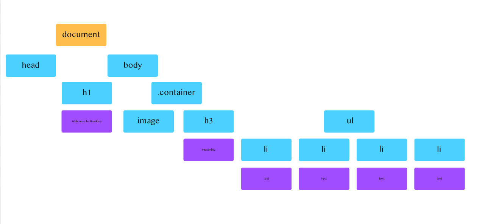
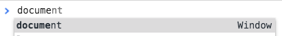
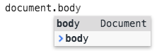
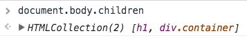
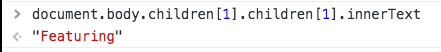
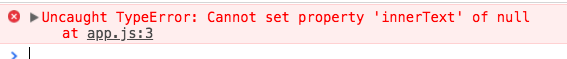
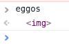
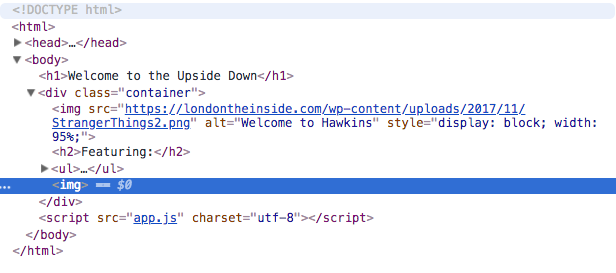
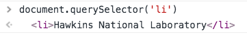
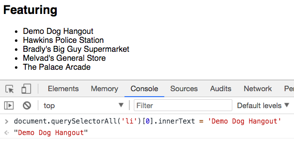

# Introduction to the Document Object Model

## Learning Objectives

By the end of this lesson, you should be able to:

- HTML as a Tree
- Relate HTML elements as parents, children, and siblings
- Define the DOM
- Explain what role the DOM plays on a web page
- Connect an external JavaScript file to an HTML file
- Explain what the attribute `defer` does and why it is needed
- Identify common DOM manipulation patterns:
- query for an element
- edit an element
- add an element
- remove an element

---

## HTML as a tree

Look at the following HTML:

```html
<!DOCTYPE html>
<html lang="en">
  <head>
    <meta charset="UTF-8" />
    <title>Hawkins, Indiana</title>
    <script src="app.js" charset="utf-8" defer></script>
    <link rel="stylesheet" href="styles.css" />
  </head>
  <body>
    <h1>Welcome to Hawkins</h1>
    <div class="container">
      
      <h2>Featuring</h2>
      <ul>
        <li>Hawkins National Laboratory</li>
        <li>Hawkins Police Station</li>
        <li>Bradly's Big Guy Supermarket</li>
        <li>Melvad's General Store</li>
        <li>The Palace Arcade</li>
      </ul>
    </div>
  </body>
</html>
```

> **Note**: If the image is broken, there is a copy in the lesson assets folder called `stranger-things`, or you can use a search engine to find a similar image.

You can see that there is a hierarchy among the elements. Some elements are children. Some are parents. Some are siblings.



The orange is the top-level `document` or the root. As you look at this image, you can see it looks like an upside-down tree. All web pages start with `document` as the top-level object. From there, you can see `document` has two children, `head` and `body`. Each element that can be branched off to have children is also known as a `node`. You can keep traversing down until the purple elements, which are text or `leaves` (they cannot be branched off of anymore).

## The DOM

This structure can be represented as an object, and this object is called the `Document Object Model` or DOM for short.

When a webpage loads, two things happen, the graphical representation of the HTML is loaded, and that's what the browser sees. But also, behind the scenes, the HTML is also loaded as an object.

You can code along or follow along. If you created a new project and added the above HTML to it, you can do the following:

Open the Chrome developer console directly with <kbd>command</kbd> <kbd>option</kbd> <kbd>j</kbd>. Alternatively, you can open the developer inspector tool and click on the console tab.

- Type `document`, and you'll see the document hint pop up:



Then you can access the body key in the object:



Then the children of the body:



And then access the inner text of the `h2` element:



You may notice two things:

- The document is an object that has a lot of nested objects with a lot of properties.
- This way of accessing elements in the DOM is very fragile. If you wanted to move the `h2` into the `div` with the class `container`, the console code would break.

Instead of accessing elements through dot notation, the `document` object has many built-in methods to help you access the elements you want.

One method is called `querySelector`. You pass it the name of the element you'd like to select as a string.

```js
document.querySelector("h1");
```

Once you've accessed the element, you can change its inner text. When you press enter, you should also see the text on the webpage itself change:


## Connect a JavaScript file to your HTML page

While the developer console is a great tool, ultimately, you'd like to build JavaScript functionality into a file you can edit and maintain.

> **Note**: While many coding languages exist, only JavaScript can be used to manipulate web pages. JavaScript was initially invented for this purpose. Since its invention, it has grown to have many other uses.

To connect a JavaScript file to an HTML file, you must use a `script` tag with an attribute of `src` (short for source):

```html
<script src="app.js"></script>
```

Using the autocomplete feature in your text editor may also add an attribute of `charset`. You can keep this default in place.

Add a console log to your `app.js` file to confirm that your files are connected.

```js
console.log("Hello from the app.js file!");
```

Refresh the `index.html` file in your browser. Where do you expect to see this `console.log`?

Notice you are not using Node.js to run the JavaScript right now. Instead, you are using the browser. Because of this, your console log should appear in the developer tools.

Now add the code you wrote above to your `app.js` file:

```js
document.querySelector("h1").innerText = "Welcome to the Upside Down";
```

You will likely get an error similar to the one below:



This is because you are querying for the `h1` element before it has loaded onto the web page. In this case, your `app.js` code is loaded first. You need a way to defer the code from running right away.

You can add a defer attribute into the script tag to do that.

```js
<script src="app.js" defer></script>
```

When you reload the `index.html` page, it should update the `h1` text without error.

## DOM Manipulation

There are four basic things to do with DOM elements:

- Create a new element
- Read elements (query or select them)
- Update an element
- Delete an element

This list should appear familiar to you. The pattern of CRUD actions will continue to appear in many things you'll be building.

### Query and store the element in a variable

You'll often want to query an element and do something with it. In this case, storing it in a variable is a good choice.

```js
const image = document.querySelector("img");
```

Log to confirm you have successfully stored it.

```js
console.log(image);
```

### Changing CSS with JavaScript

You can now manipulate our image:

Make it disappear:

```js
image.style.display = "none";
```

Make it reappear:

```js
image.style.display = "block";
```

Make it black and white:

```js
image.style.filter = "grayscale(100%)";
```

Set the width to 95%:

```js
image.style.width = "95%";
```

Finally, reset the default to make it color again:

```js
image.style.filter = "";
```

There are tons of different things you can do. The critical thing to note is how easy it is to reuse and manipulate a queried element when you store it in a variable.

## Creating an element

You can create a new element. Try a new image:

const eggos = document.createElement('img')

Where is it?

In Chrome console, but not in the DOM:



Although you created the element, you haven't appended it anywhere to the DOM.

Add those eggos to the `div` with a class `container`.

```js
document.querySelector(".container").appendChild(eggos);
```

YOU can see the tag is appended after the `ul` in the Chrome console:



But it has no attributes. You have to give it an `src` attribute with an image.

### Set an attribute

Many elements have attributes. You can add, edit and remove them using JavaScript as well.

```js
eggos.setAttribute(
  "src",
  "https://i.ytimg.com/vi/TgSmPqMGk2g/maxresdefault.jpg"
);
```

**Note**: If the image is broken, you can use the one in this lesson's `assets` folder or use a search engine to find another image.

Oh! The image is huge. Shrink them down a bit.

```js
eggos.style.width = "100%";
```

You could also target this element and style it in a CSS file. When would you use one strategy over another?

### Remove an element

Removing an element from the DOM is easy:

```js
eggos.remove();
```

### Working with a collection

You can also work with a set of elements. Try working with the list of items.

```js
document.querySelector("li");
```

Notice you only got the first element.



You have to use a different method to get all the elements.

```js
document.querySelectorAll("li");
```

Now you get a `NodeList`. A `NodeList` is similar to an array, but not quite. You will have some minor differences. Most notably, not all the array methods will be available to you.


This list is like an array - So you can access the first li ("Hawkins Laboratory") and change its text to "Demo Dog Hangout"

```js
document.querySelectorAll("li")[0].innerText = "Demo Dog Hangout";
```



Hopefully, all those drills of accessing objects and things within the objects are helping you understand how to access the DOM and where this practice can be applied practically.

Try a different one:

```js
document.querySelectorAll("li")[4].style.color = "hotpink";
```

What did you change?

Last one: Remove Melvad's

When you remove it, will The Palace Arcade lose its new color?

```js
document.querySelectorAll("li")[3].remove();
```

### Appendix

#### Common 'Vanilla' JavaScript DOM Commands

DOM commands fall into a few broad categories:

- Search/retrieval of elements on the page
- Creating new elements
- Editing the DOM
- Traversal (related to search) - navigating the DOM

You will only need a small handful of these commands for now. Here is a sample:

#### Create

- document.createElement()

#### Append

- node.append()
- node.prepend()
- node.before()
- node.after()

#### Search/Query/Read

- document.querySelector()
- document.getElementById()
- document.getElementsByClassName()
- document.getElementsByName()

#### Editing

- node.appendChild()
  - appends the child to the node
- node.removeChild()
  - removes the child from the node
- node.innerText
  - either gets or sets the the innerText of the node
- node.setAttribute()
  - sets an attribute on an HTML element
- node.removeAttribute()
  - removes an attribute from an HTML element
- node.classList
  - Methods specifically for manipulating classes
    - classList.remove()
    - classList.add()
    - classList.toggle()
- node.innerHTML
  - either gets or sets the innerHTML of the node
- node.id
  - either gets or sets the id of the node

#### Traversal

- node.parentNode
- node.childNodes
- node.children
- node.firstChild

> **Note**: `node` is a generic term for any HTML element/DOM object.
