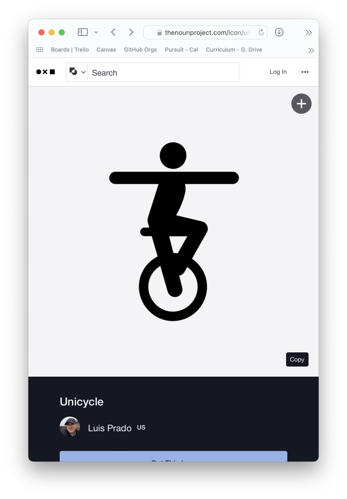
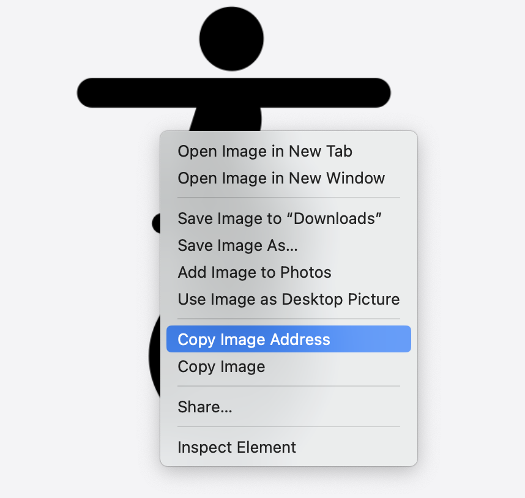

# Introduction to HTML and Web Applications

So far, you've built applications to be used in the console. Now, it's time to learn to make an application for the web.

Web pages are made up of three components:

- HTML (**H**yper**t**ext **M**arkup **L**anguage), which sets the content of a webpage.
- CSS (**C**ascading **S**tyle **S**heets), which sets a webpage's style (appearance).
- JavaScript, which sets the functionality of a webpage.

First, you'll learn HTML and how to create the content of a web page. Then you'll learn how to style the content. Finally, you'll learn how to use JavaScript to add functionality to a web page.

## Learning objectives

By the end of this lesson, you should be able to:

- Describe the role HTML plays in building web pages.
- Describe a brief history of HTML
- Describe the components of HTML boilerplate code.
- Differentiate between elements, tags, and attributes.
- Use common HTML tags to build a simple web page.
- Use common self-closing tags to build a simple web page.

---

## A brief history of HTML

HTML (**H**yper**t**ext **M**arkup **L**anguage) was first proposed in the early 1980s and was adopted in the 1990s for web browsers through HTTP (**H**yper**t**ext **T**ransfer **P**rotocol) . The initial intent of HTML was to be able to share scientific papers across academic institutions electronically. It has, since then, grown to serve nearly countless types of applications for the web.

Rather than sending a plain word document, HTML adds `tags` to documents that help define the text's role. For example, a paragraph would be wrapped with paragraph tags (`p` tags), and a `header` tag would define a header (like a title or name of a text subsection). An HTML `element` is the entire tag and its contents. For example, the following is an example of a paragraph element. Notice it has an opening tag and a closing tag:

```html
<p>Hello, world!</p>
```

This additional syntax helped define different parts of scientific articles to make them clearer to read and understand.

HTML was designed to be simple and easy for anyone to learn. The idea was that it should be accessible for anyone to create a webpage. This approach allowed the internet to be easily adapted by many people and grow relatively quickly.

## HTML documents

Each web page is an HTML document, and some key components are part of every web page. Your text editor can quickly generate these necessary components.

Feel free just to read or code along. Create a new file in the terminal. Ensure it has the extension `.html` and open it in your text editor.

```
touch index.html
```

Once you begin typing `html`, a helper menu should pop up. In VSCode, it will look like this.


Choose `html:5`. `html:5` is the latest version of HTML. This will add some `boilerplate` code to your file. Boilerplate code is often repeated and refers to the essential components required to start a new file or project.

Let's break down the different components of the boilerplate.

> **Note**: This boilerplate is subject to minor changes and can vary a little bit depending on your code editor and code editor preferences:

```html
<!DOCTYPE html>
<html lang="en">
  <head>
    <meta charset="UTF-8" />
    <title>Document</title>
  </head>
  <body></body>
</html>
```

### DOCTYPE

HTML is rendered in browsers. Browsers need some information about the file they are trying to render. One critical piece is the file extension `.html`, and the other is the doctype, which specifies the version of HTML. Currently, the latest version is 5. Adding this line will ensure your HTML is rendered with the latest features and specifications.

```html
<!DOCTYPE html>
```

### HTML

The following tag is `html`. Notice it has an opening `<html>` and closing `</html`> tag with several tags inside. Most HTML elements require opening and closing tags.

The opening tag also has some more information. It has an `attribute`. Attributes are key-value pairs separated by an `=` sign.

In this case, the `html` is being set to the language (`lang`) English (`en`). Websites are used worldwide, and specifying the default language is vital to help translate web pages and set other default properties.

```html
<html lang="en"></html>
```

**Note:** HTML does not throw errors if the tags are incomplete or incorrect. Instead, it will do its best to render what you have written. This can be both a good and bad thing.

### Head and body tags

Inside the `html` tags are two sibling components: `head` and `body`.

The `head` tag is where the metadata is stored. This contains information about the web pages and includes the title and favicon, the text, and the image appearing in the web page's tab. It can also have a lot more information that helps add style and functionality and can add critical information for SEO (**S**earch **E**ngine **O**ptimization), which is crucial information for a search engine like Google to determine how to index your web page in its search results.

The `body` tag is everything the user sees and interacts with inside the browser.

```html
<head></head>
<body></body>
```

### Common head tags

In the given example are two tags in the head tag.

One is a `meta` tag that sets the type of characters on the page for the website to render. Throughout the years, there have been many character standards. You may have heard of ASCII - which is an older standard. UTF-8 is the latest standard.

The other tag is a `title` tag. This is your webpage's title, and it shows up in the browser tab.

```html
<title>Bike shop</title>
```

```html
<meta charset="UTF-8" /> <title>Document</title>
```

### Common body elements

HTML elements are both descriptive and functional. They can contain paragraphs, navigation, images, lists, link anchors, and more.

Below are some examples of often-used HTML elements. It's essential to use the proper tags for the content you are building to maintain your project and guide your users through your page. Even though users may not see the tags you used, tags are often used to help inform what a web page is about and is used by accessibility tools like screen readers to improve the accessibility of your page.

#### Containers

Containers are meant to contain other HTML elements. Some examples are:

- `header` - typically contains things like the name of the website, the logo, today's date, and other top-level information.
- `nav`(igation) - typically contains links to other parts of the web page.
- `footer` - typically contains copyright information and links to the sitemap (about, contact, etc.).
- `main` - typically contains the main content of your web page, whether it is a blog, a new site, or an online store.
- `aside` - typically contains essential information that is tangential to the main content, like definitions of technical terms.
- `section` - typically used to break up a `main` tag into sections.
- `div` - a generic container when nothing else seems to fit.

Let's create a small webpage with some of these elements. Because these are all meant to be seen by the user, they will all go in the body tag.

```html
<body>
  <header>
    <nav></nav>
  </header>
  <main>
    <div></div>
    <section><article></article></section>
    <section><article></article></section>
  </main>
  <aside></aside>
  <footer></footer>
</body>
```

#### Text

Specific tags are designed to contain text. Some examples are

- `p` - paragraph tag, this one separates different paragraphs from each other
- `h1` - header, `h1` is the page's most important header. There are additional headers like `h2` and `h3`, which decrease in importance (think of newspaper headers, the biggest stories get the biggest headers). There are a total of 6 headers: h1 - h6.
- `span` - this tag goes inside another text tag and denotes particular text within the text.
- `em` - emphasis, the default appearance will be _italics_ and helps change the sentence's meaning: You _are_ late! vs _You_ are late!
- `strong` - also meant for emphasis. It is **NOT** meant to be used for styling. Instead, it is to help clarify the text.
- `code` - used to demonstrate a block of code.

Let's add some of these tags to the web page:

```html
<body>
  <header>
    <h1>Bicycles!</h1>
    <h2>The best bike shop in town<span>!</span></h2>
    <nav>home page</nav>
  </header>
  <main>
    <section><h3>Road Bikes</h3></section>
    <section><h3>Dirt Bikes</h3></section>
    <section><h3>Electric Bikes</h3></section>
  </main>
  <aside><code>if (bike) {console.log('yay!')}</code></aside>
  <footer>Contact <strong>us!</strong></footer>
</body>
```

Now we can view this page in a web browser. Navigate to the terminal and type.

```
open index.html
```


You'll notice that your web page looks quite plain and may even appear to look like it was styled in the 1990s. That's ok! HTML is only about the content of your web page. In a later lesson, you'll learn how to style it.

#### Links

You can link to other pages by using an anchor tag. The anchor (`a`) tag has an attribute called `href` (**h**ypertext **ref**erence).

By default, the value `#` means this page. You can use it as a placeholder until you know the address of what you want to link. You can link to other pages on your website, which can be a relative path like `/about`, or you can use an absolute path to direct someone to an external webpage by starting the link with `http://`.

```html
<a href="#">home page</a>

<a href="http://www.google.com">Google</a>
```

A link that has never been clicked will appear in blue with an underline. A link that has been clicked will appear purple with an underline. Using colors and text decorations can help users distinguish what is static on a web page and what can be interacted with. When you hover over an anchor tag, your cursor changes from a pointer to a hand.


##### Linking multiple pages

You can link multiple pages by following the folder structure.

Imagine if you have a website with the following 3 index pages. One top level `index.html` page that is the `home` page and then, two more `index.html` pages for cats and dogs. The file and folder structure would look like this:

```
.
├── cats
│   ├── index.html
│   ├── script.js
│   └── style.css
├── dogs
│   ├── index.html
│   ├── script.js
│   └── style.css
├── index.html (home page)
└── style.css
```

To link to the cats and dog pages on the home page, your anchor tags would look like this

```html
<a href="./index.html">Home</a>
<a href="./dogs/index.html">Dogs</a>
<a href="./cats/index.html">Cats</a>
```

To link, to the other pages from the cats page would look like this:

```html
<a href="../index.html">Home</a>
<a href="../dogs/index.html">Dogs</a>
<a href="#">Cats</a>
```

Notice that linking the pages follows the same file system pattern you have learned for navigating the terminal.

#### Self-closing tags

Some tags don't contain text or other content. Both of the break and horizontal line tags can be used to help improve the clarity of a web page:

- `br` - creates a break between text.
- `hr` - creates a horizontal line.

To use a self-closing tag, the forward slash goes into the tag right away:

```html
<br />
<hr />
```

Try to put either a **br**eak tag or a **h**orizontal **line** tag between the two anchor tags.

`img` is another self-closing tag. It has two attributes:

- `src` - the URL (path) to the image
- `alt` - the alternative text to show if the image does not load or if someone is using an accessibility tool.

You can search the [noun project](https://thenounproject.com) for simple and (relatively) small images to use.



This particular image is also stored in this lesson's assets folder. Open it in GitHub, then two-finger click to pull up a menu to copy the image address


And insert it into an image tag.

```html

```

For now, you can add the attribute `height="100` to make the image smaller.

> **Note**: image addresses can move and change anytime.

You can also download the image and store it on your computer. Make sure you place it in the same folder as `index.html`, and you can change the source to be a relative path:

```html

```


#### Lists

There are two common lists:

- unordered lists
- ordered lists

Both comprise the same inner elements **l**ist **i**tems or `<li>` tags.

The outer element will determine whether the list is a numbered list or a bullet list.

```html
<h4>How to ride a bike:</h4>
<ol>
  <li>Put on a helmet and other safety gear</li>
  <li>Get on the bike and go</li>
</ol>
```

```html
<h4>Best reasons to own a bike:</h4>
<ul>
  <li>Fun</li>
  <li>Cool</li>
</ul>
```

## Commenting out HTML

You can comment out code in HTML by using an arrow and dash syntax. The easiest way to do this is with the shortcut keys <kbd>command</kbd> <kbd>/</kbd>

```html
<!-- <h5> Comment out this code</h5> -->
```

## Final Code

### Image


### Code

```html
<!DOCTYPE html>
<html lang="en">
  <head>
    <meta charset="UTF-8" />
    <title>Bike Shop</title>
  </head>
  <body>
    <header>
      <h1>Bicycles!</h1>
      <h2>The best bike shop in town<span>!</span></h2>
      <nav>
        <a href="http://reddit.com">Home page</a>
        <br />
        <a href="http://www.google.com">Google</a>
      </nav>
    </header>
    <div>
      <h4>How to ride a bike:</h4>
      <ol>
        <li>Put on a helmet and other safety gear</li>
        <li>Get on the bike and go</li>
      </ol>
      <h4>Best reasons to own a bike:</h4>
      <ul>
        <li>Fun</li>
        <li>Cool</li>
      </ul>
    </div>
    <main>
      
      <section><h3>Road Bikes</h3></section>
      <section><h3>Dirt Bikes</h3></section>
      <section><h3>Electric Bikes</h3></section>
    </main>
    <aside><code>if (bike) {console.log('yay!')}</code></aside>
    <footer>Contact <strong>us!</strong></footer>
    <!-- <h5>Comment out this code</h5> -->
  </body>
</html>
```
