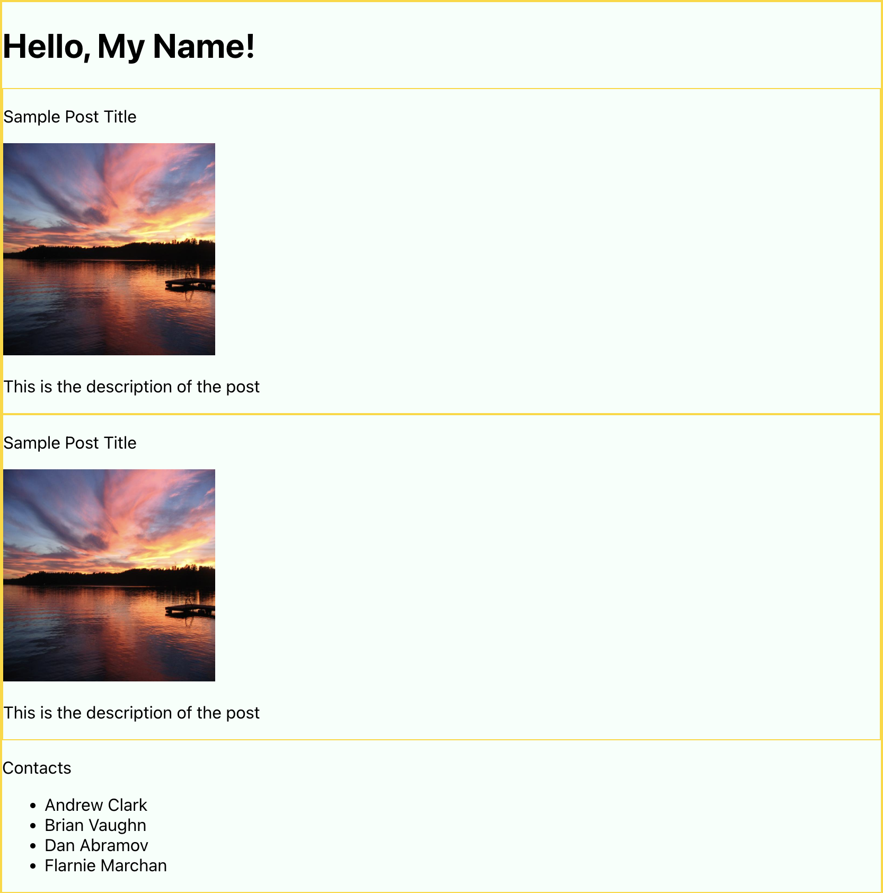
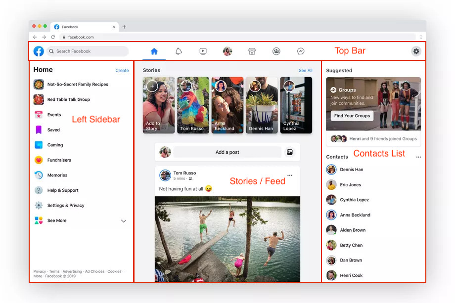
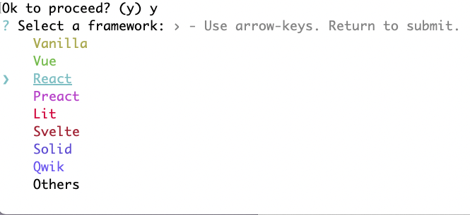
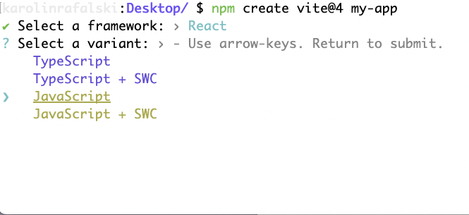
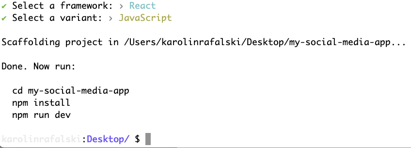
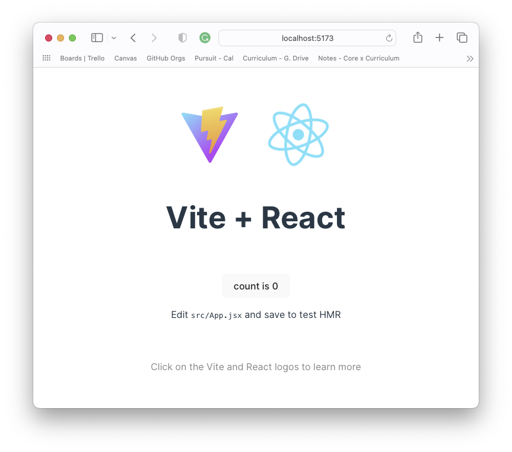
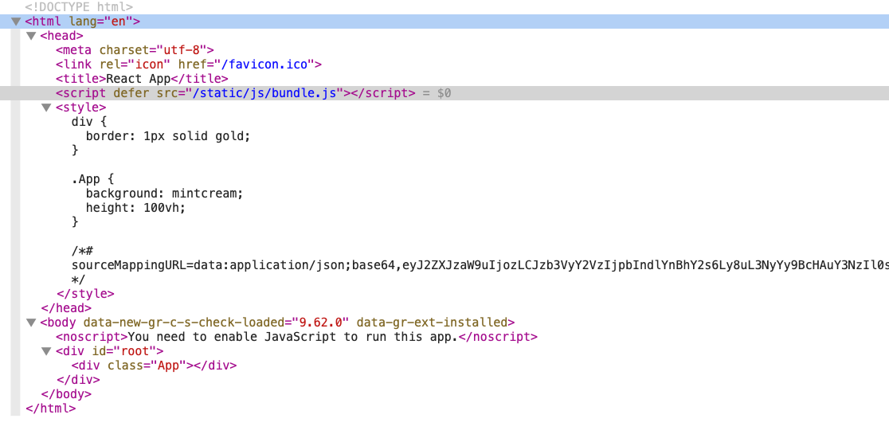
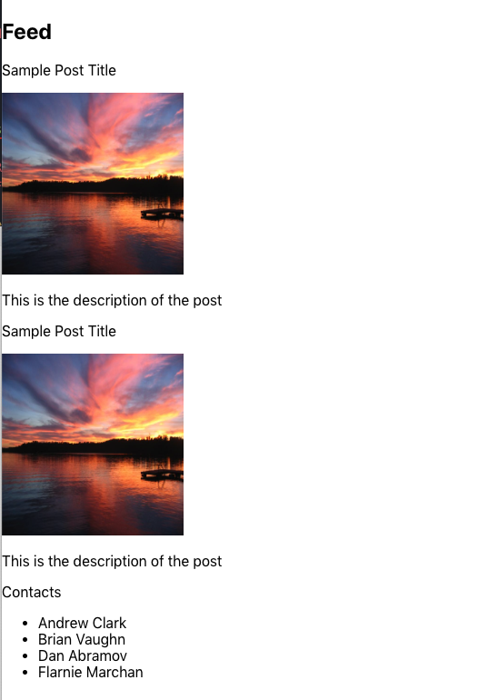

# Introduction to React

React is an open-source third party front-end framework that makes developing and maintaining large and robust front-end applications easier.

At first, there is a steep learning curve to learn the basics, but once you learn the patterns and understand the fundamental concepts it will become much more enjoyable to build with React.

## Learning Objectives

By the end of this lesson, you should be able to:

- Understand what React is and what problem it solves.
- Use Vite to start a React project.
- Understand the role of the files and folders in Vite starter code.
- Create a simple application that uses React to render its front-end.

<hr>

## Demo app

This is the full code for the examples in this pre-reading. You may try to code out the examples to learn or to use the final code as a reference. [link](https://github.com/pursuit-curriculum-resources/demo-intro-to-react)



## Motivation for learning React

You have built interactive web pages with Vanilla JavaScript (Vanilla refers to the built-in DOM manipulation functionality in a web browser). But there were some problems you likely encountered:

- The files became very large.
- The code was hard to organize.
- The lines of code were lengthy, and it could be hard to find what you were looking for.
- It was likely hard to update a small piece because all the surrounding code was particular to specific HTML element's `id`s and `classes` and thus had to be updated as well.
- It could be hard to create a reusable bit of code for all the reasons above.
- Creating logic to update multiple components likely led to [spaghetti code](https://en.wikipedia.org/wiki/Spaghetti_code).
- Updating the DOM could become slow and inefficient.

Other developers have shared these same pain points and decided to create a different approach to building front-end applications amd share them with others. These projects are called `third-party open-source libraries.` Open source software is free for anyone to use and free for anyone to contribute.

Typically, the first-party is you. The second-party is the client or employer you are working for. A third-party is a separate entity that will assist in some way.

A library is a collection of code that will assists you in building something. It can also be referred to as a framework.

You can compare your options to cooking a meal.

- You can make a meal from scratch - this gives you the most flexibility and control, but it also is the most time consuming. This is like coding an entire project from scratch.
- You can choose some items to be pre-made, like pasta, butter, or pickles. These are generic food items that someone else has made that help you speed up your cooking process, but these products don't have an opinion on what kind of dishes to you'll make with them. These items are like code libraries.
- You can buy some pre-made food like brownie mix or frozen dinners, these items have been made with a specific meal in mind. These items are like frameworks.

People tend to create third-party open-source libraries or third-party frameworks whenever code becomes difficult to manage or certain essential qualities are helpful in many projects.

React is a third-party library that you can download and use to make building robust websites easier. You will also use Vite which is an app that makes developing apps for web browsers easier.

## Introduction to React

React is a JavaScript library that was created by Facebook. Developers use React to build web applications' UI and front-end logic. Until now, you have been building UI by writing a single large HTML file, then linking it to a JavaScript file. The JavaScript file uses DOM manipulation to edit, add, and remove elements in response to user interaction. This approach has worked well for so far, but has some challenges when scaling to larger applications. Consider the following image:


There are at least four entirely distinct UI elements on the page, including:

- Top bar
- Left Sidebar
- Stories and feed section
- Contacts list

These are illustrated here:



With React, you will be able to organize the code for this kind of application by UI elements (components) in a more maintainable way. Each UI element will be its own component. Each component will have its own file, allowing for smaller files and better project organization.

## Virtual DOM

To handle the updates based on user interaction, React has a different approach than what you have done with vanilla JavaScript. React uses a **virtual DOM**. This DOM isn't the one you see on the page. The virtual DOM works behind the scenes. The virtual DOM keeps track of what to update in the real DOM. Whenever a React component changes, it updates the virtual DOM first. Then, the virtual DOM is compared to the actual DOM. React has algorithms that will only update only the necessary components of the page. This makes updates relatively fast or `reactive`.

## React in terms of code

You can begin coding in React by [Trying React](https://react.dev/learn) from the examples in the docs.

- Use an online playground like CodePen or CodeSandbox. These are useful for essential learning and experimentation: just like you used repl.it (or similar) at the start of your coding journey, this zero-configuration that works in any browser and on any computer and can be a great option to get started.
- You can add React to a website with script tags. This is another fast and easy way to try React.
- You can use a Vite (pronounced `veet`). This application has many useful basic configurations and features to help make your code ready for production.

There are numerous other ways to create a new React app. Many references you'll find are focused on creating production-level applications. While these rich resources are powerful, they are also needlessly complex for someone who is just starting out and building small demo applications. When you've mastered the fundamentals and are ready to build a production level app, you can take the steps to grow your knowledge to learn the additional things that go into a professional-level application.

In this unit, you will use Vite (pronounced `veet`) primarily for the following features:

- Automatic browser reloading when you make a change and other pre-configurations that make using it very easy.
- Helpful error messages.
- File and folder structure already configured for easy use and maintenance.
- Configured for easy deployment.

## Getting Started with React

Please feel free to read through or code along with the following code examples.

In the terminal, navigate to a convenient location on your computer and type:

- `npm create vite@4 my-app-social-media-app`
  - **create vite** allows you to start a new Vite project
    - Use the walkthroughs to select `React` and `JavaScript`
  - **@4** allows you to download version 4.x of Vite. Setting the version is helpful for class. Utilizing the same version will allow you, your instructors, and the class notes to have the same version to learn and study. If you don't include this, it will download the latest version, which may have some variations to what you see in class.
  - **my-social-media-app** this is the name of your project and the folder that will contain your Vite. You can name it anything you want.

Inside this project,run

- `npm install`

The flow should look similar to this







Then, you will see the following folders and files:

```
├── .gitignore
├── .eslintrc.cjs
├── vite.config.js
├── package-lock.json
├── package.json
├── node_modules/
├── index.html
├── public/
└── src/
```

> **Note** If node modules are missing, use `npm install` to install the needed packages.

To start the app, follow the instructions in the terminal. They should look like the following:

```
cd my-social-media-app
npm install
npm run dev
```

> **Note**: `npm run dev` may be `npm start` instead. You can always check inside `package.json`.

## Vite files and folders

This section will break down what each file and folder does. There is a lot of boilerplate code you will not need to use or change for labs, assessments, or even some projects for this course. However, they will be explained below so you can comfortably navigate the application.

> **Note** The only boilerplate file you will be heavily editing for your in-class builds is `src/App.jsx`.

#### `.gitignore`

This is a file that tells git which files to ignore. Not every file should be tracked or stored on GitHub.

An example is the file `.DS_Store`. `.DS_Store` is a Mac-specific file that tracks if files (or folders) have been moved or deleted. It allows for the functionality on a Mac computer to undo moved or deleted files. As helpful as this functionality is to you, it is not needed for a React application. Therefore it should not be tracked by git.

#### `.eslintrc.cjs`

This sets some common and best practices for formatting React. If you have a formatter in place, whenever you save, it will update your code to align with these rules, as best as possible. If you do not have a formatter installed, it will typically underline or highlight what it thinks you should correct so you can match the styles set here.

It's important to note that local configuration files like this will override any global rules you may have set.

You may also find the configurations here are too opinionated or don't suit your needs. This file is optional, and you may delete it, along with the `lint` script in the `pacakge.json`.

#### `vite.config.js`

This is a customizable configuration file for Vite to load React. For now, it is already set up for you. You could update it at a future time, if your needs change.

#### `package-lock.json`

This file keeps track of the files and folders inside the `node_modules/` folder. This file is automatically generated and maintained. You won't need to change any code here.

#### `package.json`

This is a file that contains metadata about this project.

Metadata is data about data. One of the most common examples of metadata is the data attached to a digital photograph. The data most people are interested in is the photograph. But it will also contain more data that is not visible in the picture - like the time the photo was taken, what device took the photo, the location and camera settings, and more - all of this hidden data is metadata.

The `package.json` is the metadata for this project. You can edit some of the content here (like adding an `author` field - so you can put your name in this project). However, you must keep the format in proper [JSON](https://developer.mozilla.org/en-US/docs/Web/JavaScript/Reference/Global_Objects/JSON).

### `node_modules/`

This folder contains many folders containing all of the code to run Vite and React. You can peek inside, but you won't need to change any code here. These files are determined by `package.json` and `package-lock.json`.

The top level dependencies like `react` can be found in the `package.json` file. React depends on numerous other packages: `package-lock.json` keeps track of all the other packages (and their versions) that React depends on (and the packages those packages depend on).

### `index.html`

This is the page that gets loaded into the browser. The React app will be loaded inside of the `div` with the `id` of `root`. You can change things here, like the title and favicon. However, you must always keep the `div` with the `id` of `root` and the `script` with the `type`, `module` and `src` set to `src/main.jsx`.

### `public/`

This is a folder that contains any public static assets. This folder is more important for production level applications that need to work in multiple browsers.

#### `vite.svg`

This is a [scalable vector graphic](https://en.wikipedia.org/wiki/SVG). It is simple and drawn using code, which allows it to scale to be smaller than a postage stamp, or as big as a billboard and never lose any loss of quality. This example is imported into `App.jsx` to demonstrate how to import and use one.

### `src/`

The `src/` folder (short for source) is where you will build your React application. All the code in this folder will be bundled to build your React application. If you try to add code or assets outside of this folder, they will not be able to be loaded into your React application (which will be loaded inside the `div` with the id of `root` from `index.html`).

There are several files here that demonstrate how to set up some common application elements, including:

#### `index.css` and `App.css`

These files demonstrate two different strategies for organizing CSS:

- `index.css` will apply styles to the whole app.
- `App.css` should be written to apply to styles for only the App component.

This allows you to organize your CSS in two different ways, which can help with organization and maintainability.

#### `assets/react.svg`

This example graphic is imported into `App.jsx` to demonstrate how to import and use a static graphic or image with React and Vite.

#### `main.jsx`

This is the file that is the entry point for the application. This will be the starting point of what is loaded into `index.html`.

You can see that `React,` and `ReactDOM` are added here (React can be run in other environments like a mobile device, which is why the DOM library must be loaded as well).

It loads the `index.css` file and the `App.jsx` component.

### App.jsx

If you have started the Vite app and it has loaded in the browser, you can see the contents of this file.

**Note** If a view has not opened in the browser, try going to http://localhost:5173



You can edit this file and see changes reload when you have saved the file. Try to edit the text `Vite + React` to something else; for example, `Vite + React is very cool!!!`

Now that you have oriented yourself inside Vite and have looked at some of the provided code examples, you can return to learning how React's syntax and strategy is different from vanilla JavaScript.

## Introduction to JSX

Look at the `src/App.jsx` file and look at it in the browser again. To the user, the React app looks like any other web page.

However, looking at `App.jsx`, you will note that some of this code doesn't look quite like HTML or JavaScript. It actually looks like a mix of the two.

This mix is called `JSX`, and it [extends the syntax of JavaScript](https://react.dev/learn/writing-markup-with-jsx). In short, it allows for creating dynamic HTML components in a syntax that is easy to read and update.

Simplify the `App.jsx` file so that you can focus on each line of code and understand what it does. The following code should give you a blank but functional web page:

```js
// src/App.jsx

import "./App.css";

function App() {
  return <div className="App"></div>;
}

export default App;
```

## Importing and using CSS

The top line imports and applies the CSS from the file `App.css`.

```js
// src/App.jsx
import "./App.css";
```

Go into `src/App.css`, remove the other CSS and add:

```css
/* src/App.css */

div {
  border: 1px solid gold;
}
```

This will add a gold border around every `div` in your application. Notice since the one `div` in your application is currently empty, it has no height.

Add some more CSS:

```css
.App {
  background: mintcream; /* if mintcream is too light you can try mistyrose or another color */
  min-height: 100vh;
}
```

This will add a background color and minimum height to the HTML element with a class of `App`.

Return to the `App.jsx` file. You will notice that instead of a `class` attribute in the `div`, there is a `className` attribute.

```js
function App() {
  return <div className="App"></div>;
}
```

This is because `App.jsx` is a JavaScript file, and class is a [reserved word](https://www.w3schools.com/js/js_reserved.asp). You must use the alternate `className` in your React app. However, if you open the developer tools, you will see that the React app does convert `className` to `class` for the browser. You can also see that your `App.css` file was compiled and added inside the browser inside a `style` tag.



## Using JSX

In `src/App.jsx`, below the `import` statement, add a simple and familiar expression:

```jsx
// src/App.jsx
const hello = <h1>Hello, world!</h1>;
```

Notice that this code is valid but doesn't load onto your page. Only elements inside the `return` statement inside the `App` function are rendered on the page.

Add the `hello` expression:

```js
return <div className="App">hello</div>;
```

This just added the word `hello` and not the expression.

The expression `hello` must be evaluated. To do that with `JSX`, one must wrap the expression in curly braces:

```js
return <div className="App">{hello}</div>;
```

This should seem familiar: with regular JavaScript, you could use string interpolation that used backticks \` and then curly braces with a dollar sign `${}` to evaluate an expression before turning it into a string. The syntax here is slightly different but effectively does the same thing.

[React JSX documentation](https://react.dev/learn/javascript-in-jsx-with-curly-braces) gives more examples of how JSX can be used. This time, call a function, `formatName`, in the embedded expression. The return value of this function, `My Name`, is then added to the `h1` element after `Hello`:

```jsx
// src/App.jsx
function formatName(user) {
  return user.firstName + " " + user.lastName;
}

const user = {
  firstName: "My",
  lastName: "Name",
};

const hello = <h1>Hello, {formatName(user)}!</h1>;
```

## Child Components

`App.jsx` is just one small component. However, if the goal were to build your own simple social media site, this file would quickly grow very large. One of the main features of React is the ability to create and render many components at a time in an organized and maintainable way.

Try to a new child component that `App.jsx` will import and render. This component will list some contacts.

First, create a file called `ContactList.jsx` inside the `src` folder.

> **Note**: The extension must be `.jsx` and not `.js` when you are creating a React component.

> **Note**: This code has some errors, which are important to understand and debug.

```js
// src/ContactList.jsx
function ContactList() {
 return
 <h2>Contacts</h2>
 <ul>
  <li>Andrew Clark</li>
  <li>Brian Vaughn</li>
  <li>Dan Abramov</li>
  <li>Flarnie Marchan</li>
 </ul>
}
```

You will first notice that your text editor probably triggered a lot of error messages when you added this component.

This is because there are some gotchas with JSX and JavaScript.

First, return statements can only return one line of code.

If you try to put all the code on one line, it becomes tough to read:

```js
function ContactList() {
 return <h2>Contacts</h2> <ul> <li>Andrew Clark</li> <li>Brian Vaughn</li><li>Dan Abramov</li><li>Flarnie Marchan</li></ul>
}
```

To return the expression as one line of code, but to also allow for formatting, you must wrap the expression in parentheses, and the opening parenthesis must start on the same line as the return statement, or else the return statement will return `null`.

```jsx
// src/ContactList.jsx
function ContactList() {
 return(
 <h2>Contacts</h2>
 <ul>
 <li>Andrew Clark</li>
 <li>Brian Vaughn</li>
 <li>Dan Abramov</li>
 <li>Flarnie Marchan</li>
 </ul>)
}
```

The next issue is that JavaScript functions can only return one thing. In the above code, `h2` and `ul` are sibling elements, and the expression attempts to return both. However, only one element can be returned. To fix this issue, everything must be wrapped in a single tag. You can use `<> </>`. This empty tag is known as a _fragment_ and is standard practice for rendering multiple elements in a single component if you don't want to use another HTML element (like a `div` or `section` tag) to contain them.

> **Note** You can have as many nested HTML or React components inside your component. Only the top level must be one component/HTML element.

```js
function ContactList() {
  return (
    <>
      <p>Contacts</p>
      <ul>
        <li>Andrew Clark</li>
        <li>Brian Vaughn</li>
        <li>Dan Abramov</li>
        <li>Flarnie Marchan</li>
      </ul>
    </>
  );
}
```

Returning to `App.jsx` file, you first must `import` the `ContactList` before being able to display the component.

```js
// src/App.jsx
import ContactList from "./ContactList";
```

Also, when a component is imported, the syntax is different than your `hello` expression. The component will be wrapped with HTML tags. They can have a closing tag or be self-closing:

```js
<ContactList> </ContactList>
```

or

```js
<ContactList />
```

If you are not putting any more components or HTML elements inside the component, self-closing tags are usually the best practice.

```jsx
// src/App.jsx
import ContactList from "./ContactList";

function App() {
  return (
    <div className="App">
      {hello}
      <ContactList />
    </div>
  );
}

export default App;
```

However, there is still an error with this code. This is because `ContactList` must be exported before it can be imported.

Return to the `ContactList.jsx` file and add `export default`:

```js
// src/ContactList.jsx
export default function ContactList() {
  return (
    <>
      <p>Contacts</p>
      <ul>
        <li>Andrew Clark</li>
        <li>Brian Vaughn</li>
        <li>Dan Abramov</li>
        <li>Flarnie Marchan</li>
      </ul>
    </>
  );
}
```

Forgetting to export is a common error.

## Duplicating Components

Now, build a feed that will mimic the main feed of a social media application. Like any social feed, this feed should be set up to render any number of posts.

This is where components become highly advantageous. A Facebook post will be the same format no matter who posts it. Different posts might include text, an image, or comments, but the template is the same every time. This allows the developers to create one template for a post and which allows data to be embedded into the template to create the posts dynamically. This strategy allows for automatic updates based on data rather than requiring developers to handcraft custom HTML for each update.

First, create some data. Create a file `data.js` inside the `src` folder:

```js
// src/data.js
const postData = {
  title: "Sample Post Title",
  imageLink: "https://www.stockvault.net/data/2007/03/01/100169/preview16.jpg",
  description: "This is the description of the post",
};

export default postData;
```

**Note**: Why does this file have an extension of `.js` and not `.jsx`?

Create another file, `Post.jsx`.

```js
export default function Post() {
  return (
    <div>
      <h3>Title</h3>
      
      <p>Description</p>
    </div>
  );
}
```

Import this to `src/App.jsx` and render it:

```js
// src/App.jsx
import Post from "./Post";
function App() {
  return (
    <div className="App">
      {hello}
      <Post />
      <ContactList />
    </div>
  );
}
```

There is only one `Post` component so far and it has hard-coded values.

Import the data and change the `Post` component below to use `{}` to embed values from the `postInfo` data. For now, that means all of the posts will have the same data. In later lessons, you will learn how to have the same component with different data.

> **Note** you can rename `postData` to `PostInfo` during import:

```jsx
import postInfo from "./data.js";

export default function Post() {
  return (
    <div>
      <p>{postInfo.title}</p>
      </img>
      <p>{postInfo.description}</p>
    </div>
  );
}
```

You can add more `Post` components to `App.jsx`

```js
// src/App.jsx

function App() {
  return (
    <div className="App">
      {hello}
      <h2>Feed</h2>
      <Post />
      <Post />
      <ContactList />
    </div>
  );
}
```



Now there are multiple `Post` components rendered on the page all at once. This is a very simple demonstration of how a component is reusable in React.

# Bonus: A deeper dive into React render

The previous examples demonstrated how you will build React components, but it may be worth learning more about how React works.

## `ReactDOM.render`

The `main.jsx` file is what is loaded into `public/index.html`'s `div` with the `id` of `root`.

```jsx
// src/main.js
const root = ReactDOM.createRoot(document.getElementById("root"));
root.render(
  <React.StrictMode>
    <App />
  </React.StrictMode>
);
```

Depending on the version (old, somewhat new, very new), you may or may not have your app wrapped in `StrictMode`.

> **Note** `React.StrictMode` is a special wrapper that enforces best practices for React and also will disallow older React syntax that will eventually become obsolete. It will also cause your components to render twice while in development: when you debug by adding console logs, you may notice things log twice, it might be caused by this wrapper. [Strict Mode](https://react.dev/reference/react/StrictMode#strictmode)

You can remove it to simplify this example:

```jsx
// src/main.jsx
const root = ReactDOM.createRoot(document.getElementById("root"));
root.render(<App />);
```

`ReactDOM.createRoot()` function accepts an argument that will be an existing DOM element where you want to load React. It uses vanilla JavaScript to find this element in the DOM (from `public/index.html`). It returns an object that has a method `render()`. Render will accept a single element like `App`, which will be the top level component loaded into the DOM.

Learn more about [Rendering Elements](https://react.dev/learn/conditional-rendering) from the official React documentation.

## Readings

- [React - Official Website](https://react.dev)
  - Old documentation (pre 2023) - [React - Official Website](https://reactjs.org/)
- [The Virtual DOM](https://www.codecademy.com/articles/react-virtual-dom)
- [Rendering Elements - React Docs](https://react.dev/learn/rendering-lists)

## Vocabulary

- Robust website/application
- Boilerplate code
- Virtual DOM
- Components
- React and React DOM
- render
- JSX
