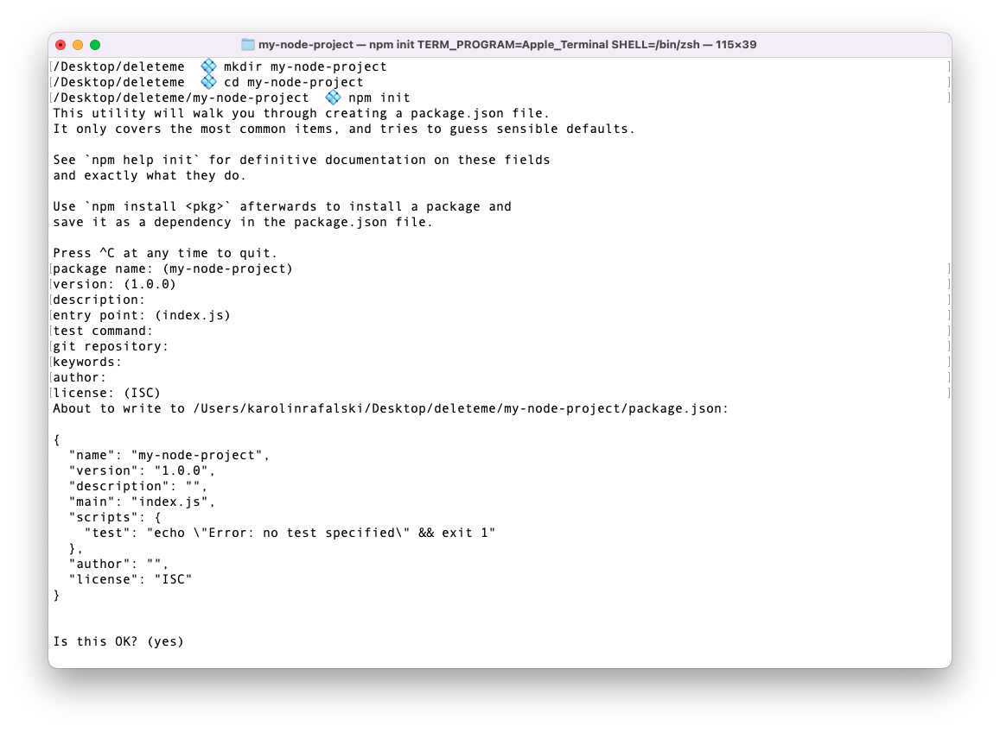

# Node.js and NPM

In the upcoming lessons, you'll learn more about how Node.js and how its package manager `npm` ([Node Package Manager](https://www.npmjs.com)) works.

You'll also move from building independent functions to building applications. Computer applications are programs designed to carry out specific tasks. For example, a web browser lets you browse the web. A calculator lets you make calculations, and your text editor lets you edit code.

To build an application, you'll need to learn how to make a user interface so that your application's user can interact with it. At first, the interface will be very simple: it will just be through the command line. But as this unit progresses, you'll begin building web applications allowing users to interact with your application through a styled view in a web browser.

Additionally, you'll learn how to organize your code by creating files and folders, to make small functions with a single purpose so that you can separate the concerns of your application, and how to put it all together so that you can run an application that feels seamless to the user.

When building applications, common issues need to be solved, for example, how to take user input, read and write data, or set up and use testing. Utilizing tools, libraries, and frameworks will allow you to build more extensive and robust applications.

## Learning Objectives

- Create a `package.json` file using the `npm` command-line tool.
- Describe the fundamental differences between a JavaScript object and JSON.
- Describe the importance and purpose of the `package.json` file.
- Import and export JavaScript data types from files using the `require()` function and `module.exports`.
- Access command line arguments through the `process` object.
- Explain how `process.argv` creates an interface for a user to interact with.

## Node.js versus NPM

It's essential to know that Node.js and npm are two separate programs. Node.js is what runs your JavaScript files, while npm manages metadata about the project and third-party libraries associated with the projects. It is possible to build a project that can be run by Node.js but doesn't use npm. It is not possible to use npm without using Node.js.

## Creating a Node.js project

> **Note**: When creating a new Node.js project, ensure you are not already inside a git repository. You can check by running `git status`. If you get the following message:

> > fatal: not a git repository (or any of the parent directories): .git

> Then you are NOT in a git repository and are ready to begin working.

You can either read the following steps or code along. A common struggle when starting is the proper location and nesting of files and folders. Example terminal instructions are provided to clarify where files and folders should go.

Node.js projects need a _top level_ folder:

- `mkdir my-node-project`
- `cd my-node-project`

Now that the _top-level_ folder setup is complete. You can initialize a new npm project:

```
npm init
```

This will log a message similar to the following one in the terminal:

> This utility will walk you through creating a package.json file.
> It only covers the most common items and tries to guess sensible defaults.

> See `npm help init` for definitive documentation on these fields
> and exactly what they do.

> Use `npm install <pkg>` afterward to install a package and
> save it as a dependency in the package.json file.

> Press ^C at any time to quit.

Take the time to read this message and see if you understand it. Some parts may not make sense yet. It will become easier to understand as you build and work with these projects.

At the very least, you should take away that:

- You will see some prompts that guide creating a `package.json` file.
- You can type <kbd>Control</kbd>+<kbd>C</kbd> to quit any time.

Press <kbd>return</kbd> to accept the default or type something different for each prompt.

The terminal should look similar to the following:



For now, when running `npm init`, you can press the <kbd>return</kbd> key repeatedly until you get your regular terminal prompt back. The default values are acceptable if you are learning or doing a tutorial. If you are working on a project that goes into your portfolio or will go into production, you would want to be more thoughtful about each value.

Remember, you can check out more documentation by typing `npm help init` or `man npm`. Both of these commands will load a manual for npm into your terminal. Make your terminal full-sized to be able to read the manual with ease. Additionally, type the letter <kbd>q</kbd> to quit the view. You can also go to the [documentation online](https://docs.npmjs.com).

Looking at the documentation, you may see the option `-y`. This means selecting all the default options for the `npm init` command. This can make setting up a basic project for a tutorial or practice even faster.

## package.json

`package.json` is a file where the `metadata` for the project is stored. npm will automatically generate some of the fields. You can also edit this file manually.

> Metadata is data about data. One of the most common examples of metadata is the data attached to a digital photograph. The photograph itself contains data to store/display the image: this is the data most people are interested in. But the photograph will also contain more data that is not visible in the picture - like the time the photo was taken, what device took the photo, the location and camera settings, and more - all of this hidden data is metadata.

You can verify that the `npm init` process has worked by checking the contents of your folder. You should see a `package.json` file.

While the contents of the `package.json` file look like a JavaScript object, they are not the same. Some key differences between a JavaScript object and JSON (**J**ava**S**cript **O**bject **N**otation) include the following:

- Double quotes around all keys
- Double quotes instead of single quotes whenever referencing a string value
- No trailing commas
- No comments are permitted

By default, the `package.json` file should look similar to the following:

```json
{
  "name": "my-project",
  "version": "1.0.0",
  "description": "",
  "main": "index.js",
  "scripts": {
    "test": "echo \"Error: no test specified\" && exit 1"
  },
  "author": "",
  "license": "ISC"
}
```

If you scroll back to the earlier screenshot and compare the output of running the `npm init` command and the file's contents, you will see they are the same.

### Editing a `package.json` file

You can edit the `package.json` file directly by opening the file in your code editor. You can change any of the keys or values at will. However, your JSON will need to be valid for your application to run. For example, you could add your name as a value for the `"author" key:

```json
{
  "name": "my-project",
  "version": "1.0.0",
  "description": "",
  "main": "index.js",
  "scripts": {
    "test": "echo \"Error: no test specified\" && exit 1"
  },
  "author": "Cam Howe",
  "license": "ISC"
}
```

> **Note:** You must maintain proper JSON format, or your project will not run.

### Application entry point

Within an application, there has to be a starting point for the application to run. The `package.json` file defines this filename with the key `main`. According to the default `package.json` file, the entry point into the application is a file called `index.js`. You can create it by running the following command:

```bash
touch index.js
```

Open this file and write a simple console log:

```js
console.log("Hello, Node.js!");
```

To run this program, type:

```bash
node index.js
```

## Modules

In learning to work as a developer, there are likely two surprising challenges that you have encountered: naming variables well and organizing your code.

Node.js allows you to organize your code into separate files. Each file is a module. Each module has its own scope for variables.

### Importing and Exporting Files

There are two syntaxes for importing and exporting files in Node.js. The default is currently the older syntax, which you have (likely) seen in the prior unit. You will learn about the newer syntax at a later time.

As a new developer, it may be tempting only to want to learn the latest tools and coding styles. However, the reality is that on the job, most companies focus on building new features and maintaining old ones rather than prioritizing rebuilding what works to the latest standards all the time. Therefore there is a good likelihood that a code base on the job will be a mix of old and new technology.

### Exporting a variable

Create a new file called `messages.js`:

```
touch messages.js
```

```js
// messages.js
const message = "Oh, hai!";
```

You will need to export this message to be able to use it in another file. You will use the `module.exports` statement.

```js
const message = "Oh, hai!";

module.exports = message;
```

> **Note**: it is `exports`, not `export`. Using `export` is a very common typo. It will not provide an error; instead, you will end up with an empty object when you try to import.

You will use the `require` statement to import this module. When requiring your file, you will use the _relative path_ to the file:

```js
// index.js
const importedMessage = require("./messages.js");

console.log(importedMessage);
```

#### Exporting and importing multiple variables

Add another variable to `messages.js`

```js
// messages.js
const message = "Oh, hai!";
const anotherMessage = "Oh, goodbye!";
```

The `export` statement would have to be set to an object to export both messages.

```js
const message = "Oh, hai!";
const anotherMessage = "Oh, goodbye!";
module.exports = { message, anotherMessage };
```

To import these variables, go to `index.js`. This log will now be the entire object:

```js
// index.js
const importedMessage = require("./messages.js");

console.log(importedMessage);
```

We can now access the original `message` with dot notation.

```js
import importedMessage from "./messages";

console.log(importedMessage.message);
```

It is also possible to get the other value with destructuring:

```js
const { message, anotherMessage } = require("./messages.js");

console.log(message);
console.log(anotherMessage);
```

You can also rename the incoming values. This can help shorten variable names or create new variable names that clarify the code.

```js
const { message: hello, anotherMessage } = require("./messages.js");

console.log(hello);
console.log(anotherMessage);
```

```js
const { message: hello, anotherMessage: goodbye } = require("./messages.js");

console.log(hello);
console.log(goodbye);
```

#### Exporting and importing functions

It is also possible to export and import functions. This will allow you to write groups of functions with related roles in the code base in their own files. Doing this will enable you to structure and organize your code to be maintainable as it grows.

```js
// messages.js

const customMessage = (message, name) => {
  return `${message} ${name}`;
};

module.exports = { message, anotherMessage, customMessage };
```

Import and call the function:

```js
// index.js
const {
  message: hello,
  anotherMessage: goodbye,
  customMessage,
} = require("./messages.js");

console.log(customMessage("Nice to see you,", "Ava"));
```

### Access Command-line Arguments

Right now, there is no way for the user (person typing in terminal) to customize the `customMessage() function`.

There are many times that user input is needed for command-line applications.

Built into Node.js is a global object called `process`. It is a fairly large object filled with data and functions, and you can log it:

```js
console.log(process);
```

Poking around code like this can be interesting. But if you want to learn about it, you should read the docs—[Node.js Process docs](https://nodejs.org/api/process.html).

There is an overwhelming amount of information available here. Let's just start with one property: `argv`. [argv documentation section](https://nodejs.org/api/process.html#processargv).

`process.argv` returns an array. The first two items are

0. The location of the Node.js program on your computer
1. The file where this command was executed.

```js
console.log(process.argv);
```

You can add more arguments. A space separates each argument. If you want multiple words, you can either use a character to separate them, or you can use quotes:

```bash
node index.js 'Good day to you' Mick greeting=hi
```

You can use these with the `customGreeting()` function. Add the follwing to the `index.js` file:

```js
console.log(customMessage(process.argv[2], process.argv[3]));
```

Try rerunning your above command:

```bash
node index.js 'Good day to you' Mick greeting=hi
```

Notice you have extra arguments before and after the ones you want. When you enter things in the command line, be aware of the order, and it will be ok. Many command line programs expect arguments in a specific order.

For example, the `mv` application will move the first argument file to the second location (or rename it if the location does not exist).

```bash
mv myFile.js ../myFile.js
```

or

```bash
mv myFile.js myNewNamedFile.js
```

The first file will always be the one to change.

### Exporting JSON

JSON can be integral to a project. The JSON format is very strict, and you cannot add a variable name and an equal sign to the file, nor can you set `module.exports`. Instead, when you add the file extension `.json`, Node.js will expect the JSON to be valid and import it correctly.

Create a file called `donuts.json`, then copy and paste these values into it.

```json
[
  {
    "id": "0001",
    "type": "donut",
    "name": "Cake"
  },
  {
    "id": "0002",
    "type": "donut",
    "name": "Raised"
  },
  {
    "id": "0003",
    "type": "donut",
    "name": "Old Fashioned"
  }
]
```

Import the JSON and log the value to confirm it has been imported:

```js
// index.js
const donuts = require("./donuts.json");
console.log(donuts);
```

## Reference: Entire Files

Below is the complete code from this reading.

The `messages.js` file:

```js
const message = "Oh, hai!";
const anotherMessage = "Oh, goodbye!";

const customMessage = (message, name) => {
  return `${message} ${name}`;
};

module.exports = { message, anotherMessage, customMessage };
```

The `index.js` file:

```js
const {
  message: hello,
  anotherMessage: goodbye,
  customMessage,
} = require("./messages.js");

console.log(hello);
console.log(goodbye);
console.log(customMessage("Nice to see you,", "Ava"));

// console.log(process.argv);

console.log(customMessage(process.argv[2], process.argv[3]));

const donuts = require("./donuts.json");
console.log(donuts);
```
