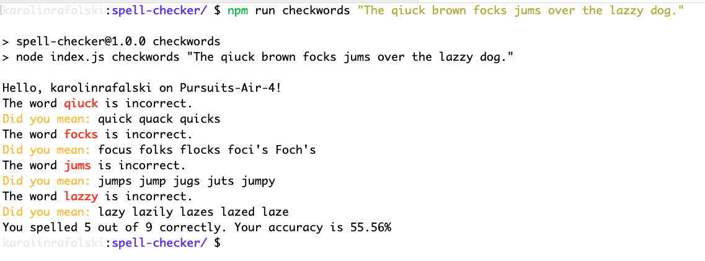

# NPM Packages and Code Libraries

## Learning Objectives

- Ignore common folders and files with the `.gitignore` file.
- Install built-in packages through NPM and use those packages within a JavaScript project.
- Distinguish between developer dependencies and production dependencies.
- Install external packages through NPM and use those packages within a JavaScript project.
- Define scripts through the `package.json` file.
- Evaluate the longevity of a third-party package. Via popularity, downloads, and most recent update.
- Read through documentation to identify how to use an external package.

## Guiding questions

- How do you start a new npm project?
- How do you set up a `.gitignore` file?
- What does `.gitignore` do?
- What is a common name for a `js` file used as an entry point for an npm project?

- How would you add a built-in Node.js module like `util` to a project?
- What does `util.inspect()` do?
- How would you add a built-in Node.js module like `os` to a project?

- How could you find out what `os` does?
- How would you log the hostname and user info using the `os` package?

## Create a new npm project

- Create a new npm project called `spell-checker` with an entry point of `index.js`
- Write a program in the file `systemcheck.js` that returns the `hostname` and `userInfo` `username`. Then console log the results of the functions. Finally, export the functions:

```js
const os = require("os");

function hostName() {
  // console.log("The hostname is", os.hostname());
  return os.hostname();
}

function userInfo() {
  // console.log("The user info is", os.userInfo());
  return os.userInfo();
}

// Small app:
console.log(hostName());
console.log(userInfo());

module.exports = {
  hostName,
  userInfo,
};
```

Set up the program so it runs with the command:

- `npm run oscheck`

```json
{
  "name": "spell-checker",
  "version": "1.0.0",
  "description": "",
  "main": "index.js",
  "scripts": {
    "test": "echo \"Error: no test specified\" && exit 1",
    "oscheck": "node systemcheck.js"
  },
  "keywords": [],
  "author": "",
  "license": "ISC"
}
```

## Evaluate an npm package

Look up the package [simple-spellchecker](https://www.npmjs.com/package/simple-spellchecker) - is it a popular package? Is it maintained? What else can you learn about it?

## Add an npm package to your project and use it

- Create a new file, `spellcheck.js`, in the same project.
- How do you install the package `simple-spellchecker`?
- How can you be sure you install version 1?
- How can you confirm the package has been installed?
- How do you set up `simple-spellchecker` so you can use it in your project?
- Set up this program so that you can type `npm run checkword WORD`, and it will spell check the word for you (where WORD represents any word you want to check?) from the `index.js` file.

```
npm run checkword seperate

npm run checkword quibble
```

```js
// spellcheck.js
const SpellChecker = require("simple-spellchecker");

function checkWord(word) {
  SpellChecker.getDictionary("en-US", function (err, dictionary) {
    // If there was a problem setting up the Spell Checker, inform the user an exit out of the function with a return statement
    if (err) {
      console.log("There was an error", err);
      return;
    }
    console.log(`Word is ${word}`);
  });
}

module.exports = {
  checkWord,
};
```

Import this function into `index.js` so a user can input a word through the terminal.

```js
// index.js
const { checkWord } = require("./spellcheck");

function run() {
  checkWord(process.argv[2]);
}

run();
```

## Creating spelling logic to check one word

```js
function checkWord(word) {
  SpellChecker.getDictionary("en-US", function (err, dictionary) {
    // If there was a problem setting up the Spell Checker, inform the user an exit out of the function with a return statement
    if (err) {
      console.log("There was an error", err);
      return;
    }
    // returns a boolean
    const misspelled = !dictionary.spellCheck(word);
    // if the word is misspelled
    if (misspelled) {
      // Provide user feedback
      console.log(`The word ${word} is incorrect.`);
      // Use the spellchecker to get suggested correct words
      const suggestions = dictionary.getSuggestions(word);
      // Log the words as a string
      console.log(`Did you mean:`, suggestions.join(" "));
    } else {
      // Notify the user that the word was spelled correctly
      console.log(`Your word ${word} is spelled correctly.`);
    }
  });
}
```

## Creating a new function to check many words

Write a new function called `checkWords` that will use the spellchecker to check several words in the `spellcheck.js` file. Be sure to export it and import it into `index.js`.

```js
function checkWords(sentence) {
  console.log("I will check many words", sentence);
}
```

- Set up a script that will work for a sentence `npm run checkwords "The qiuck brown focks jums over the lazzy dog."` and update `checkword`.

```json
 "checkword": "node index.js checkword",
 "checkwords": "node index.js checkwords"
```

Add some logic in the `index.js` file based on user input:

```js
// index.js
function run() {
  if (process.argv[2] === "checkword") {
    checkWord(process.argv[3]);
  } else if (process.argv[2] === "checkwords") {
    checkWords(process.argv[3]);
  } else {
    console.log("Be sure to use npm run checkword or npm run checkwords");
  }
}

run();
```

Now, build out the functionality for checking many words:

```js
// spellcheck.js
function checkWords(sentence) {
  SpellChecker.getDictionary("en-US", function (err, dictionary) {
    // If there was a problem setting up the Spell Checker, inform the user an exit out of the function with a return statement
    if (err) {
      console.log("There was an error", err);
      return;
    }

    // Split the sentence up into individual words
    const sentenceArr = sentence.split(" ");
    // Loop over each word
    for (let word of sentenceArr) {
      // returns a boolean
      let isMisspelled = !dictionary.spellCheck(word);
      //If the word is misspelled
      if (isMisspelled) {
        // Provide user feedback
        console.log(`The word ${word} is incorrect.`);
        // If a misspelled word is found, change this value
        allCorrect = false;
        // Use the spellchecker to get suggested correct words

        let suggestions = dictionary.getSuggestions(word);
        // Log the words as a string
        console.log(`Did you mean:`, suggestions.join(" "));
      }
    }
  });
}
```

Improve the user experience. If the user enters all the words correctly, they get no feedback. Let's add feedback.

```js
// spellcheck.js
function checkWords(sentence) {
  SpellChecker.getDictionary("en-US", function (err, dictionary) {
    // If there was a problem setting up the Spell Checker, inform the user an exit out of the function with a return statement
    if (err) {
      console.log("There was an error", err);
      return;
    }

    // Split the sentence up into individual words
    const sentenceArr = sentence.split(" ");
    // Loop over each word
    for (let word of sentenceArr) {
      // returns a boolean
      let isMisspelled = !dictionary.spellCheck(word);
      //If the word is misspelled
      if (isMisspelled) {
        // Provide user feedback
        console.log(`The word ${word} is incorrect.`);
        // If a misspelled word is found, change this value
        allCorrect = false;
        // Use the spellchecker to get suggested correct words

        let suggestions = dictionary.getSuggestions(word);
        // Log the words as a string
        console.log(`Did you mean:`, suggestions.join(" "));
      }
    }
    // Notify the user that they spelled everything correctly, rather than giving them no feedback
    if (allCorrect) {
      console.log("All your words were spelled correctly");
    }
  });
}
```

```
npm run checkwords "The quick brown fox jumped over the lazy dog."
```

## Fix a bug with punctuation

There is an issue with our program that it considers `dog` misspelled. We need a way to check the words without punctuation. We can replace any punctuation with the `.replace()` function.

We need to update the word to have no punctuation. You could write an if/else statement or switch statement that would check if every character is a letter, and if it is not, it will remove it by replacing it with an empty string. But this is a very long and tedious task. This functionality is pretty standard, and there is a shortcut way of writing it.

```js
// Remove non-letter characters
word = word.replace(/[^A-Z]/i, "");
```

- We'll use a special set of characters to check for non-letters: `/[^A-Z]/i`. ( `^` means NOT and `i` is for case-insensitive)

Add this line of code as the first line inside the for of loop.

```js
for (let word of sentenceArr) {
  word = word.replace(/[^A-Z]/gi, "");
  // ... Rest of code ...

```

## Incorporate another npm package into your application

Look up the package `chalk` - is it a popular package? Is it maintained? What else can you learn about it?

- Add the package `chalk` to your project.
- Using the documentation, what does `chalk` do?

- Make a new file, `ui.js`

It's essential to separate the concerns. The functionality for checking the spelling of words is different than changing the text color. You might want to use the text color changes in your app's `systemcheck.js` file or other parts. If you build chalk's functionality inside the spellcheck functions, you'd have to rewrite it for any additional files/functions.

- Set up chalk in the `ui.js` file.
- Set up a function called `error` that will print things in bold red.
- Set up a second function called `warning` that will print things in the color #FFA500 (orangy color).
- export the two functions.
- import the functions into the `spellcheck.js` file.

> **Note**: You can look up different color codes [At HTML Color Codes](https://htmlcolorcodes.com/color-picker/).

```js
// ui.js
const chalk = require("chalk");

const error = chalk.bold.red;

const warning = chalk.hex("#FFA500"); // #FFA500 is an orangy color

module.exports = {
  error,
  warning,
};
```

Import and use the new warning and error functions to make the user interaction clearer and more informative (2 places, noted by the comment `Add chalk`):

```js
// spellcheck.js
const { error, warning } = require("./ui.js");

function checkWords(sentence) {
  SpellChecker.getDictionary("en-US", function (err, dictionary) {
    // If there was a problem setting up the Spell Checker, inform the user an exit out of the function with a return statement
    if (err) {
      console.log("There was an error", err);
      return;
    }
    let allCorrect = true;
    // Split the sentence up into individual words
    const sentenceArr = sentence.split(" ");
    // Loop over each word
    for (let word of sentenceArr) {
      word = word.replace(/[^A-Z]/gi, "");
      // returns a boolean
      let isMisspelled = !dictionary.spellCheck(word);
      //If the word is misspelled
      if (isMisspelled) {
        // Provide user feedback
        // Add chalk
        console.log(`The word ${error(word)} is incorrect.`);
        // If a misspelled word is found, change this value
        allCorrect = false;
        // Use the spellchecker to get suggested correct words

        let suggestions = dictionary.getSuggestions(word);
        // Log the words as a string
        // Add chalk
        console.log(warning(`Did you mean:`), suggestions.join(" "));
      }
    }
    // Notify the user that they spelled everything correctly, rather than giving them no feedback
    if (allCorrect) {
      console.log("All your words were spelled correctly");
    }
  });
}
```

It seems like there is an error:

```
const chalk = require("chalk");
 ^

Error [ERR_REQUIRE_ESM]: require() of ES Module /Users/karolinrafalski/Desktop/deleteme3/node_modules/chalk/source/index.js from /Users/karolinrafalski/Desktop/deleteme3/ui.js not supported.
Instead, change the require of index.js in /Users/karolinrafalski/Desktop/deleteme3/ui.js to a dynamic import() which is available in all CommonJS modules.
 at Object.<anonymous> (/Users/karolinrafalski/Desktop/deleteme3/ui.js:1:15)
 at Object.<anonymous> (/Users/karolinrafalski/Desktop/deleteme3/spellcheck.js:2:28) {
 code: 'ERR_REQUIRE_ESM'
}
```

The latest version of `chalk` uses ESM instead of CJS (we are using CJS). To make chalk work, we must roll back to the last version that supported CJS.

```
npm uninstall chalk
npm install chalk@4
```

This will uninstall chalk (and all its dependencies, and update the `package-lock.json` file).

Then you will install version 4, the last version to support CJS (The default module system and syntax that Node.js currently supports).

You can add even more functionality to this program. Let's add one more feature to give the user some feedback on their accuracy.

```js
function checkWords(sentence) {
  // If there was a problem setting up the Spell Checker, inform the user an exit out of the function with a return statement

  SpellChecker.getDictionary("en-US", function (err, dictionary) {
    // If there was a problem setting up the Spell Checker, inform the user an exit out of the function with a return statement
    if (err) {
      console.log("There was an error", err);
      return;
    }
    let allCorrect = true;
    // Begin count for accuracy
    let count = 0;
    // Split the sentence up into individual words
    const sentenceArr = sentence.split(" ");
    // Get the total number of words for accuracy count
    const sentenceLength = sentenceArr.length;
    // Loop over each word
    for (let word of sentenceArr) {
      word = word.replace(/[^A-Z]/gi, "");
      // returns a boolean
      let isMisspelled = !dictionary.spellCheck(word);
      //If the word is misspelled
      if (isMisspelled) {
        // Provide user feedback
        // Add chalk
        console.log(`The word ${error(word)} is incorrect.`);
        // If a misspelled word is found, change this value
        allCorrect = false;
        //Increase the count of the wrong words
        count++;
        // Use the spellchecker to get suggested correct words

        let suggestions = dictionary.getSuggestions(word);
        // Log the words as a string
        // Add chalk
        console.log(warning(`Did you mean:`), suggestions.join(" "));
      }
    }
    // Notify the user that they spelled everything correctly, rather than giving them no feedback
    if (allCorrect) {
      console.log("All your words were spelled correctly");
    } else {
      console.log(
        `You spelled ${
          sentenceLength - count
        } out of ${sentenceLength} correctly. Your accuracy is ${(
          ((sentenceLength - count) / sentenceLength) *
          100
        ).toFixed(2)}%`
      );
    }
  });
}
```

Finally, update the `run` function inside the `index.js` file that will run on `npm start`. That will log the `hostname`, greet the `username`, and if there are additional arguments, it will spellcheck them.

For example:

`npm start "The qiuck brown focks jums over the lazzy dog."`

Will output something similar to this:



## Adding and committing with git

Finally, turn your project into a git repository. Add and commit your files.

Confirm that `node_modules` are not being tracked. If they are being tracked, be sure to fix it.
