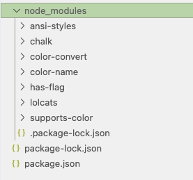
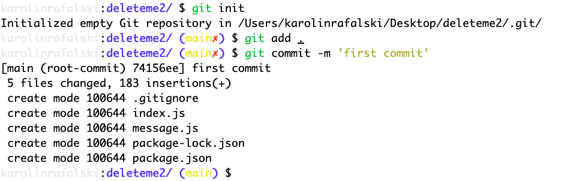
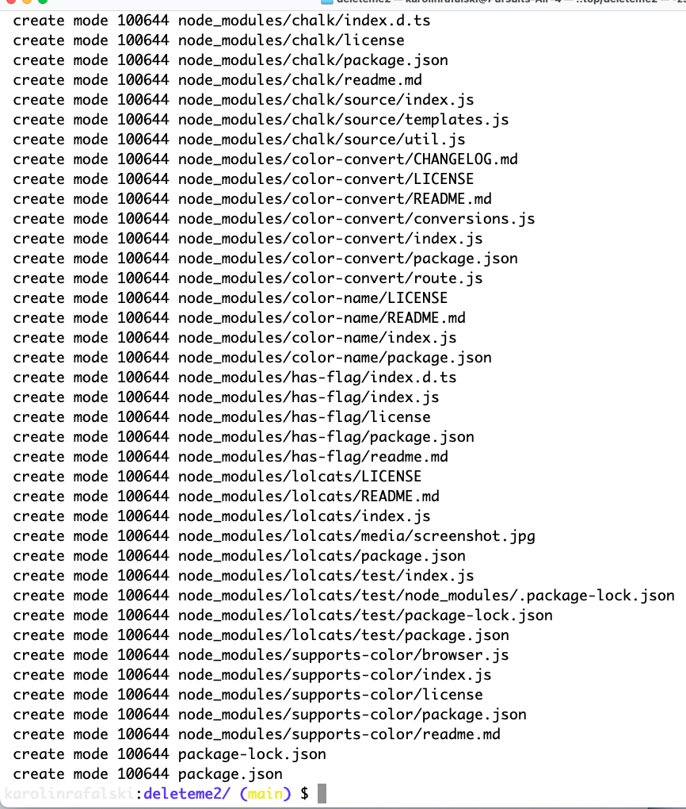
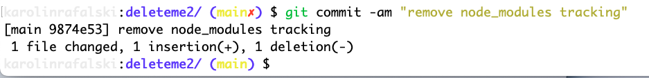
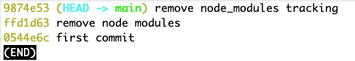
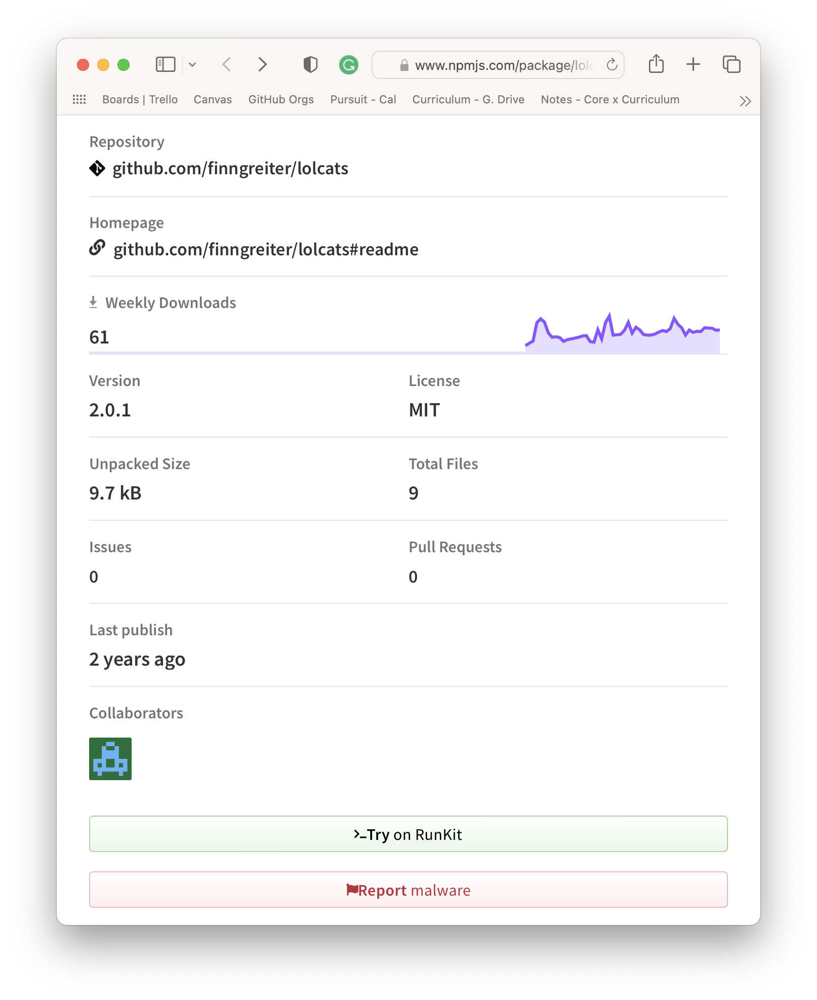
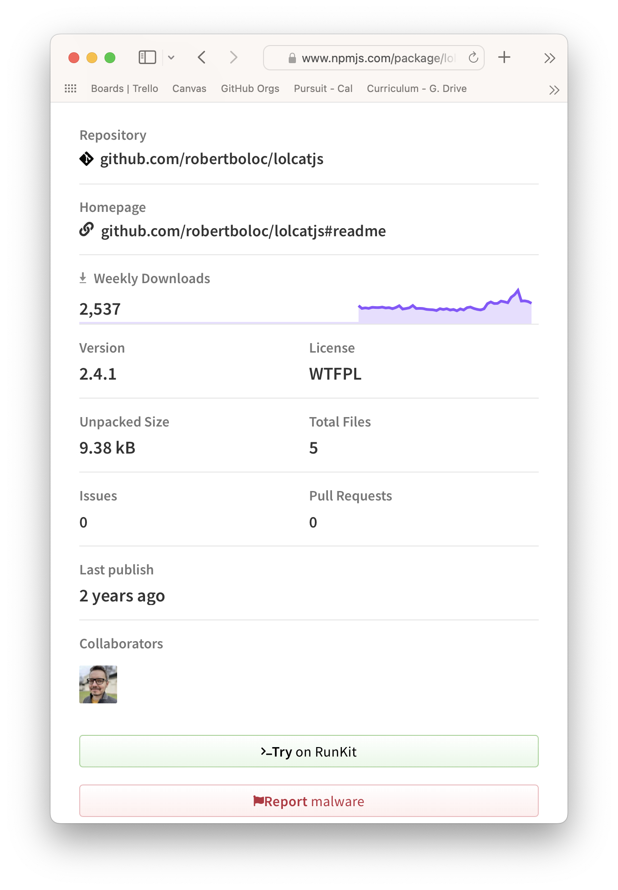
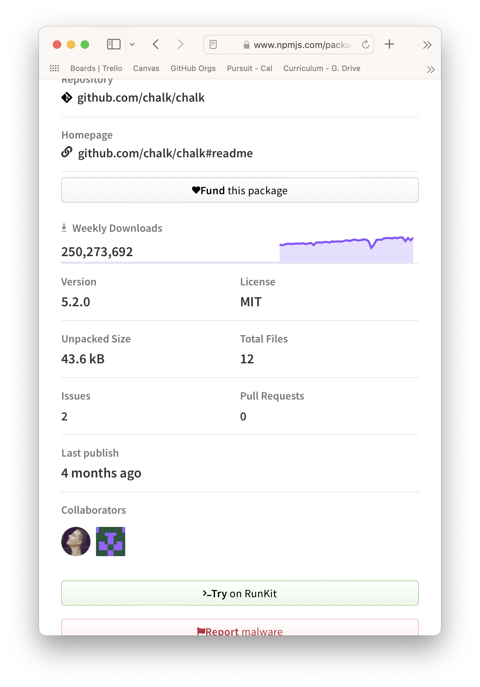

# NPM Packages and Code Libraries

There are common problems that developers run into over and over again. Rather than coding everything from scratch, developers build code libraries or frameworks for themselves and others.

For example, you've been using `Jest` rather than writing your own testing framework. Jest allows you to write tests following a simple, repeatable, and maintainable pattern. It also makes the output of tests consistent and easy to read.

Many of these libraries are `open-source`, meaning anyone can contribute to and use the project.

The difference between a library and a framework is that it tends to be un-opinionated: it isn't designed to work with a particular type of project. For example, with Jest, you can write a series of functions, a game, or other types of applications. This is in contrast to a framework like `Ruby on Rails`, which is specifically for building servers and a front-end with the language Ruby, you wouldn't use Rails to build a console app like you've been building over the last few lessons, but you might want to add Jest to improve the reliability of the code you've written.

## Learning Objectives

- Ignore common folders and files with the `.gitignore` file.
- Install built-in packages through NPM and use those packages within a JavaScript project.
- Distinguish between developer dependencies and production dependencies.
- Install external packages through NPM and use those packages within a JavaScript project.
- Understand the basics of package versioning and how to install a specific version.
- Define scripts through the `package.json` file.
- Evaluate the longevity of a third-party package. Via popularity, downloads, and most recent update.
- Read through documentation to identify how to use an external package.

## Creating an npm project

If you would like to code along, you may begin by creating a top-level folder and setting up a `.gitignore` file.

- `mkdir my-npm-project`
- `cd my-npm-project`
- `touch .gitignore`

## Prevent Git from tracking unnecessary files and folders

Eventually, you will track your projects with git and upload them to GitHub. It's a good idea to start with creating a `.gitignore` so you don't forget to do it later.

The `.gitignore` file provides a list of files for git to ignore within a project. When you work with `npm` and download packages, the code is stored and maintained in their registry. You don't need to track or upload this code to GitHub. This code is stored in a folder called `node_modules/`.

`.DS_Store` is a Mac operating system (OS) file that helps manage your folders and files on your computer. For example, when you open files and folders using the Finder program, you may create `.DS_Store` files. It is only relevant to your computer and files, so Git does not need to track them.

Whenever you create a `.gitignore` file, you will want first to add the following contents:

```
node_modules
.DS_Store
```

> **Note:** The `.gitignore` file is not a JavaScript file. You don't need to use quotes or semi-colons. Each file or folder to be ignored should be on a new line.

Now that folder setup is complete, you can initialize a new npm project by typing:

`npm init -y`

If you have successfully initialized a project, the `npm init` command will have created a `package.json` file.

## Application entry point

- `touch index.js`

Open this file and write a simple console log:

```js
console.log("Welcome to my app!");
```

To run this program, type:

- `node index.js`

## Modules

### Your own modules (review)

You can create your own modules. They can contain data or app functionality.

Let's create a new file called `message.js`:

- `touch message.js`

```js
// message.js
const whatTimeIsIt = () => {
  return `The date is ${new Date()}`;
};
```

You will need to export this function to use it in another file. To do this, you will use a built-in object called `module.exports`.

```js
// message.js
const whatTimeIsIt = () => {
  return `The date is {new Date()}`;
};
module.exports = whatTimeIsIt;
```

You will use the function `require()` to import this module. When requiring your file, you will use the _relative path_ to the file:

```js
// index.js
const importedFunction = require("./message");

console.log(importedFunction());
```

Test that it works:

```bash
node index.js
```

### Built-in modules

Node is built to be lightweight and, by default, contains the minimum amount of functionality to run a basic application. There are some built-in node modules that you can add if you need them.

Some examples are:

- readline, Allows user input in the terminal.
- file system, Allows for creating and saving files.
- path, Allows for creating dynamic paths that can work across multiple operating systems (Windows, Linux, macOS).

You can find a complete (and easily read) list of Node.js built-in modules at the following website.

- [W3Schools: Node.js Built-in Modules](https://www.w3schools.com/nodejs/ref_modules.asp)

[Node.js docs](https://nodejs.org/dist/latest-v18.x/docs/api/) also has complete documentation. However, it can be a bit dense to go through for beginners.

#### Requiring the built-in module

You may have noticed that the terminal does not display very nested objects:

```js
// index.js

const veryNestedObject = {
  one: {
    two: {
      three: {
        four: {
          five: "You found the center!",
        },
      },
    },
  },
};

console.log(veryNestedObject);
// { one: { two: { three: [Object] } } }
```

But what if you wanted to see the entire object? You can use the built-in `inspect` function from the `util` module.

Add [`util`](https://nodejs.org/api/util.html#utilinspectobject-options) to your app:

```js
// index.js
const { inspect } = require("node:util");

const veryNestedObject = {
  one: {
    two: {
      three: {
        four: {
          five: "You found the center!",
        },
      },
    },
  },
};

console.log(inspect(veryNestedObject));
```

So far, the `inspect()` function does nothing differently than `console.log()`. Let's add some options. Options go inside an object as the second argument. By default, `inspect()` only goes to a depth of 2 in an object. Let's try 5.

```js
console.log(inspect(veryNestedObject, { depth: 5 }));
```

Let's also add some colors to the output:

```js
console.log(inspect(veryNestedObject, { depth: 5, colors: true }));
```

> **Note:** You only use the module's name with built-in modules. You do not use the relative path. This is how Node.js distinguishes whether it is looking for a built-in module or your own file.

### Third-party modules

You can also import third-party code into our app.

To install some third-party code, you must know its name. A simple package to try is [`lolcats`](https://www.npmjs.com/package/lolcats). This package will allow you to print a more colorful message in the terminal.

Make sure you are on the same level as your `package.json` file for your installation to work:

- `npm install lolcats`

You can confirm that this worked by seeing that you have the following:

- A new folder, `node_modules/`. Inside this folder is

- the `lolcats` folder (The package you just installed.)
- lolcats require other folders. These additional packages are often referred to as _dependencies_.



- A new file called `package-lock.json`.
- The `package-lock.json` file contains more detailed information about the installed packages and their dependencies. It is automatically generated and updated; you never need to edit it.
- `package.json` has a new field, `dependencies`.

```json
{
  "name": "lesson",
  "version": "1.0.0",
  "description": "",
  "main": "index.js",
  "scripts": {
    "test": "echo \"Error: no test specified\" && exit 1"
  },
  "author": "",
  "license": "ISC",
  "dependencies": {
    "lolcats": "^2.0.1"
  }
}
```

When you want to import a third-party module, you will use the name of the module instead of including a relative path:

```js
// index.js
const lolcats = require("lolcats");
```

Read the [documentation for this package](https://www.npmjs.com/package/lolcats), then update the `console.log()` statement to be the function `lolcats.print()` and just print the value of the key `five`:

```js
lolcats.print(veryNestedObject.one.two.three.four.five);
```

## Versioning

By default, when you run `npm install some-package` it will install the latest version. However, the latest version may not be compatible with your system or other packages. When you tried to run your code, you probably ran into an error.

In this course (or any tutorial or book), it is best to use the instructional material's version. Tech and code change frequently, and there can be breaking changes or other updates that won't work as expected until the entire lesson/book has been updated, making learning a more frustrating experience. Once you've completed the lesson, you can try the latest version.

Let's uninstall the latest version and install the version the course materials uses:

```
npm uninstall lolcats
npm install lolcats@2
```

## Checking the `.gitignore` file

Turn this project into a git repository:

`git init`

Add and commit the files.

- `git add .`
- `git commit -m 'first commit`

Please pay attention to these commands and see what files they are committing. None of the `node_modules` files should be committed because of the `.gitignore`.

It should look like this:



Not like this:



If you see those files, you should stop them from being added and tracked:

- `rm -rf node_modules`.
- `git commit -am 'remove node modules'`.
- Update the `.gitignore` to ignore `node_modules`.
- `npm install` - to install the node packages listed in the `package.json`.
- `git commit -am "remove node_modules tracking"`.

You should now get an update similar to the following (only the `.gitignore` has changed)



If you run `git log --oneline`, you should see three commits now (press `q` to quit this view):



> **Note**: `npm install` has two functions. One is to install new packages when you add an argument. If you don't add an argument, it will look for a `package.json` file and install the packages listed under `dependencies`.

## Writing your own scripts

You know that you must run `node index.js` to start your app. But what if you named your main file `main.js` or `app.js`? All these file names are reasonable. If you were developing this project for other people to use, you'd want to make it easy for them to use the project and work with. So you can implement a typical pattern for starting node applications.

You can create your own npm scripts through the `package.json` file.

If you look into the `package.json` file, there is only one default script.

```json
 "scripts": {
 "test": "echo \"Error: no test specified\" && exit 1"
 },
```

You can run this script by typing `npm test`.

- `echo` is somewhat similar to `console.log` for the terminal.
- `&&` means run the following command if the first one is successful.
- `exit 1` is the code for a general error. You can read a [short summary here](https://askubuntu.com/questions/892604/what-is-the-meaning-of-exit-0-exit-1-and-exit-2-in-a-bash-script).

There are a few built-in commands like `start` and `test`. But you can also create your own. You'll have to add an extra word `run`, when you make your own. Let's see it in action.

Add the following script to `package.json`:

```json
 "start": "node index.js",
```

You can now start your application with `npm start`.

Create your own script:

```json
 "lol": "node index.js",
```

To run this command, type `npm run lol`. If you try `npm lol`, it will throw an error. You must include `run` for non-standard script names.

You can add additional arguments. Start by updating `index.js`.

```js
lolcats.print(process.argv[2]);
```

And run them:

```js
npm run lol 'Oh hai!'
```

For now, there is not a lot of utility in creating these commands since you are only running one function. However, understanding the concepts and syntax now will help you as things become more complex.

## Evaluating npm packages

Let's look at the data on NPM provided about the `lolcats` package.



There is some vital information here.

- The last time this package was updated (2 years ago). This means this package is not being actively maintained.
- There are 60-ish downloads a week. That's pretty low.
- There are no issues or pull requests, and the overall package size is small.

If you go to the homepage, you can see all the code and click on the creator's GitHub profile to see what else this person has worked on.

Let's compare a different package, `lolcatsjs`:



This one is somewhat more popular but also has not been updated in two years.

**Thought question**: Can you use both `lolcats` and `lolcatsjs` packages in one project?

Can you figure out how to use this package? Hint: look at the documentation and see if you can at least run the simple demo the documentation provides.

Let's look at one more called `chalk`:


Does this seem like a popular package? Does it seem safe to use? What factors are helping you consider whether this is a good package to try? Are there any other ways you could check?
