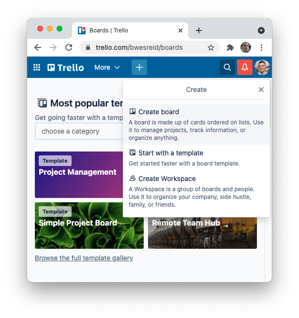
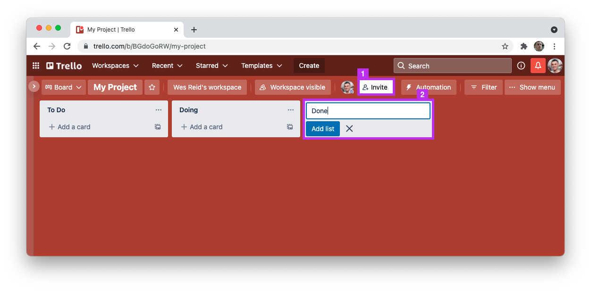
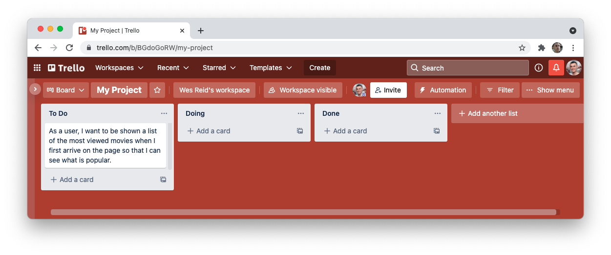
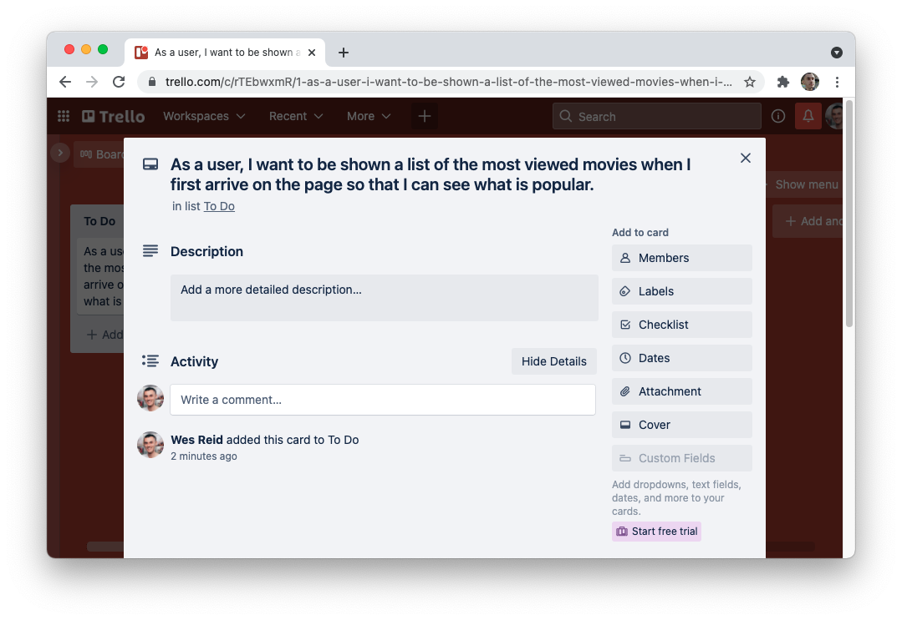

# Project Workflow

When you are coding on your own, you have control over which features get done and how they get done. However, great software is built via teams, which means making adjustments to your personal workflow.

In this lesson, you'll learn about how software development teams work. You'll also learn enough so that you could help manage a project with classmates or coworkers.

## Learning objectives

By the end of this lesson, you should be able to:

- Describe the daily workflow used by the industry to build complex applications.
- Distinguish between business concerns and implementation details.
- Write feature tasks (e.g. “cards”), focusing on business concerns.
- Create a Kanban board (e.g. To do/Doing/Done) on Trello to manage feature tasks.

---

## Working as a developer

While much of your time as a developer can be coding, meeting with other developers and project stakeholders will often be an equally important part of your job. This can create some tension. As a developer, it's important to have quality work time so that you are able to focus and solve tough problems. However, it is also important to coordinate with your team so that everyone works towards the same goal.

To solve this tension, teams of developers have tried all kinds of ways to collaborate as a large group. While different companies will have differing processes, there are many commonalities across how different developer teams work.

### Stand-ups

One of the most common features present in all developer teams is the idea of a "Stand-up". A Stand-up is a short meeting at the beginning of the day, usually no more than 15 minutes, where each member of the team will answer three questions:

1. What did I accomplish yesterday?
1. What will I aim to accomplish today?
1. Is anything blocking me from getting my work done today?

Once each member of the team has answered the questions, the group will first assess if anything anyone is working on needs to change. For example, perhaps the group wants to prioritize the completion of a particular feature before another. After all decisions have been made, the developers will then split to go work on their individual tasks.

This short meeting helps the team align on their goals while not taking hours. It also means that everyone is aware of how the project is going while getting a maximum amount of time to focus on their work.

#### Blockers

The last question, "Is anything blocking me from getting my work done today?", is often the most important to address immediately. Blockers could be anything from "I'm stuck on writing the code for this feature" to "The API is down for maintenance." If a blocker can be fixed or addressed by another member of the team, those team members should work together to "unblock" the task.

When someone is encountering a blocker on developing code, that is a good opportunity to spend some time pair programming. Work together to solve the immediate problem so that both developers can then go on to work on their individual tasks.

### Kanban boards

To keep track of what everyone is doing, many teams will use a project tracker of some kind. One of the most popular "formats" is a Kanban board.

While there can be many variations of Kanban boards, the most typical is simply a board that everyone can see with three columns: To Do, Doing, and Done.


The image above shows the following:

- Tasks "A" and "B" are in the "To Do" column, which means no one is working on them.
- Tasks "C", "D", and "E" are in the "Doing" column, which means they are currently being worked on.
- Tasks "F" and "G" have been completed and are therefore in the "Done" column.

During a Stand-up, developers will often reference the specific task they're working on in the "Doing" column. In general, the "Doing" column should always reflect work that is _actually being done,_ not work that you plan to complete.

When someone completes a task, they will move the task from "Doing" to "Done" and then pick up another task. For example, if your co-worker Gabriel is working on task "C" and completes it, they will move it from "Doing" to "Done" and then pick up another task, like task "B". They will move task "B" to the "Doing" column and then begin their work.

Kanban boards, when regularly updated and used, are really helpful for identifying the current state of a project.

## Writing tasks

To make the most of Stand-ups and Kanban boards, you and your team will need to write tasks, also called "cards" or "tickets", for each member of the team to be able to take.

### Scoping a task

One of the most difficult parts of writing tasks is to make sure that the task is well scoped. Ideally, each task you write is associated with a specific feature for your application. However, as you well know, not all features are equally easy to create.

With that said, you should avoid large and vague tasks like "build the React front end" or "eliminate bugs." Instead, it is almost better to start with tasks that are much smaller. Eventually, you will be able to identify the right size of tasks.

### Business concerns vs implementation details

One important aspect to keep in mind when writing "cards" is that the cards should focus on a business concern as opposed to the implementation details. This means staying "feature focused" as opposed to worrying about the details.

For example, consider the following two tasks which describe the same thing:

1. Build a submittable form on the new product page.
1. Allow for a user to create a new product.

Both of these tasks describe something similar, however the second is focused on the actual feature. Why is this important? Well, it allows for more discussion about how to implement the feature. For example, perhaps it would be acceptable to allow for users to create new products solely by text message.

By focusing on the feature, you can invite more creativity and collaboration than by prescribing a specific implementation.

#### User story format

One way to enhance your tasks is to the following user story format.

```
As a <TYPE OF USER>, I want <SOME GOAL> so that <SOME REASON>.
```

This format helps you to consider the audience for the feature as well as the purpose. For example, take a look at the following tasks written in this format:

- As a user, I want to be able to create a new product so that I can sell it on the main marketplace.
- As a user, I want to be able to see more information about a product so that I can decide whether or not to buy it.
- As an admin, I want to be able to hide products so that I can keep scam products away from users.

Each of the above features, by following the format, is quite detailed and gives a lot of color as to the purpose of the feature.

## Trello

A popular tool for creating Kanban boards is [Trello.com](https://trello.com). You can create a free account and invite collaborators to that account.

### Creating a new board

To create a new board, you'll press the "Create" or "+" button and then select the option for creating a new board.



You will be able to name your board and pick out some stylistic choices, like background color.

### Setting up the board

You can invite people to your board by pressing the Invite button. Get the account information from your teammates to invite them to a board.

When you arrive at an empty board, you'll want to create some new columns. Create three new columns with the titles "To Do", "Doing", and "Done".



You now have a working Kanban board.

### Creating cards

To create a card, press the "+ Add a card" button under the "To Do" column which will then turn into an input. This is where you would type out your user story.



You can hit enter to create your card. If you want to record more details about the task, you can click on the card to open up a new view.



This page allows you to add a further description to the card, labels, and much more.

#### Adding labels

You can assign labels to the card by clicking the "Labels" button. This will allow you to create and add new labels to the card. The labels you add could be "Bug", "Feature", "Front End", "Back End", or something else.

#### Assigning people

You can assign individual people to the card by clicking the "Members" button. You can then assign a task to a specific person, including yourself. This is a good way to keep track of who is responsible for which task.

#### Assigning due dates

You can add a specific due date for a task by clicking on the "Dates" button. You can set a due date for the task by using the calendar. This is a good way to keep track of when certain features should be completed.
