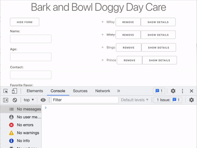

# React Forms

## Objectives

- Controlled vs. uncontrolled components
- Use React state to control a checkbox
- Use React state to control an options menu
- Use React state to control a single text input (demo in pre-reading only)
- Use the form element correctly
- Use React state to control multiple text inputs
- Clearing the inputs after submitting the form

## Doggy Day Care Application

This application will allow the addition of a new dog using a form.


There will be a number of fields to fill out including

- checkbox
- select options
- multiple text inputs

> **Note:** CSS libraries [Normalize](https://necolas.github.io/normalize.css/) and [Skeleton](http://getskeleton.com) have been included in the `public/index.html`to assist with providing visual clarity with forms.

> **Note:** Form inputs and labels, along with some properties, have been provided to allow focus on building functionality for this application.

## Getting started

Start by forking and cloning the following repository:

[React Forms Class Build](https://github.com/pursuit-curriculum-resources/starter-react-state-objects)

```
npm i
```

The form is already built. You'll be adding the functionality to make all the form components controlled by React and then using the form to create a new dog to add to the list.

## Checkbox

```js
// App.jsx

const [checked, setChecked] = useState(false);
```

Add a function to handle checkbox changes:

```js
function handleCheckboxChange() {}
```

Add state and a function to change state for the checkbox.

- Locate the input with type `checkbox` (for the value `likesSwimming`).

- Add the `checked` property to the input with the type `checkbox`.
- Set the value of `checked` to the variable `checked`.

```js
<input type="checkbox" checked={checked} onChange={handleCheckboxChange} />
```

What does each property in this HTML element do?

How do you toggle between the true/false value of checked?

<details><summary>Answer:</summary>

```js
function handleCheckboxChange() {
  setChecked(!checked);
}
```

</details>

## Select options

Add state and a function to change the state for the checkbox:

```js
// App.jsx
const [selectOption, setSelectOption] = useState("");
```

Add the function to handle the select change:

```js
function handleSelectChange() {}
```

Add the event handler/listener to the `select` tag.

```js
<select id="favFlavor" onChange={handleSelectChange}>
```

How do you set the value for the selected option?

<details><summary>Answer:</summary>

```js
function handleSelectChange(event) {
  setSelectOption(event.target.value);
}
```

</details>

## Form submit

Add the function to handle a form submit:

```js
// App.jsx
function handleSubmit(event) {
  console.log("form submitted");
}
```

Add the event listener/handler to the `form` tag:

```js
<form onSubmit={handleSubmit}>
```

- When you submit the form, do you see the console message?

- What is the default behavior of form submission?

- How do you prevent the default behavior?

<details><summary>Answer:</summary>

```js
function handleSubmit(event) {
  event.preventDefault();
  console.log("form submitted");
}
```

</details>

## Multiple text inputs

The `handleTextChange` function has already been included in `App.js`. Additionally, it has been added as the event listener/handler for each text `input`.

```js
// App.jsx
function handleTextChange(event) {
  setNewDog({
    ...newDog,
    [event.target.id]: event.target.value,
  });
}
```

- As a class, walk through every line of code and explain what each line is doing

## Creating a new dog

The `handleSubmit` function is to make sure all the things that need to occur on submit happen:

- Prevent default submit behavior
- Compile all the form values into one object and create a `newDog`
- Reset the dog form
- Hide the form

Rather than putting all the logic into this function, new functions with their specific role should be created and called.

Use the `addDog` function to put all the values together (remove the hard-coded Rover object):

```js
// App.jsx
function addDog() {
  const createDog = {
    id: generateUniqueID(),
    name: newDog.name,
    present: false,
    grade: 100,
    notes: "",
    age: newDog.age,
    likesSwimming: checked,
    favFlavor: selectOption,
    contact: newDog.contact,
  };
  setDogs([createDog, ...dogs]);
}
```

Call this function inside `handleSubmit`

```js
function handleSubmit(event) {
  event.preventDefault();
  addDog();
}
```

Create a new function, `resetDogForm`, to reset all the values in the form.

```js
function resetDogForm() {
  setNewDog({
    id: "",
    name: "",
    present: false,
    grade: 100,
    age: "",
    likesSwimming: "",
    favFlavor: "",
    contact: "",
  });
  setChecked(false);
  setSelectOption("");
}
```

Call this function inside `handleSubmit`

```js
function handleSubmit(event) {
  event.preventDefault();
  addDog();
  resetDogForm();
}
```

Finally, hide the form once the submission is complete:

```js
function handleSubmit(event) {
  event.preventDefault();
  addDog();
  resetDogForm();
  toggleNewDogForm();
}
```

## Completed Build

[See a completed build here](https://github.com/pursuit-curriculum-resources/starter-react-forms/tree/solution)

## Upcoming Lessons

The `App` component is getting very big and handling multiple responsibilities. We want to make the `form` and `li` their components. But how will we handle state? Where will the state go?

If you tried to console log inside the `handleTextChange` to check the values being set for `newDog`, you likely saw that the logs were off by one. If you typed `M`, it did not show up in the log until you typed the following letter `o`, and then you only saw `M`. This behavior is because JavaScript is asynchronous. It does not wait until one function finishes before calling the next function by default. But what if it was critical for our app to run the console log AFTER the `setNewDog` function was completed?


