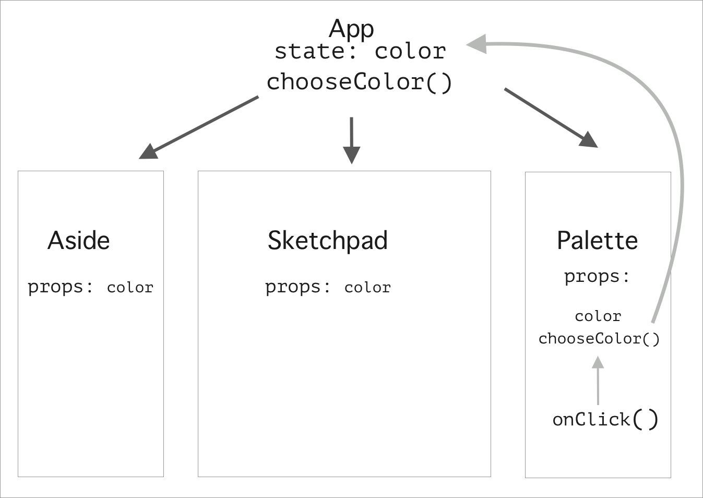

# Data Flow and Lifting State

As you've seen, data flows down in React. When you add a prop, it becomes available inside the child component. But what if you need to pass a value to a parent or sibling component (lift state)?

## Objectives

- Thinking in React
- Understand that data only flows down in React
- Learn where state should go
- Learn how to lift state

## Thinking in React

According to the [React documents](https://react.dev/learn/thinking-in-react), one of the best ways to build an app in React is to build your app in a specific order.

There are several key steps:

1. Start with a mock

   - Take the time to make wireframes and write out other details about your app.
   - Refactoring a React app can be very challenging, so when you have already started with a great layout, it will be easier to stick with it.

1. Break the UI into a component hierarchy

   - Clarify which elements will be grouped as different React components within your wireframe and determine which elements go inside other elements.

1. Build a static version first

   - Before adding conditional rendering, forms, or other functionality, first create a static view.

1. Identify the minimal complete representation of UI state

   - Determine which data will have state and which data will be passed on as props.
   - Add props to your app. It's ok to use some mock data/mock array of objects.

1. Identify where your state should live

   - State should go down to the lowest (most nested) component possible.
   - If state must be shared across components, put state in the lowest common ancestor.
   - If you can't find a good common ancestor, create one.
   - Add state to start replacing your mock data.

1. Add inverse data flow (lift state)

   - There are times when state must be shared across components. This should be the final piece you work on.

## Data flow and management in React

Data flows down from the parent component to the children components. The advantages of this are:

- Debugging is easier when the developer knows where the data is coming from and where it is going.
- Unidirectional data flow makes the program less prone to errors because there is only one way to do it.


Here is an example situation. In this sketchpad, there are four components:

- Top-level `App`
  - Color indicator div
  - Sketchpad
  - Color palette


The color selection happens in the color palette component. Still, for the sketchpad to use that color, the color must be lifted up to the `App` component and then go into the sketchpad and color indicator div.

Even though data flows down, event handlers can send data upwards.


## Lifting State

In the example of the sketchpad:


The color must be set as state and it needs to go in `App.js` because it is the most recent common ancestor of the components that will get color passed down as a prop.



Here is what it could look like in terms of code.

Starting with App.js, `color` is stored as state. Then it is passed down to `Aside` and `Sketchpad`. The function to update state is also here, it will be passed down to `Palette`.

```js
function App() {
  let [color, selectColor] = useState("white");

  function chooseColor(color) {
    selectColor(color);
  }

  return (
    <div className="App">
      <header>
        <h1>Sketchpad</h1>
      </header>
      <main>
        <Aside color={color} />
        <Sketchpad color={color} resetBoard={resetBoard} />
        <Palette colors={colors} chooseColor={chooseColor} />
      </main>
    </div>
  );
}
```

This is a color selection square inside of the `Palette` component.
`chooseColor` has been passed down to the square. When the click event listener/handler is triggered, it will call `chooseColor`, which originates in `App.js`.

```js
export default function Square({ colors, chooseColor }) {
  return (
    <div
      key={color}
      style={{ backgroundColor: color, height: "40px", width: "40px" }}
      onClick={() => chooseColor(color)}
    />
  );
}
```
