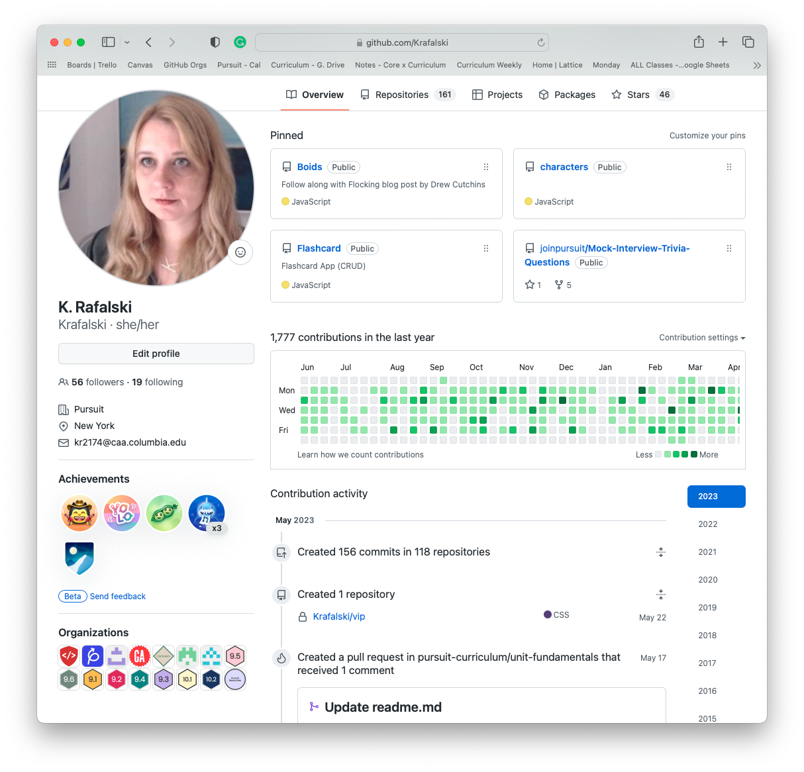

# Request-response Cycle & API Calls with Postman

You are currently reading content on a webpage. What code was required to run when you clicked on a link to bring you here? Where did this content come from? What steps happened on your computer and in the browser/app to get this content to you?

It is easy to take for granted how much it takes to create a seamless experience when interacting with the Internet. This lesson will begin to help you understand how the internet works, which, in turn, will help you start to build full-stack web applications.

You'll learn how the Internet works and how to get data from a [third party](https://en.wikipedia.org/wiki/Third-party_source). In particular, you'll focus on how the request-response cycle allows you to view content on the web. You'll also learn about the components of the Internet's architecture. Finally, you'll learn how to request third-party data using a Postman application.

## Learning Objectives

By the end of this lesson, you should be able to:

- Identify critical components of the Internet, including browsers, servers, and databases.
- Describe the request-response cycle and how it relates to server architecture.
- Describe what an API is.
- Use Postman to make GET requests to a public API.
- Identify the four main parts of an HTTP request.
- Identify the three main parts of an HTTP response.
- Identify different types of data that can be used in a response.

---

## How does the internet work?

Your browser (a client) makes a request to a server whenever you click on a link or go to a website. For example, when you click on a link to load this webpage, your browser makes a request to GitHub. Then GitHub's servers receive your request and respond with the data required to render this view.

This, in a nutshell, is the request-response cycle. It is a pattern where one program asks another program for some data. If the second program responds, the process is complete. To better understand how the request-response cycle relates to how the Internet works, it's helpful to learn about some of the different pieces of architecture that make up the Internet.

### Clients & Servers

A client is any program that makes a request and receives a response from a server. A server is any program that listens for requests and sends a response.


#### Client

What your browser receives can vary, but often one of the first pieces of data it receives is the contents of an HTML file.

```html
<!DOCTYPE html>
<html lang="en">
  <head>
    <meta charset="UTF-8" />
    <title>My Page</title>
    <link rel="stylesheet" href="https://mydomain.com/home/styles.css" />
  </head>
  <body>
    <!-- Visible content in the browser -->
  </body>
</html>
```

Depending on what's in the HTML, the browser may make more requests. For example, when the browser reads a `link` or `src` element, another request is made to receive CSS, JavaScript, image, or other file data. Your browser then compiles all the data into one view.


#### Server

A server is any program that can receive a request and send a response. A server can run on any computer, but typically, there are specialized computers that work as servers. Unlike your laptop, which can go to sleep or is offline when you take it somewhere, servers are computers designed to stay powered up and online all the time. Each website has one or more servers that respond to each request made by a client.

When servers receive a request, they will respond in some way. Servers often respond with HTML or JSON. The server may respond with the information needed to display a webpage if the request is valid. If invalid, it may respond with an error of some sort.

#### Internet Addresses

These three internet addresses, called URLs (Uniform Resource Locator) below, point to very different websites:

- https://pursuit.org
- https://developer.mozilla.org
- https://css-tricks.com

When a request is made to those addresses, their respective servers respond with data for their homepage. However, you can also go to a more specific address within these websites by including more in the URL.

- https://pursuit.org/contact
- https://developer.mozilla.org/en-US/docs/MDN/Contribute/Getting_started
- https://css-tricks.com/snippets/css/complete-guide-grid/

These more complex URLs store more information than just the primary address. All URLs above include a _path_ that helps the server distinguish which data should be sent.

Below is a diagram showing different possible parts of a URL.

```
 http://www.example.org:3000/hello/world/index.html?name=foo&limit=20#footer
 \___/ \_____________/ \__/ \___________________/ \_______________/ \____/
 protocol host/domain port path query-string hash/fragment
```

All the above parts of a URL can help a server determine how to respond to a given request.

The URL components are always in the same order.

| Element          | About                                                                                                                                                                                                                                                                                                                                                                                                        |
| ---------------- | ------------------------------------------------------------------------------------------------------------------------------------------------------------------------------------------------------------------------------------------------------------------------------------------------------------------------------------------------------------------------------------------------------------ |
| protocol         | The application protocol in this example is HTTP or HTTPS (`S` stands for secure). Other familiar types of application protocols include SMTP/POP and SSH.                                                                                                                                                                                                                                                   |
| host/domain name | The server's name that provides the resource.                                                                                                                                                                                                                                                                                                                                                                |
| port             | A server can have multiple ports. Multiple ports allow users to access different applications on the same host. The port is usually pre-configured, so it typically does not need to be included in the URL to locate a resource.                                                                                                                                                                            |
| path             | Web servers can organize resources into a system similar to files and folders in directories.                                                                                                                                                                                                                                                                                                                |
| query-string     | The client can pass parameters to the server through the query-string. The query string allows additional request information to be passed through the URL. For example, if you go to an international website, it may have `?lang=en`, which means to request a response with the web page in English.                                                                                                      |
| hash/fragment    | The client can use a hash/fragment to identify some portion of the content in the response. If you click on an element in the table of contents on this page, the page will scroll down to that section, and you will see a hash fragment in the URL corresponding to the section. If you send your friend the link with the hash fragment, the page will load and automatically scroll down to the section. |

### HTTP Protocol

HTTP (HyperText Transfer Protocol) always starts with a _request_. For every _request_, there can be one and only one _response_.

We can make four common requests, which correspond to four primary ways we typically want to interact with data.

- **POST**: _**C**reate_ data, make a new user account
- **GET**: _**R**ead_ data, see details of the user account
- **PUT/PATCH**: _**U**pdate_ data, make changes to the user account
- **DELETE**: _**D**estroy_ data, delete the user account

These four ways of interacting with data are often referenced as CRUD. CRUD is an acronym for _create_, _read_, _update_, and _destroy_.

HTTP primarily sends data as strings. It has two main parts: A _header_ and a _body_.

### Header

The header contains essential data about requests and responses. You can think of it as metadata for requests and responses.

Some examples of the information included in a header of a request are:

- **URL**: The location from where the request was made.
- **Method**: The type of request being made.

Some examples of the information included in the header of a response are:

- **Content-Type**: The type of data allowed. It can be plain text, HTML, JSON, or other files like images or videos.
- **Status Code**: A numerical code that describes the response.

You can view headers sent by opening your browser’s dev tools, going to the Network tab, and selecting a file.


When a request or response is sent, a header is always required.

### Body

The body is an optional part of both the HTTP request and response. The body contains form data or content like HTML or JSON. Looking at example.com, you can see the HTML that has been sent in the Network tab as well:


### Back-end and Databases

The things built for the user to interact within a browser are usually called the front-end. The things built to handle the business logic and store data for the company are typically called the back-end. The back end is typically made up of servers and databases. A developer who works on both the front-end and back-end is generally called a full-stack web developer.

Databases are also servers. They receive requests and respond to those requests. However, clients rarely get direct access to databases. To secure and control the data, users interact with the client that interacts with the server, and the server interacts with the database.


Consider when you create or update your profile on GitHub. When the changes are submitted, no developer is sitting at GitHub waiting to update the changes to the profile page by hand.

Instead, the data goes to the database and can be retrieved from there. Developers create an HTML template for the profile page, and the data gets embedded into the HTML. This process allows for each profile page to be created dynamically, and each profile page reflects the user.



You typically interact with the browser that allows you to see data or input data through forms.

## Request-response cycles

The request-response cycle requires that for every request, there is a single response. However, when interacting with a website, there are countless request-response cycles happening.

To better understand the request-response cycle flow, look at what generally happens when you purchase a product from a website.


1. You input a URL into your _browser_ that will bring you to an order form. Your _browser_ requests the web server.

1. The _web server_ responds with the HTML, CSS, and JavaScript needed to make the page with the formwork.

1. You enter your information into the _browser_ and then hit submit. This sends another request to the _web server_, with your submitted data.

1. Assuming all the information is filled out correctly, the _server_ then sends your order request to the _database_ to store it.

1. The _database_, storing the information, then responds to the _server_ with relevant information it's created, such as an order number.

1. The _server_ packages up that information and sends it back to the _browser_ HTML, CSS, and JavaScript relevant to the user, such as a receipt.

## API

API stands for Application Programming Interface. An API is a resource that allows other applications to interact with it. This is a broad definition that can apply to numerous applications. This course generally refers to an API that serves data in JSON format.

Some developers are happy to develop APIs and share them. However, the cost of maintaining (in terms of the developer's time and running one or more server(s)/database(s)) an API can become rather expensive. APIs that are highly useful or have important data that numerous businesses can use tend to cause the price to use the API to skyrocket. Some examples of APIs that typically have a lot of value are maps, stocks, sports, music, tv, and nutrition information. Therefore, using these APIs typically requires one to sign-up and possibly input credit card or other payment information.

For ease of learning, starting with a free API that requires no authentication (account registration and utilization of a key (similar to a password) or any other setup) is best. Later, once you understand the basics, you can choose APIs that require more setup for projects.

Here is a list of [public APIs](https://github.com/public-apis/public-apis).

When starting, check the list and choose one with no auth and no CORS, like Cat Facts, so you can focus your learning on the fundamentals before adding more complications. Be aware these services can change at any time. So if one doesn't work, try another one.

For Cat Facts, you can [read the documentation](https://alexwohlbruck.github.io/cat-facts/docs/).


And try to make a request:

https://cat-fact.herokuapp.com/facts


This will show JSON in your browser. If it is hard to read, you can go to [Chrome Extensions](chrome://extensions/), then search and add a JSON formatter like [JSON Viewer](chrome://extensions/?id=gbmdgpbipfallnflgajpaliibnhdgobh)

Then you can visit the [Cat Facts web application](https://cat-fact.herokuapp.com/#/cat/facts) to see how the data is incorporated into a website.


## Postman

Postman is an application that makes working with APIs much more manageable. The types of requests you make are very limited in the browser, and you have to type into the browser URL and refresh continually. Alternatively, you'd have to build out the HTML and JavaScript for your app first to make the requests.

Trying to build your app and learn how to use the API simultaneously can be challenging. When a problem occurs, it can be hard to determine if your code is the issue or if the API is the issue (maybe the service is down or you have the wrong endpoint).

Postman lets you focus on testing your API calls which can improve your development process.

### Installing Postman

You can download the Postman application by clicking on the link below.

- [Postman](https://www.postman.com/downloads)

Once you've downloaded the application, it will be in your `Downloads/` directory. To completely install it, drag it from your `Downloads/` directory to your `Applications/` directory.


You will be prompted to make an account when you open the program. While you can do so, skip ahead by clicking the link at the bottom of the screen.


### Making requests

When you request Postman, it's as if you were to go to that page in the browser. However, with Postman, you can customize the request and the response more deeply.

To request with Postman, first, click on the "New" button in the upper-left portion of the screen. There are a few other ways to create a new request as well.


Then, click the option that allows you to make an HTTP Request.


A new tab will open that will allow you to enter a URL. You'll enter your URL in the gray box.


For example, in the above image, the following URL was entered:

```
https://goweather.herokuapp.com/weather/Berlin
```

Finally, to make the request, you will press the "Send" button.

Once you do so, you should see the bottom half of the page change. In particular, you look for the text "200 OK".


## Parts of a request

There are four critical components to any request. While in the browser, much of this is set for you, as a web developer, you will often need to specify one or more of the following components.


### URL

In the image above, the URL starts with `https://goweather.herokuapp.com/`.

### Method

In the image above, the method is "GET". This is because the sent request wants to "GET" information back.

You will learn other types of methods at a later time.

### Headers

Headers generally include metadata that is part of the request.

You will only need to modify the headers in a few specific scenarios. For now, you can leave the headers as is.

### Body

The body refers to information being sent as part of the request. From the client, this is usually form data.

Postman allows you to enter form data. However, GET requests are designed only to request data and not send it. You must make a different request, like a POST request to transmit data.

## Parts of a response

The response you receive contains three key components: status code, header, and body. Different servers will share information differently, but all will necessarily send back the following information.


### Status code

The status code is a numerical representation of what happened during the request-response cycle. Each numerical code has a short word or phrase associated with it.

For example, a "200 OK" status code was sent back in the image above. This means that the request successfully reached the server, was formatted as expected, and that the server could respond.

There are many different types of status codes. Some of the most common are below.

| Status Code | Message               | Description                         |
| ----------- | --------------------- | ----------------------------------- |
| 200         | OK                    | Everything went great!              |
| 201         | Created               | A new resource was created.         |
| 404         | Not Found             | Nothing could be found at this URL. |
| 500         | Internal Server Error | Something in the server went wrong. |

### Headers

The response has headers as well. Like with the request, these headers are meta information. These headers differ from the request headers in that they typically tell information about the server or the response.

### Body

The response can have content in the body as well. This is where all the information requested is stored.

A response doesn't need to have a body. It could be empty. But, it is common for some data to be in the body.

In the example above, the response was sent back as JSON. Other popular formats are HTML and XML.
