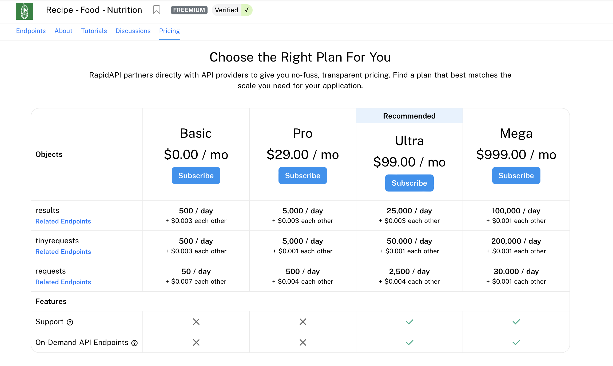

# Researching External APIs

## Introduction

Imagine you'd like to develop a sports app with all the historical and latest sports information available. You could spend many months putting together the historical list and then spend many hours a day inputting new data as new sporting events happen, or you could use a third-party API that has all this data available for you.

There are hundreds of APIs available for you to use. But how do you evaluate whether an API suits you and your project?

## Learning Objectives

By the end of this lesson, you should be able to:

- Research and find external APIs to use for their project.
- Assess the constraints of working with an external API, including how to get access to the API and any limitations in cost or requests.
- Build a test workflow that uses their API, confirming that the API distributes the needed information.
- Appropriately hide API keys on GitHub through the use of environment variables.

## Finding a lead

### Important note

APIs are always changing. APIs can go from free to paid, or their pricing can change, going from reasonable to unsustainable for many companies. For example, [Twitter](https://techcrunch.com/2023/03/29/twitter-announces-new-api-with-only-free-basic-and-enterprise-levels/#:~:text=Twitter%20announces%20new%20API%20with%20only%20free%2C%20basic%20and%20enterprise%20levels,-Ivan%20Mehta%40indianidle&text=After%20weeks%20of%20stalling%2C%20Twitter,and%20a%20costly%20enterprise%20level.) or [Reddit](https://www.digitaltrends.com/computing/reddit-api-changes-explained/) API pricing changes in 2023.

The project can also be canceled and removed from the internet due to rising costs. For example, [Studio Ghibli API was hosted on a platform called Heroku. Heroku removed their free tier, and the developer chose to take down the project rather than pay in 2022](https://github.com/janaipakos/ghibliapi#studio-ghibli-api). However, the developer allowed others to fork and host the project independently.

Or some companies decide to keep some data private instead. For example, [Netflix used to have an API but chose to remove public access to it in 2014](https://techcrunch.com/2014/11/16/netflix-api/?guccounter=1&guce_referrer=aHR0cHM6Ly93d3cuZ29vZ2xlLmNvbS8&guce_referrer_sig=AQAAAHbf7CFJtgNSuajdMTjSi800TowtPmNrU9wNmVjGuFyP6ZC1UPbQtG-TvpkbYGvsXMeKWj7UV7pOKeH4zZqPIWA1rmy4n5SlBW3VsaUN7RP-2lUu0yqC2H0G_0Z3ZnM4wUrx9TP9qJyd6PvF6T-LnPPOMzUkpDNDiG7vP1_KyIKc).

Please remember that specific examples provided in this lesson may have details that change. However, the core concepts will stay the same.

### Google, public-APIs, Open Data, and Rapid API

When searching for an API to work for your project, Google will give you several up-to-date choices and, most likely, some links to blogs and article posts about top APIs. Adding the word `free` to your search can help you narrow your field.

[public-apis](https://github.com/public-apis/public-apis) is an open-source project anyone can use and contribute to. It offers an easy-to-use list that helps you quickly decide if you want to try the API based on whether or not it requires an API key or uses HTTPS or CORS. This site offers simple APIs built by a single hobbyist or professional APIs like the [Art Institute of Chicago](https://api.artic.edu/docs/).

Several cities, including NYC, provide APIs based on government data: [NYC Open Data](https://opendata.cityofnewyork.us).

[Rapid API](https://rapidapi.com) is an API hub that summarizes APIs consistently, including pricing and example API calls. They also have additional features. However, you may or may not need them. Rapid API tends to have most professional-level APIs that are typically [freemium](https://en.wikipedia.org/wiki/Freemium).

### Why do APIs cost money?

So much of the internet appears to be free to use that it can feel frustrating when something on the internet costs money.

If someone (or a small group of people) is dedicating a few hours a week to maintain a hobby-level app, it can be nice to gain experience and provide something useful online. But often, success is one of an application's first major make-or-break points.

As apps begin to grow in popularity, more server usage is required. Possibly, multiple servers are needed. Servers require electricity, space, and someone to maintain and protect them from malicious attacks.

These days server scaling and maintenance are handled by a service like Cloudflare or AWS (Amazon Web Services). Who follow the same pattern of allowing some small usage of their service for free, but after a certain threshold, the app requires more resources and then, in turn, must charge to sustain their business.

## Assessing an API for your needs

Let's say you are researching using a recipe API and find [Recipe-Food-Nutrition API on Rapid API](https://rapidapi.com/spoonacular/api/recipe-food-nutrition).

The description reads

> The Spoonacular Recipe - Food - Nutrition API gives you access to thousands of recipes, store-bought packaged foods, and chain restaurant menu items. Our food ontology and semantic recipe search engine make it possible to search for recipes using natural language queries, such as "gluten-free brownies without sugar" or "low-fat vegan cupcakes." You can automatically calculate the nutritional information for any recipe, estimate recipe costs, visualize ingredient lists, find recipes for what's in your fridge, find recipes based on special diets, nutritional requirements, or favorite ingredients, classify recipes into types and cuisines, convert ingredient amounts, or even compute an entire meal plan. With our powerful API, you can create many food and nutrition apps.

This seems very promising!

Let's look at an example API call provided "https://spoonacular-recipe-food-nutrition-v1.p.rapidapi.com/recipes/complexSearch". Notice that this single API call is going to count for 3 calls based on their documentation:

> Search through thousands of recipes using advanced filtering and ranking. NOTE: Since this method combines searching by query, by ingredients, and by nutrients into one endpoint, each request **counts as 3 requests**

Go to the pricing tab (this screenshot is from June 2023):

The free tier allows 50 requests a day. If you want to make complex queries like the example one, you can only make 16 daily requests.

That means if you have more than 16 daily users, not all of them can make a request. Further, if one user makes more than 16 requests as they explore different recipes, the app will also stop working for the day. Finally, if you were to build and test your app, you would be limited to just 16 calls a day, which would likely keep your progress very slow.

Next, checking if the endpoints have the data you are looking for is essential. Let's say your app idea is to compare the nutrition information of the same dish but using different brands of ingredients. If you look through the [endpoints of Recipe-Food-Nutrition](https://rapidapi.com/spoonacular/api/recipe-food-nutrition), there are no brand endpoints. Therefore, this API would not meet your app needs.

Finally, when reading about billing, it seems that a credit card is required to sign up to use this API. Reading the fine print, you can see two possible consequences for exceeding the limit: suspending or charging the credit card.

When learning how to use APIs, it is recommended that you start using ones that do not require a credit card whenever possible. Making mistakes when using an API is normal. However, making a mistake with an API that costs money can be stressful.

Two common things can happen to cause chargers on your card:

- You use your API too much and end up with a fee.
- You accidentally post your API key somewhere online, and a bot finds it. The bot then steals the key, and some bad actors utilize it. [This can end up costing thousands of dollars](https://news.ycombinator.com/item?id=19610658).

You should not use a debit card as it is much harder to get a refund when you use debit over credit.

## Testing endpoints

Before building a full-fledged application:
Take the time to create some simple queries that console log the data.
Ensure you understand the data format and if it helps you get the data you want.
Check if the data you are asking for is a complex query (one request triggers many more requests) and if you can build an app with the limits placed on the API.

## Hide API Keys

API keys should never be published online. Ensure you have a `.gitignore` file set up correctly and that you put your API key in a `.env` file that GitHub does not track.

When you go to deploy your application, sites like Netlify have a dashboard that lets you enter your API key safely.
