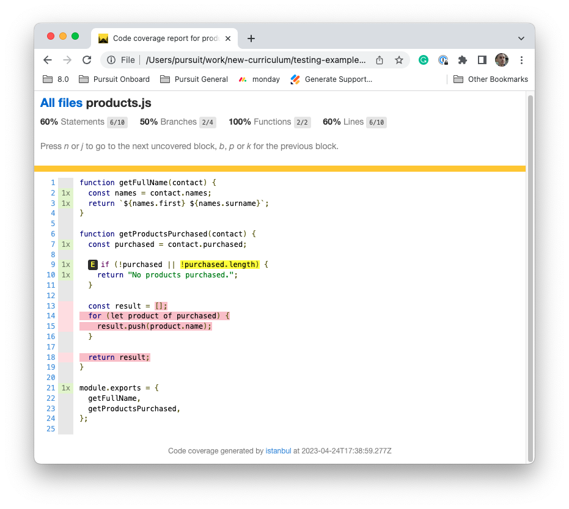

# Test with Jest

As a programmer, you want to make sure that your code works correctly before you share it with others. One way to do that is by writing "unit tests" that check your code's behavior in different situations. Unit tests are small, focused tests that check the behavior of a single piece of code, such as a function or a class.

In this lesson, you will learn to write unit tests with the popular `jest` package. By the end of this lesson, you should be prepared to write tests for individual functions. Furthermore, you'll learn how to see whether or not your tests are evaluating every section of your code.

## Learning objectives

By the end of this lesson, you should be able to:

1. Distinguish between developer dependencies and production dependencies.

1. Write unit tests using the `jest` framework.

1. Identify best practices for writing unit tests.

1. Use the coverage tool to help identify how your tests can be improved.

---

## Developer dependencies

When you want to use a package in your project, you use npm to download and install it. But there are two types of packages you can install: "developer dependencies" and "production dependencies."

Developer dependencies are packages that you only need while you're working on your project. They might help you with things like testing your code, formatting your code to make it easier to read, or compiling your code into a final version that other people can use. These packages won't be included when you share your code with others or when your code is running on a server. To install developer dependencies, you can use the following command:

```
npm install <package-name> --save-dev
```

Production dependencies, on the other hand, are packages that your project needs to run properly when it's live on a server. These packages might include things like libraries that help you interact with a database or tools that help you handle user authentication. When you share your code with others, they'll need these packages installed on their computers or servers to run your code correctly. To install production dependencies, you can use the typical installation command:

```
npm install <package-name>
```

Testing frameworks are typically categorized as developer dependencies. While tests will enable us to ensure our apps are running correctly, the tests themselves are not needed once the application has gone to production. Or, put another way, your users should not be running your tests for you.

## Unit tests with Jest

One popular framework for writing unit tests in JavaScript is called Jest. Jest is an open-source framework that helps you write and run tests, and it's used by many developers and companies around the world.

In this lesson, you will learn to write unit tests using the `jest` package.

### Get started

First, you must have an NPM project and install the `jest` package. As previously discussed, you should install the `jest` package as a developer dependency.

```
npm install jest --save-dev
```

After installing the package, you should notice a change to your `package.json` file. To access the `jest` command, you will need to update your scripts to make use of the `jest` package.

```json
{
  "scripts": {
    "test": "jest"
  }
}
```

Updating your `"scripts"` object to the one above will make it so that running `npm test` will run the `jest` package. By default, the `jest` package will look for a folder called `__tests__` and attempt to run files within it. So, you should create a `__tests__` directory in the root of your project.

Next, you will choose a file to test. It is common for test files to share the name of the filename of their testing, except they will have `.test.` in the middle of the file. For example, if you were writing a calculator application, your file structure might look like this:

```
.
├── __tests__
│   └── calculator.test.js
├── package-lock.json
├── package.json
├── readme.md
└── src
    └── calculator.js
```

In the example above, you can see that the `src/calculator.js` file is being tested by the `__tests__/calculator.test.js` file.

### Connect your files

Once you've created your test files, you will need to connect the two files by exporting the function you wish to test to your test file. For example, assume you have the following function in your `src/calculator.js` file:

```javascript
// src/calculator.js
function sum(a, b) {
  return a + b;
}
```

You will first want to export this function from the file.

```javascript
// src/calculator.js
module.exports = { sum };
```

Then, in your test file, you will need to import that function.

```javascript
// __tests__/calculator.test.js
const { sum } = require("./src/calculator");
```

Once the functions you wish to test are accessible in your test file, you are ready to test those functions.

### Jest framework

The purpose of Jest is to make it easy for you to write and run tests for your JavaScript code. Jest provides a set of tools and APIs that you can use to write tests that check the behavior of your code in different scenarios. Jest can also generate reports that show you which tests passed and which failed, so you can quickly identify any issues with your code.

Once you've created your test files, you can edit your file to contain one or more test cases. Each test case is a function that checks a specific piece of code, and you can use Jest's built-in functions to define the expected behavior and compare it to the actual behavior of your code.

For example, suppose you have a function called `sum()` that adds two numbers together. You could write a test case for this function like this:

```javascript
test("adds 1 + 2 to equal 3", () => {
  expect(sum(1, 2)).toBe(3);
});
```

This code is a test case for a function called `sum()`, which is presumably a function that adds two numbers together. The test case uses the `test()` function provided by `jest` to define a new test case. The `test()` function takes two arguments: a string that describes what the test does, and a function that contains the actual test code.

In this case, the string argument is `'adds 1 + 2 to equal 3'`, which describes what the test does. The function argument is an anonymous function that takes no arguments and contains the actual test code.

The actual test code inside the anonymous function is this:

```javascript
expect(sum(1, 2)).toBe(3);
```

This line uses the `expect()` function provided by `jest` to define the expected behavior of the `sum()` function. The `expect()` function takes one argument, which is the value that you want to test. In this case, the argument is `sum(1, 2)`, which is the result of calling the `sum()` function with arguments `1` and `2`.

The `toBe()` function is then called on the result of `expect(sum(1, 2))`. `toBe()` is a matcher function provided by `jest` that checks whether the value it's called on is equal to the argument passed to it. In this case, the argument passed to `toBe()` is `3`, which is the expected result of adding `1` and `2`.

So, putting it all together, the test case is checking if the `sum()` function correctly adds `1` and `2` together to give a result of `3`. If the test passes, it means that the `sum()` function is working correctly. If the test fails, it means that there's something wrong with the `sum()` function, and you need to investigate further to figure out what the problem is.

## Best practices

Writing tests can be a powerful tool for helping ensure your code works as intended. However, it is possible to write tests that are difficult to read or don't test exactly what is needed. Developers follow several best practices when writing tests that lead to better-written and more competent tests.

### File structure

First, it is common to structure in a way that matches your codebase's file structure. This may mean duplicating some folders but will lead to a more navigable repository.

For example, imagine you have the following file structure for one of your projects.

```
.
├── package-lock.json
├── package.json
├── readme.md
└── src
    ├── helpers
    |   ├── authentication.js
    |   └── validation.js
    └── products.js
```

If `src/` contains all of your testable code, When building tests, you would try and mirror that structure in your `__tests__` folder.

```
.
├── __tests__
│   ├── helpers
│   │   ├── authentication.test.js
│   │   └── validation.test.js
│   └── products.test.js
├── package-lock.json
├── package.json
├── readme.md
└── src
    ├── helpers
    │   ├── authentication.js
    │   └── validation.js
    └── products.js
```

By sensibly naming and structuring your test files, it'll be easier to find those files as your project grows in size. And, by keeping the names of the files the same except for the `.test` addition, you will have an easier time searching for specific files as well.

### Describe blocks

Large projects can quickly have dozens or even hundreds of tests in a single codebase. It's important to organize the test output so that it is easy to understand what is going wrong or right with the codebase.

In Jest, the `describe()` function is used to group together related test cases. You can think of it as a way to create a "test suite" that contains multiple test cases that all relate to a specific part of your code.

For example, below is an example of how you might use `describe()` to group together test cases for a Calculator class:

```javascript
describe("Calculator", () => {
  test("adds two numbers", () => {
    // test code
  });

  test("subtracts two numbers", () => {
    // test code
  });
});
```

In this example, the `describe()` function is used to create a test suite for a calculator file. The string argument passed to `describe()` is simply a description of the test suite. This string will appear when the tests are run. The second argument that goes into the `describe()` function is another function.

Inside the `describe()` block, there are four individual test cases that each test a different method of the Calculator class. These test cases are defined using the test() function, which takes a string argument describing what the test does, and a function that contains the actual test code.

So, why would someone want to use the `describe()` function? There are a few reasons:

1. **Organization:** Grouping related test cases together in a `describe()` block can help keep your test code organized and easier to understand.

1. **Clarity:** By describing what the test suite is testing, you make it easier for other developers (or your future self!) to understand what the purpose of the tests is.

1. **Filtering:** When you run your tests, you can choose to run only specific `describe()` blocks or test cases, which can be helpful when you're working on a specific part of your code and want to focus on the relevant tests.

In short, `describe()` is a bit like adding directories to your project. While not necessary, it can make it much easier to understand your codebase as it grows in size.

### Describe tests

The strings that are passed into the `describe()` and `test()` functions can be anything you want. However, it is best to be descriptive and clear as to what exactly is being tested. One way to do this is to treat test descriptions as if you were writing a sentence using the `it()` alias.

The `it()` function works exactly the same as the `test()` function. You may want to use the `it()` function if you wish to write more English-oriented tests that start with the word `it()`. Take a look at the example below and try reading the code and description as if it were a sentence.

```javascript
describe("Calculator", () => {
  it("should add two numbers", () => {
    // test code
  });

  it("should subtract two numbers", () => {
    // test code
  });
});
```

Do you notice how the tests read more like sentences now? For example, "it should add two numbers?" While this is a stylistic choice, it can make tests easier to read.

It is also a good idea to be detailed with your tests. At the very least, you may wish to describe in the test statement the expected input and output.

```javascript
describe("Calculator", () => {
  it("should add two numbers and return the sum", () => {
    // test code
  });

  it("should subtract two numbers and return the difference", () => {
    // test code
  });
});
```

### Write easy-to-read tests

The code below is an example of a functional test. If the function works as intended, the tests should pass.

```javascript
describe("sum()", () => {
  it("should add two numbers and return the sum", () => {
    expect(sum(1, 2)).toBe(3);
  });
});
```

While the code above does work, it is a bit difficult to read. This is because a function is getting called (i.e., `sum()`) with two arguments and, in the same line, the resulting value is being placed into another function call (i.e., `expect()`) which returns a value that allows for _another_ function to be called. And this is with a simple example! What might the code look like with more complex code?

```javascript
describe("getFullName()", () => {
  it("should return a string with the full name of the contact", () => {
    expect(
      getFullName({
        names: { first: "Jude", surname: "Pearson" },
      })
    ).toBe("Jude Pearson");
  });
});
```

The code above would accurately test whether or not the function worked as intended, but it's quite difficult to read. While there are many ways to write good tests, it is best to define clear variables to help describe what exactly is going on in the test. For example, the code above could be refactored to look like the following:

```javascript
describe("getFullName()", () => {
  it("should return a string with the full name of the contact", () => {
    const input = { names: { first: "Jude", surname: "Pearson" } };
    const actual = getFullName(input);
    const expected = "Jude Pearson";
    expect(actual).toBe(expected);
  });
});
```

This format is much easier to read and can be reproduced in many different testing situations.

### Failing tests

When your tests fail, you will receive an output that looks very similar to what you may see in your console when an error occurs.


For example, in the image above you can see that the test for the `getFullName()` function has failed. It shows you what the expected value was and what the actual value was. It also highlights the exact point in the test where there is a failure.

Remember that a test failure is really _a good thing._ While it's never fun to see a problem with your code, it likely means your tests are working or that you need to update your tests. Tests are a way to ensure correctness across your application as it changes and grows.

### Using appropriate matchers

Many different functions can be called from the `expect()` result besides `.toBe()`. These are called test matchers. Matchers are functions provided by Jest that allow you to test specific conditions on the values that you're testing. They often are very readable and do exactly what they say.

The `.toBe()` matcher tests if the value being tested is exactly equal to the expected value. It uses the `===` operator to compare the values, so the types of the values must match as well.

Another common matcher is the `.toEqual()` matcher. This matcher tests if the value being tested is "deeply" equal to the expected value. This means that it will recursively check all of the properties of the value to make sure they match. `.toEqual()` is commonly used when comparing objects or arrays.

For a list of the most common test matchers, you can always check the Jest documentation.

- [Jest Using Matchers](https://jestjs.io/docs/using-matchers)

## Coverage tool

The Jest coverage tool is a feature of the Jest framework that helps you determine how much of your code is being covered by your tests. This is important because it can help you identify areas of your codebase that are not being tested, which may contain bugs or other issues.

To run the Jest coverage tool, you can use the `--coverage` option when running your tests. For example, if you normally run your tests with the command `npm test`, you can run your tests with coverage by running `npm test -- --coverage`.

When you run your tests with coverage, Jest will generate a code coverage report that shows you which lines of your code were executed during the tests, and which lines were not. The report will also show you the percentage of lines, statements, functions, and branches that were covered by your tests.

```
 PASS  __tests__/calculator.test.js
  Calculator
    ✓ should add two numbers and return the sum (1 ms)
    ✓ should subtract two numbers and return the difference

---------------|---------|----------|---------|---------|-------------------
File           | % Stmts | % Branch | % Funcs | % Lines | Uncovered Line #s
---------------|---------|----------|---------|---------|-------------------
All files      |     100 |      100 |     100 |     100 |
 calculator.js |     100 |      100 |     100 |     100 |
---------------|---------|----------|---------|---------|-------------------
Test Suites: 1 passed, 1 total
Tests:       2 passed, 2 total
Snapshots:   0 total
Time:        0.154 s, estimated 1 s
Ran all test suites.
```

In the example above, you can see that all statements (i.e., `Stmts`), branches (i.e., `Branch`), functions (i.e., `Funcs`), and lines of code (i.e., `Lines`) have been fully tested. This means that there is a test that covers all parts of the code in the `calculator.js` file.

The Jest coverage report can be useful for several reasons. Here are a few examples:

- It can help you identify areas of your code that are not being tested, so you can add tests to cover those areas.
- It can help you identify areas of your code that may contain bugs or other issues, since these areas are likely to be uncovered by your tests.
- It can help you ensure that your tests are actually testing what you think they're testing, by showing you which lines of your code are actually being executed during the tests.
- It can help you track your progress as you add more tests to your codebase, by showing you how your code coverage changes over time.

Overall, the Jest coverage tool is a powerful feature that can help you improve the quality of your code by ensuring that it is thoroughly tested. By using the coverage tool regularly, you can ensure that your codebase remains robust and free from bugs. Keep in mind, however, that having 100% test coverage does not automatically ensure that your code will work as intended. Ultimately, you must write good tests and code to ensure that.

### Coverage folder

When you run the coverage tool, you'll see that in addition to the output in your console, a `coverage/` directory has been created. This coverage directory contains detailed information about the run as well as a full website you can use to visually browse the results of your coverage run.

To find the website, locate the `index.html` file within the folder. It will likely be under the `lcov-report/` directory. Then, open that file in a web browser.


This page can be easier to view than the output in your console at times. You'll see a summary of your report at the very top and the ability to click into any specific file to learn more about why the report was scored in a certain way. For example, clicking on the `products.js` link in the image above will lead to the following page:


The image above highlights in red those lines that have not been tested at all and shows in green how many times certain lines were run with code. For example, line 2 in the code above was run once thanks to the test code while the `getProductsPurchased()` function was never run.

### Example

Take a look at the function below which expects an object and will either return a string statement (i.e., "No products purchased.") or an array of product names.

```javascript
function getProductsPurchased(contact) {
  const purchased = contact.purchased;

  if (!purchased || !purchased.length) {
    return "No products purchased.";
  }

  const result = [];
  for (let product of purchased) {
    result.push(product.name);
  }

  return result;
}
```

If this code is not tested at all, it will be highlighted in all red through the coverage tool. Now take a look at the test below. How do you think the coverage report will change based on this test?

```javascript
describe("getProductsPurchased()", () => {
  it("should return a statement if no products have been purchased", () => {
    const input = {};
    const actual = getProductsPurchased(input);
    const expected = "No products purchased.";
    expect(actual).toEqual(expected);
  });
});
```

The function above tests _one of the conditions_ needed to produce the `"No products purchased."` return result. That leads to the following change in the coverage report:



You'll notice that, compared to the previous report, more of the function is being tested. You'll also notice that part of the conditional statement on line 9 is highlighted. This part of the code is _not tested_ as of yet. Continuing to add more tests will lead to more and more of the red and yellow highlighting being removed.
