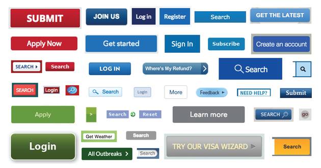
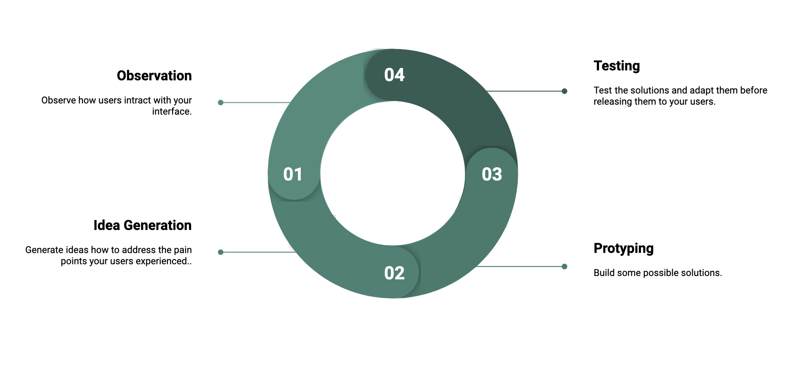
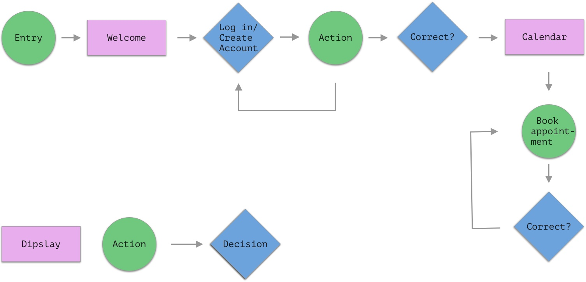
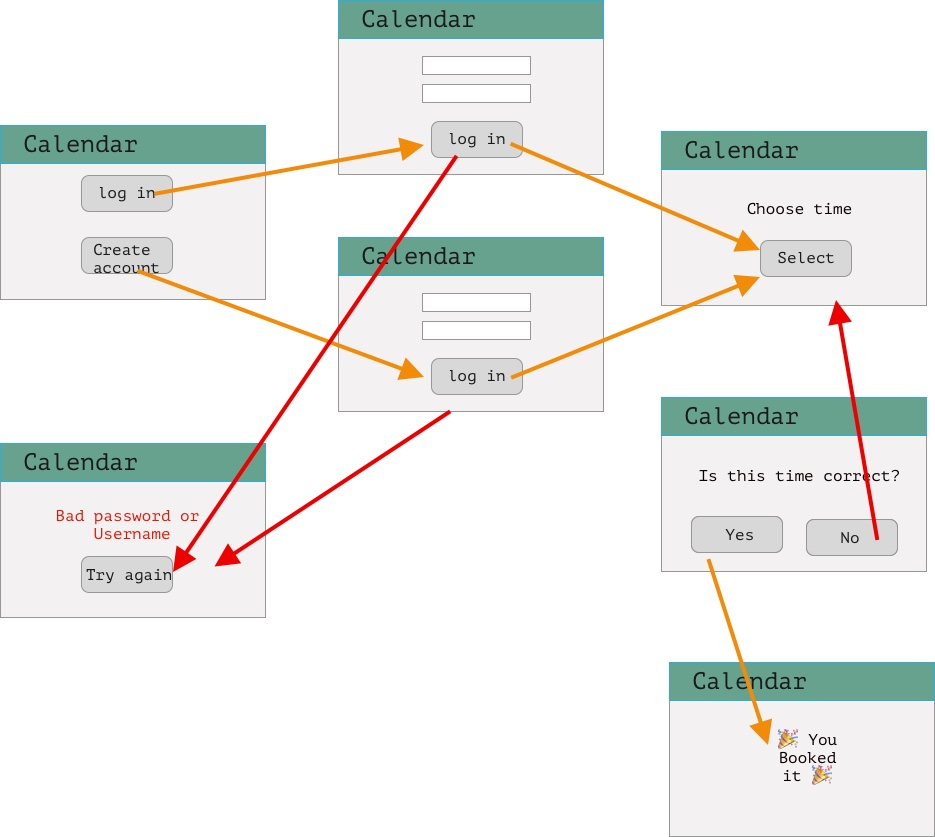

# User Experience and Design

Please think of the last time you interacted with something new: it can be an object, machine, or website. Whatever it was, you likely wanted to start using it immediately. You did not want to begin by reading an instruction manual on using the new item. This is a very human desire.

The most successful websites build strategies so that users can immediately start using the website. They might include some minor tutorial walkthroughs, but generally, a user just goes to the website and starts being able to use it successfully with minimal trial and error. Or, if the website is too difficult to navigate, the user may abandon using it.

Making a website that is a good experience for the user takes a lot of effort, and there are dedicated jobs to assist with creating a website that is enjoyable to use. The way a user interacts with a website (or other object) is called User Experience (UX). The User Interface (UI) is where the experience occurs; for a website, it is the site itself; for something like a lamp, it will be the light switch.

## Learning Objectives

By the end of this lesson, you should be able to:

- Explain what is User Experience (UX) and why it is important.
- Describe what a user flow is and why considering it is essential for application development.
- Design a user flow for a standard feature on a website.
- Identify errors that can happen to a user along the way to complete a goal and determine how a website should handle those errors.
- Identify common patterns in web development that allow users to navigate your website quickly.
- Identify anti-patterns that can confuse users in navigating your website.

---

## User Experience (UX) and User Interface (UI)

User Experience (UX) enhances user satisfaction by improving ease of use and pleasure in the interaction between the customer and the product.

User Interface (UI) is the space where the interaction occurs. In this course, it will be the websites you build.

An example of a good user experience is the 1980s video game Super Mario Brothers. [Watch this ~6-minute video highlighting how design made this game a hit](https://www.youtube.com/watch?v=ZH2wGpEZVgE&feature=youtu.be).

An example of a bad user experience is Norman Doors. [Watch this ~6-minute video to learn what Norman Doors are and why they are a bad experience](https://www.youtube.com/watch?v=yY96hTb8WgI).

Think about how you can apply the principles you've learned in these videos to your websites.

## Common traits of good design

A good design has several common traits:

### Smooth Onboarding

Onboarding is the time spent learning or participating in how to use something new. Creating designs that make onboarding easy and intuitive makes a website more enjoyable and likely for users to keep using the new website.

### Goal focused

The design focuses on users completing the task. This can include highlighting the next steps or removing unnecessary complications, for example, taking a long form and breaking it up into cohesive sections. Or conducting research on how many questions people are typically willing to answer for a form and adjust the number and type of questions to improve completion.

### Intuitive guidance

The design is intuitive and self-explanatory. For example, a cancel button will say the word `cancel`, which will be in color like red, not green.

### Discoverability

Discoverability is the ability to discover what operations a user can do independently. For example, a user can access a menu with named operations to help a user find options.

### Feedback

Users want (and often need to know) what happened. Did the user interaction succeed or fail? Was an order placed, or did something go wrong? What must the user do if something goes wrong to solve the issue?

### Forgiving

User error is bound to happen. Preventing a user from moving forward (for example, not selecting a state in an address form) and providing error messages (letting the user know what is wrong) allows the user to fix the problem independently.

The user is not required to do everything perfectly to succeed. Instead, the user can do their best and be guided to a successful outcome.

### Consistent

Ensuring that the same color scheme, styles, and user flow are used throughout a website help increase trust in a website, smooth onboarding, and also helps with security. When people are familiar with a consistent design, they can be alerted to a possible fake site because the styles differ.

Here is an example of various government website styles from 2015. You can read more about the decision to update the websites here: [The Atlantic: Making the US Government's Web Design Less Sucky, by Robinson Myer, October 16, 2015](https://www.theatlantic.com/technology/archive/2015/10/the-us-governments-new-design-standards/410986/). How would seeing all the various styles across a website make you feel? Would you feel confident in using the site? Would you question whether the website is genuinely a government website? What other concerns did you have when you used a website with inconsistent design?

## Iterations

Most times, the first version of something will need improvement. Observing users using your application is essential to determine what improvements you need to make for the next iteration.

A great way to get feedback is to watch a friend or family member interact with your app. When they get stuck, don't comment on how to use the app; instead, take notes about what made them stuck. Thank them for their time, and don't blame them if things do not go well. Your volunteers represent people unfamiliar with your app and can help you understand how new users would interact with your app.

Then, work on building ideas and designing a solution to help people use the app. This may involve moving things around, adding labels or colors, tooltips, or other solutions.

Then build a prototype or test version.

Finally, bring your app back to users to test and observe them to see if your idea worked and look at the next following things to improve.

Each iteration will help you build a better app.

## Designing user flow

A user flow is a chart or diagram that outlines the path your user can take when using your app. Building these diagrams first can help you understand how to develop our app and what features are needed so that your users can complete the necessary tasks.

Below is a simple example that requires a user to either login or create an account to book an appointment.

The user flow can then be incorporated with a wireframe to ensure the UI has all the elements needed:

As you can see, the flows can become rather complex quickly. For the user, there are clear options on what to do and what is happening. For the developer, there is a lot of work to make this experience possible.

## Identifying errors

Users make mistakes all the time. But also, there may be problems with the application. For example, the service may be down.

Identifying common errors and building in error handling is essential for a good experience. In this course, the focus is building out the core functionality first. However, error handling is a vital part of development for any real-world application.

## Identifying common patterns

Take a moment to compare two popular websites. You can visit any two (Etsy and Youtube are fine examples).

There are common patterns across websites, like where the logo is (usually along the top). You can click the logo to take you to the home page. There are sitemaps at the bottom of the page.

What other patterns do you see? Using common patterns in your application can help people feel comfortable using your application faster.

## Identifying anti-patterns

Anti-patterns are patterns where an alternative solution that is documented, repeatable, and proven effective is disregarded in favor of another less effective solution.

An obvious one is when a cancel button is colored green and might be bigger and more evident than a submit button.

## Dark patterns

Dark patterns are deceptive designs in a user interface that trick users into doing things, like instead of closing a modal, it takes the user to a different website or signing up someone for recurring billing when they only wanted to make a one-time payment.

Awareness of dark patterns can help you make informed decisions when you navigate websites.

[Darkpatterns.org](darkpatterns.org)

## Converting a bad app into a good one

Read the following article to get a big picture of everything that went into converting a bad app into a good one.

[The Atlantic: The Secret Startup That Saved the Worst Website in America](https://www.theatlantic.com/technology/archive/2015/07/the-secret-startup-saved-healthcare-gov-the-worst-website-in-america/397784/)
